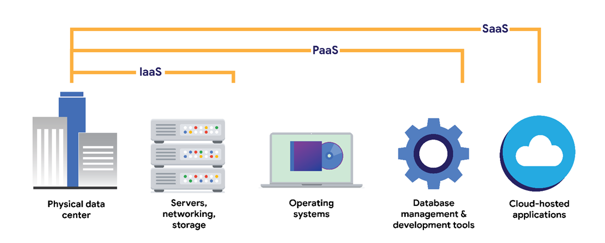

# Cloud

| <h3>Computing processes in the cloud</h3> |
| ----------------------------------------- |

Traditional networks are called on-premise networks, which means that all of the devices used for network operations are kept at a physical location owned by the company, like in an office building, for example. Cloud computing, however, refers to the practice of using remote servers, applications, and network services that are hosted on the internet instead of at a physical location owned by the company.

A cloud service provider (CSP) is a company that offers cloud computing services. These companies own large data centers in locations around the globe that house millions of servers. Data centers provide technology services, such as storage, and compute at such a large scale that they can sell their services to other companies for a fee. Companies can pay for the storage and services they need and consume them through the CSP’s application programming interface (API) or web console.

CSPs provide three main categories of services:

·          Software as a service (SaaS) refers to software suites operated by the CSP that a company can use remotely without hosting the software.

·          Infrastructure as a service (Iaas) refers to the use of virtual computer components offered by the CSP. These include virtual containers and storage that are configured remotely through the CSP’s API or web console. Cloud-compute and storage services can be used to operate existing applications and other technology workloads without significant modifications. Existing applications can be modified to take advantage of the availability, performance, and security features that are unique to cloud provider services.

·          Platform as a service (PaaS) refers to tools that application developers can use to design custom applications for their company. Custom applications are designed and accessed in the cloud and used for a company’s specific business needs.

<figure><figcaption>
Cloud
</figcaption></figure>

| <h3>Hybrid cloud environments</h3> |
| ---------------------------------- |

&#x20;

* When organizations use a CSP’s services in addition to their on-premise computers, networks, and storage, it is referred to as a hybrid cloud environment.
* When organizations use more than one CSP, it is called a multi-cloud environment.
* The vast majority of organizations use hybrid cloud environments to reduce costs and maintain control over network resources.

