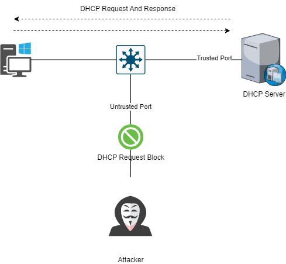

# L2 Security

### DHCP Snooping

* The DHCP Snooping feature provides network protection from rogue DHCP servers. It creates a logical firewall between untrusted hosts and DHCP servers. The switch builds and maintains a DHCP snooping table (also called DHCP binding database), shown in Figure 4-4a. In addition, the switch uses this table to identify and filter untrusted messages from the network. The switch maintains a DHCP binding database that keeps track of DHCP addresses that are assigned to ports, as well as filtering DHCP messages from untrusted ports. For incoming packets received on untrusted ports, packets are dropped if the source MAC address does not match MAC in the binding table entry.
* Hackers leverage tools like Yersinia to execute multiple fake DORA requests, depleting the DHCP pool and obstructing legitimate users from accessing the LAN and internet, leading to network downtime.
* Yersinia creates counterfeit MAC addresses and inundates the DHCP server with discovery packets, overwhelming it and hindering the fulfillment of genuine requests, thus causing DHCP starvation.
* To combat this, DHCP can be fortified with L2 security on switch ports to effectively safeguard against various attacks, including MAC flooding.

<figure><figcaption><p>DHCP SNOOPING</p></figcaption></figure>

* IP spoofing and MAC spoofing are serious security threats that can compromise the integrity of a network. IP spoofing involves falsifying an IP address to deceive the network, while MAC spoofing uses tools like smac.exe to hide a device's true identity. Additionally, CDP Flooding can be carried out by manipulating packets with Yersinia -G. It is crucial to establish strong security measures to protect against these threats, especially since trunk ports do not provide built-in security.
* According to a recent study by cybersecurity firm, 60% of network attacks involve some form of IP or MAC spoofing. Furthermore, CDP Flooding attacks have increased by 25% in the last year alone. It is evident that the need for robust security measures to combat these threats is more pressing than ever.
* The DHCP Snooping feature is an essential component for ensuring the security of your network infrastructure. It can be set up on switches and VLANs to intercept and protect DHCP messages, thereby maintaining the integrity of your network. Enabling DHCP Snooping on a switch allows the interface to function as a Layer 2 bridge within the VLAN, while enabling it on a specific VLAN allows the switch to act as a Layer 2 bridge within that VLAN domain.
* For optimal functionality, all DHCP servers connected to the switch should be configured as trusted interfaces using the "ip dhcp snooping trust" interface configuration command. Conversely, all other DHCP clients and ports receiving traffic from outside the network should be configured as untrusted using the "no ip dhcp snooping trust" interface configuration command.
* To configure the DHCP Snooping feature, you can first enable it on specific VLANs using the "ip dhcp snooping vlan \[vlan-id]" command in global configuration mode. Then, globally enable DHCP Snooping using the "ip dhcp snooping" command in global configuration mode. Both options must be set to enable DHCP snooping effectively.
* Furthermore, for added security, the DHCP server can be connected to a trusted port with a rate limit of 100 packets per second, ensuring that a DHCP flood will not overwhelm the server. In this scenario, DHCP Snooping is enabled on VLAN 5 and globally activated to provide comprehensive protection for your network.

```
ip dhcp snopping #enable the dhcp snooping
ip dhcp snopping vlan ( Vlan number)
```

* now the Switch will untrust anyone DORA packets of DHCP.
* Configure to the trust the switch with the original DHCP server.


```bash
interface etherent 0/0 #those interface where the DHCP is connected to.
    ip dhcp snooping trust
    
ip dhcp relay information trust-all

show ip dhcp snooping binding
```


* DHCP and switch both make entry to IP Assign to save this.

> interface DHCP
>
> > ip dhcp snooping database
> >
> > disk0 : mydhcp.txt
> >
> > write-delay 60 sec

```
Switch(config)# interface ethernet0/0
Switch(config-if)# ip dhcp snooping trust
Switch(config-if)# ip dhcp snooping limit rate 100
Switch(config-if)# exit
Switch(config)# ip dhcp snooping vlan 5
Switch(config)# ip dhcp snooping
Switch(config)# ip dhcp snooping information option

```

Use the **show ip dhcp snooping** command to display DHCP snooping settings. Use the **show ip dhcp snooping binding** command to display binding entries corresponding to untrusted ports.


```bash
interface ethernet 0/0
    switch port-security #enables port-security
    switch port-security mac-address sticky #prevent MAC Address Attacks.
    switch port-security sticky #pervent MAC Address Attacks,
    switch port-security maximum (number) 1 #prevent dhcp stravation 1 mac address gets 1 ip address.
    switch port-security vilolation #means attack happends counter attack by doing port in shudown state.
```



```bash
clear ip dhcp binding * (* means all)
debug ip dhcp server packet
```


* after the attack was prevented and the ports are in shutdown state&#x20;
* its can be up by manully restart the port.

> shutdown
>
> > errdisable recovery cause pseure-violations

> no shutdown
>
> > errdisbale recovery interval 120 (Time interval in seconds).

### MAC Spoofing

* in Linux its easy to change mac address and bypass the static mac binding which is,


```
interface ethernet 0/0
    shutdown
    mac-address 1111:0000:: #admin device MAC in this sencaior.
```



```bash
mac changer -m 1111:0000:: eth 0
ifconfig eth 0 down
ifconfig eth 0 up
```


* now insider attacker has the admin Privileges in network because of MAC Address.
* that same can be used in IP Address Spoofing.

### IP Source Guard

* The IP Source Guard feature is essential for enhancing security by effectively restricting IP traffic on untrusted Layer 2 ports. It achieves this by filtering traffic based on the DHCP snooping binding database or manually configured IP source bindings. This feature plays a crucial role in preventing IP spoofing attacks, where a host attempts to use the IP address of another host. Any IP traffic entering the interface with a source IP address not assigned via DHCP or static configuration will be filtered out on the untrusted Layer 2 ports.
* To enable the IP Source Guard feature, it must be used in conjunction with the DHCP snooping feature on untrusted Layer 2 interfaces. It establishes and maintains an IP source binding table, learned through DHCP snooping or manually configured static IP source bindings. Each entry in the IP source binding table includes the IP address, associated MAC, and VLAN numbers. IP Source Guard is supported on Layer 2 ports, including access and trunk ports, and it also enables dynamic source IP and MAC address filtering.

```bash
Switch(config)#interface GigabitEthernet1/0/1
Switch(config-if)#ip verify source port-security
```

* shows how to enable the IP Source Guard with a static source IP address and MAC address filtering mapped on VLAN 5.
* To mitigate form this using verify source.

<pre class="language-bash" data-title="Configuration"><code class="lang-bash"><strong>swicth(config-if#)interface ethernet 0/0-3
</strong>    ip verify source
    OR
    ip verify source port-security
    
show ip verify source
Switch(config)# ip source binding 0011.0011.0011 vlan 5 10.1.1.11 interface
Ethernet0/0

</code></pre>

* ip verify source card is active , the switch will verify its soucres of IP Address and MAC addres from it Table. if its not Valid as per its table the the port will be shutdown.
* Use the **show ip verify source** command to display the IP Source Guard configuration and the **show ip source binding** command to display the IP source bindings on the switch


### Dynamic ARP Inspection

**Overview:** ARP spoofing, a potential security threat, involves sending false Address Resolution Protocol (ARP) messages within a network. Unlike hub-based networks, where all data is broadcasted to every device, switches selectively forward data based on MAC addresses, reducing unnecessary broadcast traffic. Dynamic ARP Inspection (DAI) is a security feature designed to validate ARP packets and prevent ARP spoofing attacks.

**ARP Spoofing Scenario:** In ARP spoofing, attackers flood the switch's ARP table with fake ARP requests, potentially causing increased CPU and RAM utilization and network downtime. Manipulating the ARP table allows attackers to associate their MAC address with critical devices, posing a risk of unauthorized file transfers.

**Execution of ARP Spoofing:** Attackers execute ARP spoofing by sending a fake Gratuitous ARP (GARP) packet. For instance, an attacker can use a packet with IP address 10.0.0.2 and MAC address M2. This broadcast prompts devices to update their ARP tables. With manipulated ARP tables, the attacker intercepts important files when devices attempt to send them to an admin PC.

**Mitigation Measures:** To mitigate ARP spoofing, implement the following measures:


1. **IP Source Guard and ARP Inspection:**
   * Require DHCP Snooping.
   * Implement ARP inspection on specific VLANs (e.g., `ip arp inspection vlan [vlan number]`).
2. **Verify ARP Tables:**
   * Use the CLI command `show arp -a` to verify ARP tables.
   * Prevent unauthorized changes to ARP tables and detect potential ARP spoofing attacks.

**Overview:** DAI is a security feature validating ARP packets in a network. It ensures the legitimacy of ARP requests and responses by performing IP-to-MAC address binding inspection before forwarding packets to the destination.

**Functionality:** ARP operates at Layer 2 of the OSI model, providing IP-to-MAC resolution. ARP caches, vulnerable to attacks, can compromise data privacy. DAI safeguards against ARP-based attacks, dropping packets with invalid IP-to-MAC bindings.

**DAI in Action:** Figure 4-5b illustrates DAI blocking an intruder attempting to poison ARP entries on an untrusted port.

<figure><figcaption><p>ARP SPOOFING</p></figcaption></figure>

**DAI in a DHCP Environment:**

* Configure secure interfaces as trusted using `ip arp inspection trust`.
* Enable DAI for specific VLANs: `ip arp inspection vlan [vlan-range]`.

```
Switch(config)# interface GigabitEthernet1/0/1
Switch(config-if)# ip arp inspection trust
Switch(config)# ip arp inspection vlan 5-10
```

**DAI in a Non-DHCP Environment:**

* Define an ARP ACL using `arp access-list [acl-name]`.
* Apply the ARP ACL to specified VLANs: `ip arp inspection filter arpacl vlan [vlan number]`.
* Untrust an interface: `no ip arp inspection trust`.

```
Switch(config)# arp access-list arpacl
Switch(config-arp-acl)# permit ip host 10.1.1.11 mac host 0011.0011.0011
Switch(config-arp-acl)# exit
Switch(config)# ip arp inspection filter arpacl vlan 5
Switch(config)# interface GigabitEthernet1/0/2
Switch(config-if)# no ip arp inspection trust
```


**Rate Limiting ARP Packets:**

* Prevent ARP flooding DoS attacks with `ip arp inspection limit` to limit incoming ARP requests and responses.
* Default limit: 15 pps on untrusted interfaces; no limit on trusted interfaces.

**ARP Validation Checks:**

* Perform additional checks using `ip arp inspection validate {[src-mac] [dst-mac] [ip]}` to validate destination MAC, sender and target IP addresses.

**Monitoring:**

* Use `show ip arp inspection interfaces` to display trust state, rate limit, and burst interval.
* Check DAI configuration and VLAN operation state with `show ip arp inspection vlan [vlan# or range]`.

**Packet Statistics:**

* Use `show ip arp inspection statistics` to display packet statistics on DAI-configured VLANs.

### Layer 2 Security Best Practices

To conclude this chapter, a list of best practices is presented here for implementing, managing, and maintaining secure Layer 2 network:

* Manage the switches in a secure manner. For example, use SSH, authentication mechanism, access list, and set privilege levels.
* Restrict management access to the switch so that untrusted networks are not able to exploit management interfaces and protocols such as SNMP.
* Always use a dedicated VLAN ID for all trunk ports.
* Be skeptical; avoid using VLAN 1 for anything.
* Disable DTP on all non-trunking access ports.
* Deploy the Port Security feature to prevent unauthorized access from switching ports.
* Use the Private VLAN feature where applicable to segregate network traffic at Layer 2.
* Use MD5 authentication where applicable.
* Disable CDP where possible.
* Prevent denial-of-service attacks and other exploitation by disabling unused services and protocols.
* Shut down or disable all unused ports on the switch, and put them in a VLAN that is not used for normal operations.
* Use port security mechanisms to provide protection against a MAC flooding attack.
* Use port-level security features such as DHCP Snooping, IP Source Guard, and ARP security where applicable.
* Enable Spanning Tree Protocol features (for example, BPDU Guard, Loopguard, and Root Guard).
* Use Switch IOS ACLs and Wire-speed ACLs to filter undesirable traffic (IP and non-IP).

