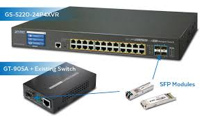
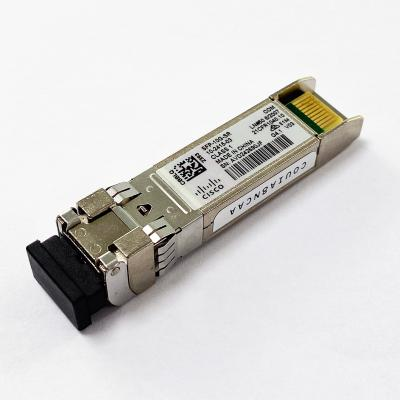

# Network Cables

### <mark style="color:purple;">Eithernet</mark>

> Ethernet is a technology on which all cables run.
>
> Ethernet standards are defined in the IEEE 802.3 standard in 1983.
>
> IEEE = Institute of Electrical and Electronics Engineers.

<table><thead><tr><th width="123">Speed</th><th>Common Name</th><th>IEEE Standard</th><th>Informal Name</th><th>Max Length</th></tr></thead><tbody><tr><td>10mbps</td><td>Ethernet</td><td>802.3i</td><td>10base-t</td><td>100m</td></tr><tr><td>100mbps</td><td>Fast Ethernet</td><td>802.3u</td><td>100base-t</td><td>100m</td></tr><tr><td>1gbps</td><td>Gigabit Ethernet</td><td>802.3ab</td><td>1000base-t</td><td>100m</td></tr><tr><td>10gbps</td><td>10 Gigabit Ethernet</td><td>802.3an</td><td>10gbase-t</td><td>100m</td></tr></tbody></table>

### <mark style="color:purple;">**Types of Cables**</mark><mark style="color:purple;">:</mark>

<mark style="color:blue;">**UTP (Unshielded Twisted Port)**</mark>

> * Doesn't have Aluminum Shield.
> * Vulnerable to electrical disturbance.
> * 4 pairs of cables (total 8 wires) are twisted together, which helps eliminate electromagnetic interference (EMI).
> * These 8 wires are connected to 8 pins present in the RJ-45 connector.
> * Used for internal usage.

<mark style="color:blue;">**STP (Shielded Twisted Pair):**</mark>

> * Has Aluminum Shield.
> * More expensive than UTP.
> * Used for external usage.

<mark style="color:purple;">Ethernet Cable Types:</mark>

> <mark style="color:blue;">**Fast Ethernet (FE) and Ethernet (10/100 MBPS):**</mark>
>
> * These cables use 4 wires.
> * Pin 1 and Pin 2 are used for transmitting data from the PC to the switch.
> * Pin 3 and Pin 6 are used for receiving data from the switch to the PC
>
> <mark style="color:blue;">**Gigabit Ethernet and 10 Gigabit Ethernet:**</mark>
>
> * These cables use 8 wires.
> * Provide higher data rates and require more wires for transmission.

### <mark style="color:purple;">**Connection Between PC and Switch (Straight Through Cable):**</mark>

> <mark style="color:blue;">Transmit Data (PC) → Receive Data (Switch):</mark>
>
> * Pin 1 (Transmit) on PC to Pin 1 (Receive) on Switch.
> * Pin 2 (Transmit) on PC to Pin 2 (Receive) on Switch.

> <mark style="color:blue;">Receive Data (PC) → Transmit Data (Switch):</mark>
>
> * Pin 3 (Receive) on PC to Pin 3 (Transmit) on Switch.
> * Pin 6 (Receive) on PC to Pin 6 (Transmit) on Switch.

### <mark style="color:purple;">**Connection Between Switch and Router (Straight Through Cable):**</mark>

> Similar to PC to Switch connection, as the router behaves like a PC in this context.

### <mark style="color:purple;">**Crossover Cable (Same Device to Same Device):**</mark>

> * When connecting devices of the same type (e.g., router to router), a crossover cable is used.
> * Pin 1 (Transmit) on one end to Pin 3 (Receive) on the other end.
> * Pin 2 (Transmit) on one end to Pin 6 (Receive) on the other end.
> * Pin 3 (Receive) on one end to Pin 1 (Transmit) on the other end.
> * Pin 6 (Receive) on one end to Pin 2 (Transmit) on the other end.
>
> This information outlines how Ethernet cables are used to establish connections between various network devices, covering both straight-through and crossover cable configurations.

### <mark style="color:purple;">**Device Pin Connections:**</mark>

| Device   | Transmit | Receive |
| -------- | -------- | ------- |
| Router   | 1 and 2  | 3 and 6 |
| Firewall | 1 and 2  | 3 and 6 |
| PC       | 1 and 2  | 3 and 6 |
| Switch   | 3 and 6  | 1 and 2 |

> * For gigabit Ethernet and 10 gig, for straight connections, all cables are connected straight.
> * New devices aren't affected by this because of AUTO MDI-X feature. The device detects which pins the device uses to transmit data and accordingly adjusts their own pins.

### <mark style="color:purple;">**Cable Standard:**</mark>

| TIA/EIA 568A Wiring | TIA/EIA 568B Wiring |
| ------------------- | ------------------- |
| White Green         | White Orange        |
| Green               | Orange              |
| White Orange        | White Green         |
| Blue                | Blue                |
| White Blue          | White Blue          |
| Orange              | Green               |
| White Brown         | White Brown         |
| Brown               | Brown               |

> * Mostly Used Wiring is TIA/EIA 568B Wiring.
> * If the same standard cable is applied on both sides, it's called a Straight Cable.
> * If both are different, then it's called a crossover.
>   * Example: Switch to Hub, Server to PC are Crossover.
> * ORANGE & GREEN / BOTH WHITE are the data flow wires.
> * BLUE & BROWN / WHITE are for supplying electric power to devices.

### <mark style="color:purple;">**Fiber Optic Cable:**</mark>

> There are two types of fiber cables:
>
> 1. Single mode: Core is smaller than multi-mode.
> 2. Multi-mode: Core is wider than single mode, allows multiple modes of light waves to enter the glass.

| Informal Name                 | IEEE Standard | Speed  | Cable Type                | Max Length  |
| ----------------------------- | ------------- | ------ | ------------------------- | ----------- |
| 1000base-lx                   | 802.3z        | 1gbps  | Multi-mode or single mode | 550m (MM) - |
| 
5km (SM) 10gbase-sr
 | 802.3ae       | 10gbps | Multi-mode                | 400m        |
| 10gbase-lr                    | 802.3ae       | 10gbps | Single mode               | 10km        |
| 10gbase-er                    | 802.3ae       | 10gbps | Single mode               | 30km        |

#### <mark style="color:blue;">Small Form-Factor Pluggable (SFP)</mark>

> Small Form-factor Pluggable (SFP) module is a compact, hot-swappable transceiver used for both telecommunication and data communication applications.

<figure><figcaption>
SFP
</figcaption></figure>

#### Long && Short Range SFP

<figure><figcaption>
SFP LR And SR
</figcaption></figure>

> Long Range SFP is used for long range communication, Both Side should be equal.
>
> Short Range SFP is used for Short range communication, Both Side shoild be equal.

### <mark style="color:purple;">**MDIX Technology:**</mark>

> If accidentally applying the wrong standard of cable, this feature automatically changes the energy to both connections.
>
> This allows them to cooperate; NIC cards support MDIX Technology.
