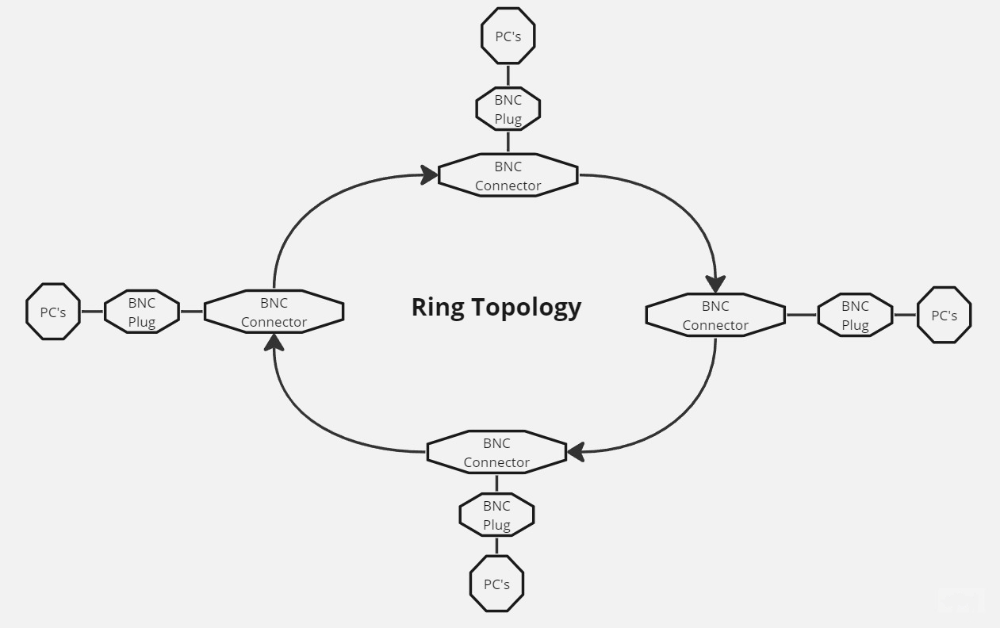
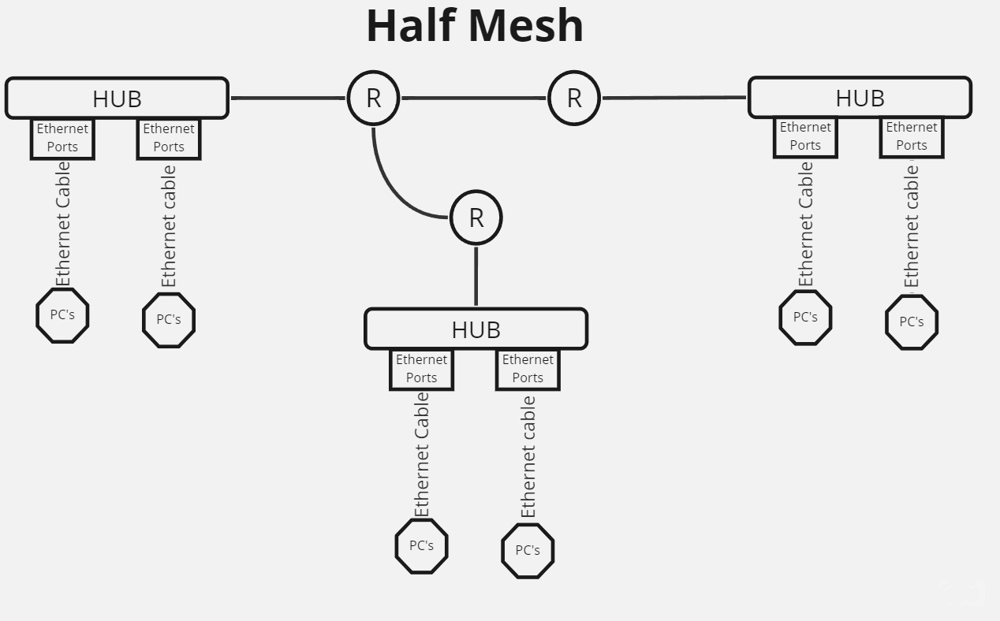
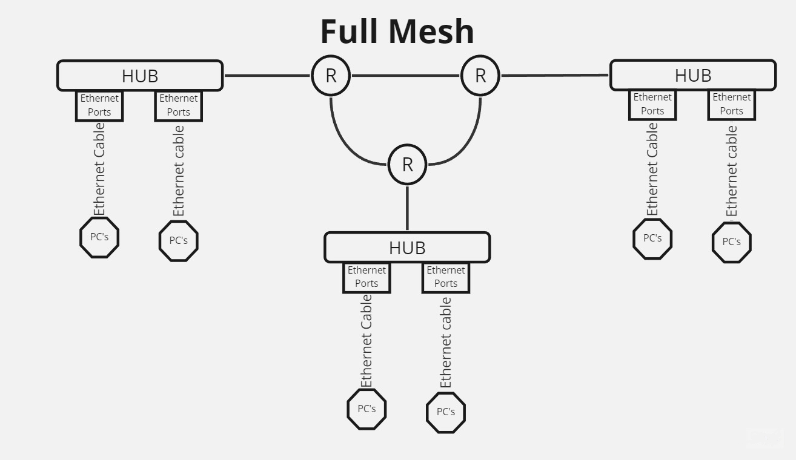
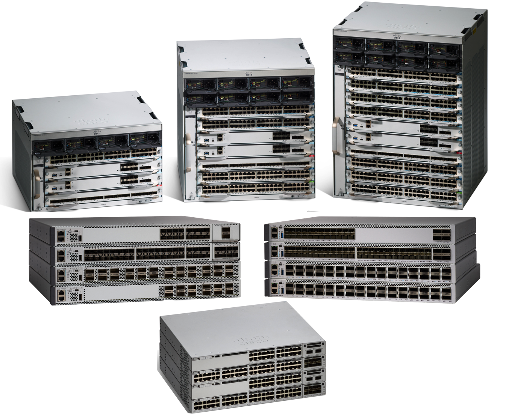
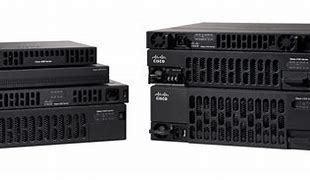
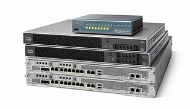
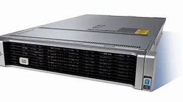
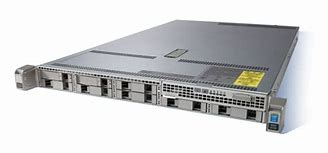
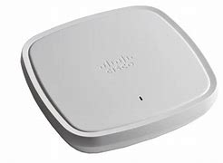
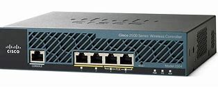

# Network Topology & Components

## <mark style="color:purple;">Topology & Components</mark>

### <mark style="color:blue;">Network Topology</mark>

> Topology Means the arrangements or layout.
>
> > Network Topology Means Network Diagram or layout of network.

### <mark style="color:purple;">Types</mark>

#### <mark style="color:blue;">POP Topology</mark>

> Point to Point Topology connects between two nodes directly.

#### <mark style="color:blue;">Bus Topology</mark>

> It the first topology used to connect two or more computers using single cable (Coaxial Cable).
>
> > BNC Creator (Bayonet Neil Concelman)
> >
> > > used with coaxial cable to connect multiply devices.
> > >
> > > Data travels in both directions but only one device can send data at a time (Half Duplex)
> > >
> > > A single failure can bring the whole network down.

<figure><figcaption>
Bus Topology
</figcaption></figure>

| Pros                                                            | Cons                                                 |
| --------------------------------------------------------------- | ---------------------------------------------------- |
| Bus topology is cheap,                                          | Files doesn't has secret (it broadcasts data to all) |
| Use a single coaxial cable which connects all ,including nodes. | There is not backup when the cable is damage         |

#### <mark style="color:blue;">Ring Topology</mark>

> * Every device is connected to exactly two other devices, forming a ring for communication.
> * Data travels in one direction (or sometimes both, in a dual ring).
> * The failure of a single device can affect the entire network unless it’s a dual ring.

<figure><figcaption>
Ring Topology
</figcaption></figure>

| Pros                                             | Cons                                                                                                                                                                         |
| ------------------------------------------------ | ---------------------------------------------------------------------------------------------------------------------------------------------------------------------------- |
| Its has a backup ways to destination in networks | Its doesn't have <mark style="color:orange;">BNC Terminator</mark>. & ts has struggle to add new Pc’s because ring Wire has to be the connected wires, It has BNC connector. |

#### <mark style="color:blue;">Star Topology</mark>

> All the devices are connected to a central HUB or switch.

<figure><figcaption>
Star Topology
</figcaption></figure>

| Pros                                                                             | Cons                                                         |
| -------------------------------------------------------------------------------- | ------------------------------------------------------------ |
| If one PC is down & cable is physically damaged, So the others are not effected. | A hub or switch is a single point of failure for the network |

#### <mark style="color:blue;">Hybrid Topology</mark>

> A Combination of two or more different types of topologies.

<figure><figcaption>
Hybrid Topology
</figcaption></figure>

| Pros                                               | Cons                                                   |
| -------------------------------------------------- | ------------------------------------------------------ |
| Flexible And Scabble for Large and Complex network | Can be more expensive and complex to set up and manger |

#### <mark style="color:blue;">Mesh Topology</mark>

> Every devise is connected to every other device.

| Pros                                                                   | Cons                                          |
| ---------------------------------------------------------------------- | --------------------------------------------- |
| 
High Redundancy and reliability Multiply paths for data flow
 | Expensive and complex to install and maintain |

<mark style="color:blue;">Types</mark>

<mark style="color:blue;">Half Mesh Topology</mark>

> Only some devices are connected to multiple others.

<figure><figcaption>
Half Mesh
</figcaption></figure>

<mark style="color:blue;">Full Mesh Topology</mark>

> Every device is connected to every other device.

<figure><figcaption>
Full Mesh Topology
</figcaption></figure>

## <mark style="color:purple;">Network Components</mark>

> It is a digital telecommunications network which allows nodes to share resources. Nodes are also known as endpoints or end hosts.

#### <mark style="color:blue;">Clients</mark>

> * laptop, desktop, phones.
> * These devices access service made available by a server.

#### <mark style="color:blue;">**SERVERS**</mark>

> A device provides services with clients.

#### <mark style="color:blue;">**SWITCHES & HUB**</mark>

> * The first device was HUB then its updated by Switches.
> * HUBs
>   * Its a dummy device.
>   * Its doesn't understand IP & MAC Address.
>   * Its broadcast Data to all.
>   * Its not costly & doesn’t need power supply.

| Pros                                                    | Cons                                                                                                              |
| ------------------------------------------------------- | ----------------------------------------------------------------------------------------------------------------- |
| Cheap, doesn’t need power supply, Multiply connections. | Broadcast, dummy device, Doesn’t understand IP **& MAC**, can’t perform configuration, no software & half duplex. |

#### <mark style="color:blue;">Switches</mark>

> * Switches are used to connect devices within a Lan.
> * Switches have multiple interfaces/ports for end host to connect to.
> * Once devices are connected to it, it creates a table a save the mac addresses of these devices using ARP Protocols.

<figure><figcaption>
Switches
</figcaption></figure>

| Pros                                                                                                                                           | Cons                    |
| ---------------------------------------------------------------------------------------------------------------------------------------------- | ----------------------- |
| 
Connects multiple device has serval ports company can also customize the switch according to the requirements.

Doesn’t Broadcast.
 | Expensive / Costly.     |
| Understands MAC & IP Address. & Have some Security Feature.                                                                                    | Need More Power Supply. |

<mark style="color:blue;">**ROUTERS**</mark>

> * Routers are used to connect different **LANs**.
> * They have fewer network interfaces than switches.
> * They are used to send data over the internet.
> * Cisco **ISR** routers are enterprise grade routers Now which is Re known as **Cisco CSR**.
> * Routers at the end that connect the entire network to internet is called gateway.
> * Understand IP for sending outside LAN we required router.

<figure><figcaption>
Routers
</figcaption></figure>

<mark style="color:blue;">**Repeater**</mark>

> Repeater helps to transfer the data with some speed it started \[boost data and frequency etc ]

#### <mark style="color:blue;">Network Speeds</mark>

> * **Ethernet:** Up to 10 Mbps
> * **Fast Ethernet:** Up to 100 Mbps
> * **Gigabit Ethernet:** Up to 1 Gbps
> * **SFP (Small Form-factor Pluggable) Ports:** Up to 100 Gbps
>   * SR(Short Range) and LR (Long Range)

#### <mark style="color:blue;">Firewall</mark>

> * Network security devices that protect a network from attacks.
> * Can be hardware or software/virtualized firewalls.

#### <mark style="color:blue;">**Cisco ASA (Adaptive Security Appliance):**</mark>

> * Filters IP addresses.
> * Manages traffic flow.
> * Determines which IP addresses are permitted or denied.
> * Can manually block URLs.
> * Does not filter emails.

#### <mark style="color:blue;">**Cisco FTD (Firepower Threat Defense):**</mark>

> Combines functions of WSA (Web Security Appliance), firewall, NGIPS (Next Generation Intrusion Prevention System), and AMP (Advanced Malware Protection).

<figure><figcaption>
Cisco Firewall Family
</figcaption></figure>

#### <mark style="color:blue;">**Cisco ESA (Email Security Appliance):**</mark>

> * Monitors and filters emails.
> * Secures emails from unauthorized access.
> * Filters emails based on geolocation, file types (e.g., .exe, .gif, .jpeg), etc.
> * Prevents email attacks on companies.

<figure><figcaption>
ESA (IronPort)
</figcaption></figure>

<mark style="color:blue;">**Cisco WSA (Web Security Appliance):**</mark>

> * Monitors and filters internet traffic.
> * Filters URLs.
> * Profiles unknown websites and can set access times.
> * Sets video quality and disables download buttons.
> * Blocks files with viruses.
> * Prevents viruses from the internet.

<figure><figcaption>
WSA
</figcaption></figure>

#### <mark style="color:blue;">**Cisco ISE (Identity Services Engine):**</mark>

> * Manages authentication for employees.
> * Generates user accounts and passwords for devices.

<figure><figcaption>
ISE
</figcaption></figure>

#### <mark style="color:blue;">**AAA (Authentication, Authorization, and Accounting):**</mark>

> * **Authentication:** Verifies user identity.
> * **Authorization:** Grants access to authorized devices.
> * **Accounting:** Tracks user activities.

#### <mark style="color:blue;">**NGIPS (Next Generation Intrusion Prevention System):**</mark>

> * Scans data for viruses, trojans, etc.
> * Tracks unauthorized activities.
> * Positioned behind the firewall.

<mark style="color:blue;">**Wi-Fi Access Points:**</mark>

> Devices that provide wireless access to a network.

<figure><figcaption>
Access Point
</figcaption></figure>

<mark style="color:blue;">**WLC (Wireless Lan Controller)**</mark>

> Manage Multiply Access Point

<figure><figcaption>
WLC
</figcaption></figure>

<mark style="color:blue;">**AMP (Advanced Malware Protection):**</mark>

> Protects against malware.

<mark style="color:blue;">**Cisco Talos:**</mark>

> * A threat intelligence and research organization.
> * Provides protection against cybersecurity threats.
> * Offers threat intelligence, research, and analysis.
> * Provides products like firewalls and intrusion prevention systems.
> * Helps organizations stay ahead of emerging threats.
