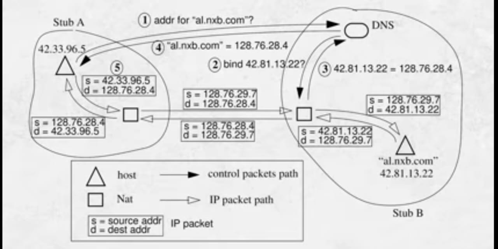
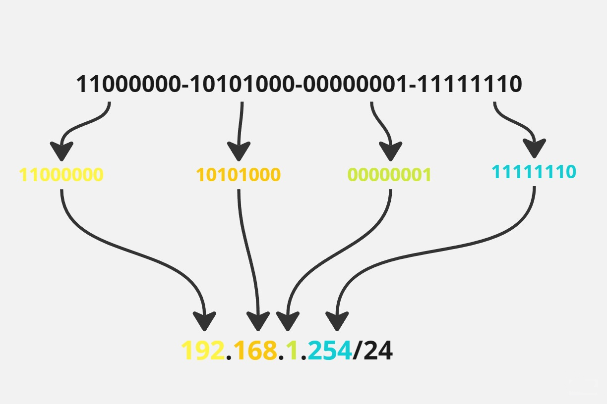
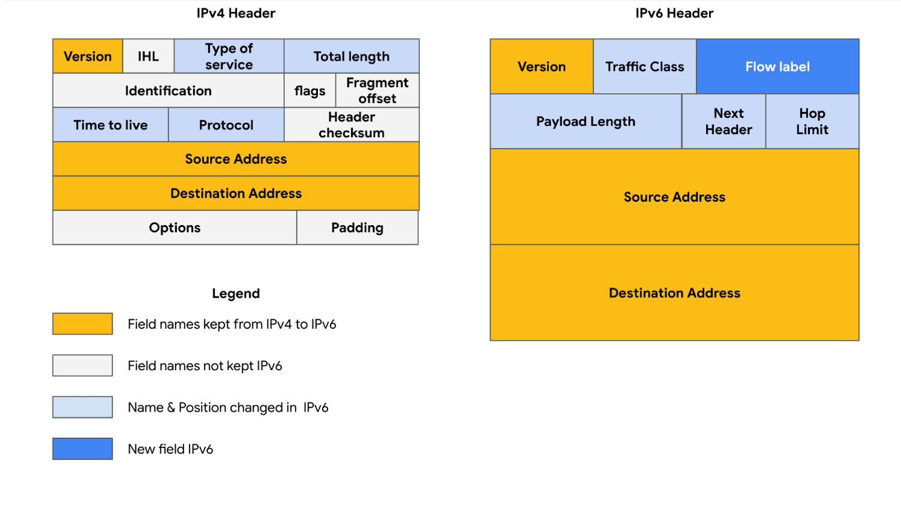

# Networking Fundamentals IP Address And Subnetting

## <mark style="color:purple;">IP Address & Subnetting</mark>

### <mark style="color:blue;">**IP & MAC**</mark>

> IP Stands for **Internal Protocol.**
>
> Its a set of rules govering the format of data sent over the internet or local network.
>
> Which created by ICANN also know as **IANA** (Internet Assigned Number Authority)

> An IP address is a unique address that identifies a device on the internet or a local network. It can be static (permanent) or dynamic (temporary).
>
> IANA (Internet Assigned Numbers Authority) is responsible for coordinating global IP address allocation by distributing IP address blocks to regional internet registries (RIRs).

> A MAC (Media Access Control) address is a unique identifier assigned to a network interface controller (NIC) for use as a network address within a network segment.

> Devices need to find each other on a **network** to establish communications. These devices use **`unique addresses`**, or **`identifiers`**, to locate each other. These addresses ensure that communication happens with the right device. These are called **IP and MAC addresses**.

> Think of a MAC address as a permanent identifier like a serial number on a device, whereas an IP address is like a temporary postal address assigned to the device when it connects to a network.

> **Example of IP and MAC:** A company gives you an **ID card** called an **IP address. the personal identity is (AADHAR) called a MAC address**. The company hires you based on your MAC address, and then you get an IP address.

### <mark style="color:blue;">**IP Address Versions**</mark>

> **IANA has IP Address  its product for them so they use to launch it with version.**
>
> * IP Address has **IPv4 and IPv6 versions all the other version was unlauched.**
> * IPv4 is made of 4 blocks, each block holds 8 bits.
> * IPv4 only uses decimal numbers.
> * IPv6 was introduced due to IPv4 shortages.
> * IPv6 is made of 8 blocks, each block holds 16 bits.
> * IPv6 uses hexadecimal numbers.

### <mark style="color:blue;">**IP Address Classes**</mark>

| Class   | Range                       | Details                      |
| ------- | --------------------------- | ---------------------------- |
| Class A | 1.0.0.0 - 126.255.255.255   | Used By ISP & its Public IP  |
|         | 127.0.0.1                   | NIC Card check (Loopback)    |
| Class B | 128.0.0.0 - 191.255.255.255 | Used By ISP & its Public IP  |
| Class C | 192.0.0.0 - 223.255.255.255 | Used By ISP & its Public IP  |
| Class D | 224.0.0.0 - 239.255.255.255 | Network Device Communication |
| Class E | 240.0.0.0 - 255.255.255.255 | Research Centers             |

> * Address range: <mark style="color:orange;">**`0-255.0-255.0-255.0-255.`**</mark>
> * Dynamic combination.
> * First & last part should not be zero.
> * **ISPs (Internet Service Provider)** can use Class **A, B, or C which is our internet wale Bhaiya.**
> * Last number zero indicates network.
> * One IP can maintain 65,535 devices (connection & port numbers).

### <mark style="color:blue;">**Types of IP Address**</mark>

1. **Public:** Used on the internet. No simultaneous identical IP and port for two machines.
2. **Private:** Used in LAN. Different LANs can have the same IPs. Machines in LAN can't access the web

## <mark style="color:purple;">**NAT (Network Address Translation)**</mark>

Converting private IP addresses into public IP addresses. Private IP addresses work under LAN but need NAT to access WAN.


Due to increased electronic devices, IP address shortage led IANA to introduce Private Addresses with NAT.



&#x20;<mark style="color:orange;">**PIX Engineer**</mark> Created NAT Which was Network Translation Inc. & Cisco Buy PIX and come up with PIX ASA Adaptive Security Appliance


<figure><figcaption>
<strong>PIX Figure of NAT</strong> 
</figcaption></figure>

#### <mark style="color:blue;">**Private IP Address IPv4**</mark>

<table><thead><tr><th>Class</th><th width="191">Range</th><th>Hosts</th></tr></thead><tbody><tr><td>Class A</td><td>10.0.0.0 - 10.255.255.255</td><td>16,777,216 IP addresses</td></tr><tr><td>Class B</td><td>172.16.0.0 -172.32.255.255</td><td>1,948,576 IP addresses</td></tr><tr><td>Class C</td><td>192.168.0.0 - 192.168.255.255</td><td>65,536 IP addresses</td></tr></tbody></table>

> These are private addresses for local network use. They can't access the internet directly. <mark style="color:orange;">**Private IPs**</mark> are converted to public for internet access.

### <mark style="color:blue;">**Dig up IP Address**</mark>

> * IPv4 is divided into 4 parts, <mark style="color:orange;">**`0-255.0-255.0-255.0-255.`**</mark>
> * Each part has **8 bits.**
> * IPv4 has a total of **32 bits.**
> * Each part ranges from **0-255.**
> * IP can't start or end with **0** but can have **0** in other places.
> * IP ending with **0** represents the network.

## <mark style="color:purple;">Subnet</mark>

> * Subnetting divides **big networks.**
> * Subnetting controls **IP addresses.**
> * **Subnets are the bits within an IP address.**
>
> > **Example:** 192.168.1.0 has a subnet mask of 255.255.255.0, which provides 65,536 IP addresses as free addresses in LANs.

<figure><figcaption>
<strong>Binary to Subnet Conversation</strong>
</figcaption></figure>

> * **Subnetting** involves dividing subnets.
> * Network bits are fixed and cannot be changed.
> * <mark style="color:orange;">Host bits are changeable</mark>

> #### Example:
>
> * **Class A:** 10.0.0.0
>   * Network bits: 10
>   * Host bits: 0.0.0. (32 - 8 = 24 host bits)
>   * Class A 10.0.0.0 has 8 network bits and 24 host bits.
> * **Class B:** 172.16.0.0
>   * Network bits: 172.16
>   * Host bits: 0.0. (32 - 16 = 16 host bits)
>   * Class B 172.16.0.0 has 16 network bits and 16 host bits.
> * **Class C:** 192.168.1.0
>   * Network bits: 192.168.1
>   * Host bits: 0. (32 - 24 = 8 host bits)
>   * Class C 192.168.1.0 has 24 network bits and 8 host bits.

### <mark style="color:blue;">**Formula for Subnet Mask Calculation**</mark>

|  N  | 2^n |
| :-: | :-: |
|  0  |  1  |
|  1  |  2  |
|  2  |  4  |
|  3  |  8  |
|  4  |  16 |
|  5  |  32 |
|  6  |  64 |
|  7  | 128 |

> <mark style="color:orange;">**N = 1 + 2 + 4 + 8 + 16 + 32 + 64 + 128 = 255**</mark>

### <mark style="color:purple;">**IPv6**</mark>

> IPv6 was introduced to address the shortage of IPv4 addresses.

> The size of IPv6 addresses is **128 bits.**
>
> IPv4 has four octets (e.g., 192.168.1.0), with each octet consisting of 8 bits, totaling 32 bits.
>
> IPv6 has 8 segments, each part being 16 bits.
>
> > Example: **`ffff:abcd:shsh:8587:7632:agsv:asuy:8362`**
> >
> > **16x8 = 128 bits.**

> **IPv6 is classless.**
>
> **IPv6** is not an upgraded version of **IPv4**; both are different.
>
> Larger Address
>
> * **Header Size**
>   * **IPv4 has 20 bytes.**
>   * **IPv6 has 40 bytes.**
>
> 128 bits + additional information = **40 bytes.**
>
> IPv4 has 16 information sections to read.
>
> IPv6 has 8 information sections to read.

> **NAT** is not required.
>
> IPv4 had Private & Public IP concepts to address the IP shortage, but IPv6 provides an abundance of IPs.
>
> IPv6 supports **Statefull**, Stateless, and automatic IP generation using MAC addresses (PCs can automatically generate IPs through their own MAC addresses).
>
> IPv4 supports **Unicast, Multicast, Broadcast**, while IPv6 has Unicast, Multicast, Anycast (nearby devices), but no Broadcast.
>
> *   Example:
>
>     * `Phone -> Airtel Tower -> Provided IP (random)`
>
>     In **IPv6**, even if the location changes, the IP may not change; however, an ISP like Airtel could provide an option to maintain the same IP for payment.
>
> Location changing in **IPv6** doesn't necessarily result in IP changes.
>
> **VPN** supports **IPv6** features.

### <mark style="color:blue;">**Difference between IPv4 and IPv6**</mark>

> It became clear that all of the IPv4 addresses would eventually be depleted; this is called IPv4 address exhaustion. At the time, no one had anticipated how many computing devices would need an IP address in the future.
>
> IPv6 was developed to mitigate IPv4 address exhaustion and other related concerns.

| <mark style="color:blue;">**IP Version 4 Vs IP Version 6**</mark>                                                                                                                                                                                                                                                                                             |
| ------------------------------------------------------------------------------------------------------------------------------------------------------------------------------------------------------------------------------------------------------------------------------------------------------------------------------------------------------------- |
| One of the key differences between IPv4 and IPv6 is the length of the addresses.                                                                                                                                                                                                                                                                              |
| IPv4 addresses are numeric, made of 4 bytes, and allow for up to 4.3 billion possible addresses.                                                                                                                                                                                                                                                              |
| IPv4 addresses are made up of four strings, and the numbers range from 0 to 255.                                                                                                                                                                                                                                                                              |
| An example of an IPv4 address would be: 198.51.100.0. IPv6 addresses are hexadecimal, made up of 16 bytes, and allow for up to 340 undecillion addresses (340 followed by 36 zeros).                                                                                                                                                                          |
| An example of an IPv6 address would be: `2002:0db8:0000:0000:0000:ff21:0023:1234.`                                                                                                                                                                                                                                                                            |
| There are also some differences in the layout of an **IPv6 packet header**. The IPv6 header format is much simpler than IPv4. For example, the IPv4 Header includes the HLEN Identification, and Flags fields, whereas the IPv6 does not. The IPv6 header introduces different fields not included in IPv4 headers, such as the Flow Label and Traffic Class. |
| There are some important security differences between IPv4 and IPv6.                                                                                                                                                                                                                                                                                          |
| IPv6 offers more efficient routing and eliminates private address collisions that can occur on IPv4 when two devices on the same network are attempting to use the same address.                                                                                                                                                                              |

<figure><figcaption>
<strong>Different Between IPv4 And IPv6..</strong>
</figcaption></figure>
