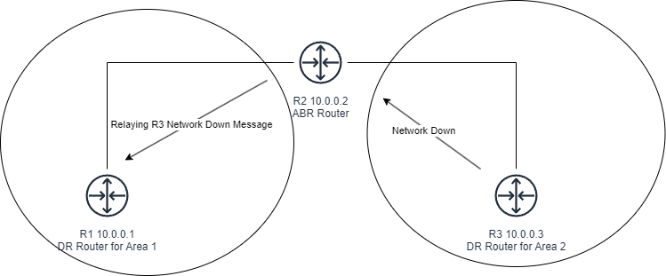

# Routing

### **Basic Router Concepts:**

1. **Router Functionality:** Routers operate at Layer 3 (Network Layer) of the OSI model and are used to connect different networks.
2. **Routing Table:** Routers maintain a routing table, which contains information about destination IP addresses and the paths (routes) to reach them.
3. **Interface Configuration:** Router interfaces are typically in a shutdown state by default, and you need to manually enable them using the **no shutdown** command.

### **Basic Router Configuration Commands:**

* **enable**: Enter privileged EXEC mode.
* **show ip interface brief** or **show interfaces**: View information about all interfaces.
* **show ip interface \<interface>**: Check details for a specific interface.
* **show interfaces status**: Display the status of interfaces.
* **show ip route**: View the routing table.
* **configure terminal**: Enter global configuration mode.
* **hostname \<name>**: Set a hostname for the router.
* **enable secret \<password>**: Set an encrypted enable password.
* **banner motd \<symbol>**: Configure a banner message for login.
* **line console 0**: Configure the console line for password protection.
* **password \<pass>**: Set a console password.
* **login**: Enable login on the console line.
* **service password-encryption**: Encrypt passwords.
* Interface Configuration:
  * **interface \<interface>**: Enter interface configuration mode.
  * **ip address \<IP> \<subnet mask>**: Set an IP address and subnet mask for an interface.
  * **no shutdown**: Enable the interface.
* **interface range fa<0/1-4>**: Select multiple interfaces for configuration.
* Web Server Configuration:
  * **ip http server**: Enable HTTP server for port 80 connections.
  * **ip http secure-server**: Enable HTTPS server for port 443 connections.
* **no ip domain lookup**: Disable DNS lookup.
* **show clock**: Check the router's time.
* **clock set \<time and date>**: Set the router's time and date.
* **clock timezone \<timezone>**: Change the router's timezone.

### **Routing Concepts:**

* Router has two types:

1. &#x20;Fixed2
2. &#x20;Modular

* Boot Sequence:
* POST (Power-On Self-Test), which loads a bootstrap program.
* It checks the configuration register values, which are 0x2012 and 0x2142.
* The bootstrap program locates the configuration register and proceeds to check for the IOS on the flash drive, loading it into RAM (Decompression of IOS).
* Once loaded, it becomes the running configuration stored in RAM, and the startup configuration is saved in NVRAM.
* **Routing Protocols:** Routers use routing protocols to exchange network information and fill their routing tables. Examples include RIP, OSPF, and EIGRP.
* **IGP (Interior Gateway Protocol):** Used for smaller networks within an organization. Examples: RIP, OSPF, EIGRP.
* **EGP (Exterior Gateway Protocol):** Used for larger, external networks like the Internet. Examples: BGP, EGP.
* **Distance Vector vs. Link State:** Routing protocols can be categorized as distance vector (based on hop count) or link-state (considering factors like speed).
* **Hop Count:** The number of routers between the source and destination is known as hop count.

### **Static Routing & Default Routing:**

* Static routing involves manually configuring routes on a router.
* Example Command: **ip route \<destination> \<subnet mask> \<next hop IP>**
* Default Route: Used when the destination IP is not known. Example: **ip route 0.0.0.0 0.0.0.0 \<next hop IP>**

#### There are two types of Routing

* Static Routing & Default Routing
* &#x20;Will have to inform and direct all router about they route or direction.

#### Disadvantage

* Its hard to monitor in static routing.
* It doesn't know backups.
* By directions Routes required.

#### Dynamic Routing

* Its works on Algorithms.

#### There are three types of Algorithms.

### **Dynamic Routing:**

* Dynamic routing involves configuring a dynamic routing protocol on a router to automatically select the best routes.
* These protocols automatically update routes when network changes occur, making them adaptive.

### **Routing Protocol Types:**

1. **IGP (Internal Gateway Protocol):**
   * Used within a single autonomous system (organization or company) to share routes.
   * Examples include RIP, OSPF, and EIGRP.
2. **EGP (External Gateway Protocol):**
   * Used to share routes between different autonomous systems.
   * Example: BGP (Border Gateway Protocol).

### **Routing Algorithm Types:**

1. **Distance Vector Algorithm:**
   * Older than the link-state protocol.
   * Routers send known destination networks and metrics to their directly connected neighbors.
   * Routers learn routes based on the information provided by their neighbors.
   * Often referred to as "routing by rumor."
2. **Link-State Algorithm:**
   * Faster than distance vector.
   * Every router creates a connectivity map of the network.
   * Advertisements are shared among routers until all routers have the same network map.
   * Each router independently calculates the best route to each destination based on this map.
   * Requires more CPU on routers but shares more information.

#### **Administrative Distance (AD):**

* AD is used to determine the preference of routing protocols. Lower AD values indicate more trustworthy and preferred protocols.
* When using static routes, you can append an AD value to indicate a preference. These are called "float static routes."

#### **Passive Interfaces:**

* Passive interfaces send routing protocol updates but do not accept any updates from the interface.
* Useful for interfaces connected to non-routing devices (e.g., PCs, switches without routing capability).
* Can be configured using commands like


```
enable configure terminal interface <interface> router <routing-protocol> passive-interface <interface>
```


#### **Debugging ICMP:**

* The **debug ip icmp** command helps determine if a router is responding to ICMP (ping) requests.

These concepts are essential in understanding routing protocols and configuring routers for effective network communication.

### **RIP**[**​**](http://localhost:3000/journey/docs/CyberSecurity/CCNA/Routing#rip)

RIP (Routing Information Protocol):

#### **Overview:**

* RIP was created using the Bellman-Ford algorithm and is also known as a distance vector protocol.
* RIP counts the number of "hops" or routers between networks to determine the best path.
* It chooses the best path based on the fewest number of hops, irrespective of link speed.

#### **Disadvantages:**

* Metric is based solely on hop count (minimum hop is considered the best).
* RIP operates as a service under UDP port 520.
* RIP has a maximum hop count limit of 15.

#### **Timed Updates:**

* RIP sends updates every 30 seconds to share routing information.
* When a new router is added, it sends updates with both new and previous data.
* Hold-down time of 180 seconds: RIP waits for this duration when a network goes down, thinking it might recover.
* After 180 seconds, the flush timer becomes active, which is set to 60 seconds. During this time, it deletes network data. The total time is 240 seconds.

#### **Administrative Distance (AD):**

* AD values indicate the trustworthiness of a route. Lower values are more trusted.
* RIP has an AD of 120.

#### **RIP Version 1:**

* Does not support authentication, which can lead to security issues and network instability.
* Doesn't understand customized subnet masks, which means it doesn't support Variable Length Subnet Masks (VLSM) or Classless Inter-Domain Routing (CIDR).
* Broadcasts all data, which can be inefficient.

### **Differences Between RIPv1 and RIPv2:**

| **Aspect**                 | **RIPv1**                  | **RIPv2**                                       |
| -------------------------- | -------------------------- | ----------------------------------------------- |
| Routing Type               | Distance vector            | Distance vector                                 |
| Subnet Mask Support        | Classful (No VLSM or CIDR) | Classful and Classless (Supports VLSM and CIDR) |
| Authentication             | No authentication support  | Supports authentication mode                    |
| Hop Limit                  | 15                         | 15                                              |
| Update Mechanism           | Broadcast updates          | Triggered updates                               |
| Manual Route Summarization | Not supported              | Supported                                       |


Authentication is important in RIP to prevent unauthorized routers from injecting incorrect routing information into the network, which could lead to network instability or attacks like DoS and DDoS. RIPv2, with its support for authentication and classless routing, offers enhanced security and flexibility compared to RIPv1.


### **Default Configuration:**

```bash
router rip
version [number]
network [network-id]
```

### **IGRP (Interior Gateway Routing Protocol):**[**​**](http://localhost:3000/journey/docs/CyberSecurity/CCNA/Routing#igrp-interior-gateway-routing-protocol)

#### **Overview:**[**​**](http://localhost:3000/journey/docs/CyberSecurity/CCNA/Routing#overview-1)

* IGRP (Interior Gateway Routing Protocol) was developed by **Cisco**.
* It's used for routing within an autonomous system (AS).
* IGRP uses a dual algorithm to calculate the metric.
* The metric in IGRP is determined by two factors: bandwidth and delay.

#### **Metric Components:**[**​**](http://localhost:3000/journey/docs/CyberSecurity/CCNA/Routing#metric-components)

* **Bandwidth:** It represents the speed of the interface. Higher bandwidth is preferred.
* **Delay:** IGRP calculates the delay based on how long it takes for a packet to travel from the source to the destination. Lower delay is preferred.

#### **Timed Updates:**[**​**](http://localhost:3000/journey/docs/CyberSecurity/CCNA/Routing#timed-updates-1)

* IGRP sends updates every 90 seconds.
* The maximum number of hops allowed in IGRP is 100.
* The administrative distance (AD) value for IGRP is 100, which indicates its trustworthiness in routing decisions.
* When IGRP sends updates, it broadcasts the data to all devices in the network.

#### **Protocol Characteristics:**[**​**](http://localhost:3000/journey/docs/CyberSecurity/CCNA/Routing#protocol-characteristics)

* IGRP uses protocol number 9 in IP headers.
* IGRP operates in a classful manner, which means it does not support subnetting, Variable Length Subnet Masks (VLSM), or Classless Inter-Domain Routing (CIDR).


IGRP was an early proprietary routing protocol developed by **Cisco**. While it had some advantages, it's largely been replaced by more open and widely adopted routing protocols like **OSPF** and **EIGRP**. These modern protocols offer greater flexibility and are more suited to complex, modern networks.


### **EIGRP (Enhanced Interior Gateway Routing Protocol):**

* **Protocol Number: 88**
* **Developed and maintained by Cisco, an advanced version of IGRP.**
* **Utilizes Dual Algorithms for routing decisions.**
* **Metric Calculation:**
  * **EIGRP metric calculation includes bandwidth, delay, reliability, load, and MTU.**
* **Key Features:**
* **Supports Classless routing.**
* **Supports FLSM (Fixed-Length Subnet Masking) and VLSM (Variable-Length Subnet Masking), including subnets.**
* **Wildcard masks can be used for summarization.**
* **Maximum Hops is 256**
* **Classless, Support FLSM & VLSM , Subnets.**
  * **Support Wildcard , which is Total number of subnet minus subnet question**
  * **Example:**
  * **255.255.255.255**
  * **255.255.255.0**
  * **0.0.0255**
* **Load Balancing:**
* **Load balancing occurs when multiple routes have identical metrics.**
* **Load can dynamically change based on traffic patterns.**
* **History of link utilization is considered for load balancing.**
* **Load balance**
  * **When both route has all functions same. Then load balance will apply.**
  * **Load can be change anytime, because of traffic.**
  * **How many times , the packed down its check the history of link (link means wire)**
  * **Multi cast id 224.0.0.10**
* **Hello Packets and Neighbor Table:**
* **Hello packets are exchanged every 5 seconds between routers to check the status of neighboring routers.**
* **Neighbour tables store information about adjacent routers, including address and interface details.**
* **Update Timing:**
* **Updates occur every 5 seconds.**
* **Hold-down time is 15 seconds.**
* **Neighbour table**
  * **Each router keep state information about adjacent neighbours. When a newly discoverd neighbour is found its address and interface are recorded and information is hold in neighbour table.**
  * **R1 ---> R2**
    * **Hello Packet**
  * **R1 <---- R2**
    * **Hello Packet**
  * **Its send packet not data sp router memories and ram is not getting fullystorage.**
  * **Topology table**
  * **Collect all the data of route.**
  * **R1 ----> R2**
    * **Full Table**
  * **R1 <---- R2**
    * **Thanks**
  * **R1 <---- R2**
    * **Full Table**
  * **R1 -----> R2**
    * **Thanks**
* **Topology Table:**
  * **Collects all data about routes.**
* **Routing table shows the best of best routes in this tables.**
* **Routing Table:**
* **Displays the best routes.**
* **Filters all routes to show only the best ones.**
* **Its filters all the routes shows the best routes Now router has many route so Router cant shows all the routes.**
  * **It shows the best routes.**
* **Send hello packet every 5 second (To check the partner is Alive or dead)**
* **And if down then its takes 15 second to shutdown that routes.**

#### **Bandwidth and Delay Calculation:**

* **Bandwidth calculated as 10^7 / (least bandwidth).**
* **Delay is the sum of delays on serial links, divided by 10 for unit conversion to seconds.**

#### **MTU**

* **Maximum transmission Units**
* **First converted into frightments and into binary to Physical OSI layer and send data into 1500 BYTES.**

**MTU (Maximum Transmission Unit):**

* **Represents the maximum size of data transmitted over a network.**
* **EIGRP now primarily uses bandwidth and delay for metric calculation instead of MTU.**

**So Load balance , Reliability can caused RAM and CPU of router heavy impacted that why now eigrp only uses Bandwidth and speed.**

| **Type**            | **Bandwidth**  | **Delay**     |
| ------------------- | -------------- | ------------- |
| **Serial Cable**    | **1544 KBBPS** | **20,000 MS** |
| **Ethernet**        | **10 MBPS**    | **200 MS**    |
| **FastEtherent**    | **100 MBPS**   | **100 MS**    |
| **GigabitEthernet** | **1 GBPS**     | **10 MS**     |

* **To change the EIGRP routes its can be change by cahnging the bandwidth and delay.**

#### **EIGRP Formula**

* **EIGRP Choice the least form link**
* **For bandwidth with serial Link.**
  * **107 / least Bandwidth = 107 / 1544 = 1,00,000/1544 = 6477**
* **For delay**
  * **Delay = sum all link**
  * **R1 + R2 + R3+ with serial link number**
  * **20,000 + 20,000 + 20,000 = 60,000**
  * **Divide by 10 % because convert into unit per second**
  * **60,000 / 10 = 6000**
* **For Metric**
  * **Metric = Bandwidth + delay \* 256**
  * **6477 + 6000 \*256 = 3194112**

### **EIGRP and OSPF:**

* **Both have incremental updates, meaning new connections are updated instantly.**
* **IGRP and EIGRP work specifically on Cisco devices, while OSPF is vendor-independent.**
* **EIGRP AND OSPF**
  * **Has incremental updates / full table update means if new connection is there added it inteastly , they update increase connection update.**
  * **It doesn't update old connection data.**
* **IGRP AND EIGRP only works on Cisco but OSPF Works on Every Vendors.**

### **Universal Configuration**

```
Router eigrp <AS Number>
Network <wildcard>
Eigrp verification
Show ip eigrp neighbors
Show ip eigrp interface
Show ip route eigrp
Show ip eigrp topology
Show ip eigrp traffic
Show ip protocols
```

### **OSPF**

* **Open Standard path first.**
* **Its work on Dijkstra’s Algorithm.**
* **Protocol number 89**
* **Multi cast update.**
* **MultiCastID 224.0.0.5,224.0.0.6 NetworkID**
* **Classless , 🡪 Support VSLM, FLSM. Wildcard.**
* **Hops are unlimited.**
* **Update time**
  * **Hello packet 10second.**
  * **Hold down packet 40 seconds.**
  * **Its has trigger update m has a type called incremenetals update.**
* **Neighbour table**
  * **Send hello packet to know neighbour through networked.**
* **Topology table**
  * **Show all the possible route.**
* **Route table**
  * **It filters route through topology table and shows the best of best route to the destination.**
* **Support authentication.**
* **Link State is speed.**
* **Metric is speed.**
* **Disadvantage is area concept design its very difficult because the same protocols ,which make its difficult, if design wring OSFP won’t work.**

#### **Area Concept.**

* **It help to reduce the data floodes.**

<figure><figcaption><p>OSPF Heavy Routers.</p></figcaption></figure>

* **There are only two heavy router and all are low storage devices. If RIP is applied it will share data every time to everyone so low storage device might get damage.**
* **But OSPF Is applied.**

<figure><figcaption><p>OSPF Area</p></figcaption></figure>

* **Area 0 is the backbone of all routers.**
* **Protocols rule is somehow every router must connect to area 0.**
* **Its basically, area 0 is the head of a community and take problems to the superior (like network added or down etc.)**

### **Universal configuration**

```
routing ospf <numbers>
#network <ip-address> <wildcards> area <0-255 number>
```

* **OSPF single network is also called LSA 1**

<figure><figcaption></figcaption></figure>

* **OSFP multi Network**

<figure><figcaption></figcaption></figure>

* **If router are connected to multi connection this might cause flooding.**
* **This is why DR and DBR comes in.**

**DBD (Database Description)**

* **Router ID**
  * **It used for in router to another router,**
  * **It used highest IP address.**
  * **In case you will create loopback what will you used , used loopback that will different that the create in router.**

### **OSPF Neighbor STATE.**


* Down State
  * where the Communication is not being.

#### 1. Down:

The first of many OSPF neighbor states is "down." When a device is in the "down" state, it means that there is currently no hello package being received from that device. This could be due to a physical issue, such as a broken network cable, or a software issue, such as incorrect configuration parameters. In any case, it is important to troubleshoot and resolve this issue as quickly as possible, as it can greatly impact the network’s overall performance.

#### 2. Attempt:

In a network, the "attempt" **OSPF state** is only applicable in a non-broadcast multi-access (NBMA) environment. In this type of network, routers use unicast hello packages to establish adjacencies with their neighbors. The "attempt" neighbor state indicates that a router has received a hello package and is attempting to become neighbors with the sending router.

#### 3. Init

In OSPF networking, "init" refers to a neighbor state in which a hello package has been received, but no router ID has been received. This generally indicates that the exchange of information between routers has just begun, and the network is still in the process of establishing connections.

4. Initial State/Two Way State

* Two Ways state is also known as Down State. That means no comm to used.
* In OSPF, the exchange neighbor state is when two routers share information about their connections and distances. This helps them build a map of the network. It's an important step for routers to work together and communicate properly.

<figure><figcaption><p>Two Way State.</p></figcaption></figure>

5. Exstart State

* Routers decide and compare each other, is big IP Address one will recived Full Routes Tables First.
* The "Exstart" state in OSPF neighbor relationships means that both routers have agreed to exchange information about their connections and have established a leader-follower relationship. During this state, they start sharing information about their connections until they have nothing left to share. This helps routers find the best paths for sending data between networks.

&#x20;

<figure><figcaption><p>ExStart State</p></figcaption></figure>


6. Exchange State

* in OSPF, the exchange neighbor state is when two routers share information about their connections and distances. This helps them build their maps of the network. This step is important for routers to communicate and route properly in a network.

7. Loading: "Loading" means the router is exchanging link state information with its neighbors to build a complete database. Once done, the neighbor state changes to "Full," showing successful exchange of all link state information.
8. Full: "Full" is the normal and desired state for routers in an OSPF network, where they are fully synchronized and have efficient communication and routing. If a router is in "Init" or "Down" state, it may indicate a problem. Having routers in a "Full" state is important for smooth network operation.


### DR and BDR rules:&#x20;

* DR stands for Designated Router&#x20;
* BDR stands for Backup Designated Router&#x20;
* By default, the highest priority is One.&#x20;
* The router with the highest OSPF priority becomes the DR, and the router with the second-highest priority becomes the BDR.&#x20;
* If the priorities are the same, the router with the highest Router ID becomes the DR, and the router with the second-highest Router ID becomes the BDR.&#x20;
* Router ID election: The Router ID can be manually configured in OSPF. If the Router ID is not manually configured, the highest IP address on any loopback interface is selected as the Router ID.&#x20;
* If there are no loopback interfaces, the highest IP address on any active interface is selected as the Router ID.&#x20;
* Important points: The DR is decided to be the router with the highest IP address. The BDR is second in line and has the next highest IP address.&#x20;
* If a router's priority is 0, it cannot be elected as DR or BDR in OSPF. OSPF is non-preemptive, so you must run the command "clear ip ospf process" to make changes take effect.&#x20;
* DR/BDR election happens on a per multi-access segment, not per area. You can check the DR/BDR status in the topology using the command "show ip ospf neighbor" or "show ip ospf database."

Area Border Routers (ABRs) and Autonomous System Boundary Routers (ASBRs) are two types of routers:

* ABRs and ASBRs are two types of routers in OSPF networks. ABRs connect different areas and provide routing between them. They are located near the border between OSPF areas and connect them to the backbone. ABRs advertise routes from one area to other areas. If a router is running multiple areas, it is called an ABR.

<figure><figcaption><p>ABR Router</p></figcaption></figure>


* ASBRs are like the exit doors of an OSPF network. They connect the OSPF network to other networks using different protocols. They can take routes from these other networks and add them to the OSPF network. This process is called redistribution. ASBRs run multiple algorithms and are important for connecting different types of networks together.

<figure><figcaption></figcaption></figure>

ABR and ASBR functions can be on the same device. The difference is that ASBRs inject prefixes from other networks to your network, while ABRs connect two internal OSPF areas.


### LSA

The Autonomous System Boundary Router (ASBR) functions as the exit point in an OSPF (Open Shortest Path First) network, linking the OSPF network to external networks that use different routing protocols. ASBRs perform redistribution, incorporating routes from these external networks into the OSPF network. ASBRs utilize multiple algorithms and play a crucial role in connecting diverse network types.

the message that route send to everyone when network is down, OR network is added is caled LSA

So this message process is called LSA.

&#x20;Types of LSA

<table data-header-hidden><thead><tr><th width="160"></th><th></th><th></th><th></th><th></th></tr></thead><tbody><tr><td>LSA TYPE </td><td>Description </td><td>Originator </td><td>Flooded To </td><td>Purpose </td></tr><tr><td>Type 1 </td><td>Router LSA </td><td>Router </td><td>Same Area </td><td>Describes router’s Link </td></tr><tr><td>Type 2 </td><td>Network LSA </td><td>DR </td><td>Same Network </td><td>Describes routers on a network segment </td></tr><tr><td>Type 3 </td><td>Summary LSA </td><td>ABR </td><td>Other Area </td><td>Advertise routes between areas </td></tr><tr><td>Type 4 </td><td>Summary ASBR LSA </td><td>ABR </td><td> </td><td>Informs about an ASBR </td></tr><tr><td>Type 5 </td><td>Autonomous System external LSA </td><td>ASBR </td><td>OSPF Domain </td><td>Advertises external routes </td></tr><tr><td>Type 6 </td><td>Multicast OSPF LSA </td><td>OSPFv3 router </td><td>Same Area </td><td>Used for multicast group memberships </td></tr><tr><td>Type 7 </td><td>NSSA External LSA </td><td>ASBR in NSSA </td><td>NSSA </td><td>Carries external routes in NSSA configuration </td></tr></tbody></table>


LSA 1&#x20;

* If the update or message send within the areas is called LSA 1.

<figure><figcaption><p>Single Network LSA 1</p></figcaption></figure>

&#x20;\


<figure><figcaption><p>Multiply Network LSA 1</p></figcaption></figure>

* When there is network down in an area and the router inform to DR (Router Leader ) by messaging is called LSA 1.
* Routers in an OSPF (Open Shortest Path First) network generate their own Router Link State Advertisement (LSA). This Type 1 LSA provides information about the router's links and interfaces, describing their states within an OSPF area. Importantly, Type 1 LSAs are confined to the area in which they originate and do not propagate beyond its boundaries. The Router LSA includes details such as the Router ID, the status of links, and IP information for each interface.


LSA 2

* but when DR get the message and inform other router about the network which is down somewhere , this process called LSA 2

<figure><figcaption><p>Network LSA 2</p></figcaption></figure>

* In OSPF, Network Link State Advertisements (LSAs) are exclusively flooded by Designated Routers (DRs). These LSAs provide details about routers directly connected to multi-access network segments, including information about DRs, Backup Designated Routers (BDRs), and subnet information. Like Router LSAs, Network LSAs are confined to the OSPF area of origin and contribute to ensuring that all routers within the area maintain an accurate understanding of the network topology.

LSA 3

* if area has to send information to different areas, first it's goes to ABR router through different area's , first it's goes to ABR router through different Area's ABR&#x20;
* ABR will inform to DR. and this process is called LSA 3

<figure><figcaption><p>LSA 3</p></figcaption></figure>

* In OSPF, when information about a specific area needs to be shared with another area, Summary Link State Advertisements (LSAs) or Inter-Area LSAs, known as Type 3 LSAs, are utilized. ABRs (Area Border Routers) generate these LSAs to advertise routes between OSPF areas. In the OSPF routing table, they are represented as "O IA," signifying routes learned through inter-area routing. Type 3 LSAs play a key role in facilitating communication and connectivity between different OSPF areas.

LSA 4

* Multiply Algorithms are running including OSPF,
* ASBR Router will inform the update/down  add network other algo throught ASBR.
* ASBR will generate a message (about updates) is different algo,
* this process is called LSA 4

<figure><figcaption><p>LSA 4</p></figcaption></figure>

