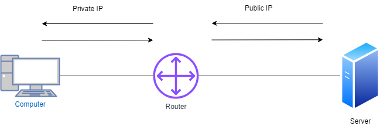
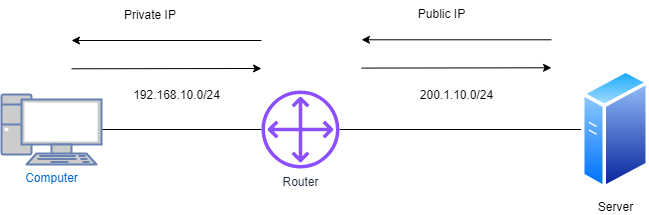
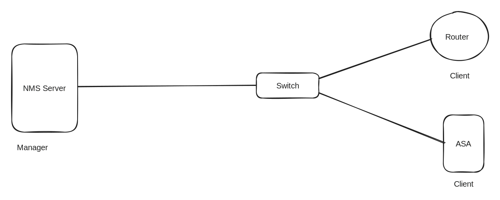

# System Trade


* Access Control List (ACL) An Access Control List (ACL) is a security feature that acts as a security guard for a network by allowing or denying access based on IP addresses. It operates at the OSI Layer 3 network level and is used to permit or deny network traffic. ACLs are typically applied to Layer 3 devices for effective network security.

<table data-header-hidden><thead><tr><th></th><th width="149"></th><th></th><th></th></tr></thead><tbody><tr><td>IP Address</td><td>Protocols</td><td>Port</td><td>Data</td></tr><tr><td>10.0.0.1</td><td>TCP</td><td>Source address Random</td><td>FILE</td></tr><tr><td>200.1.30.10</td><td>TCP</td><td>Destination Address : 443</td><td>FILE</td></tr></tbody></table>

* Access lists can be applied under IP, Protocol, and Ports. They start from the OSI Layer 3 network and extend to the Application Layer 7.

### ACL configuration guidelines&#x20;

* Only one ACL per interface, per protocol, per direction is allowed.
* ACLs are processed top-down; the most specific statements must go at the top of the list. Once a packet meets the ACL criteria, the ACL processing stops and the packet is either permitted or denied.
* ACLs are created globally and then applied to interfaces.
* An ACL in network configuration can filter traffic going through the router, or traffic to and from the router.

Types of Access List

* standard access list
  * A standard access list verifies only the source and destination IP addresses. It uses numeric identifiers (1-99) and can be applied inbound or outbound on an interface.


```bash
ip access-list standard (1-99)
    deny host (single network)
    permit any

interface ethernet 0/0
    ip access-group (number) in or out

```



```bash
ip access-list standard Shadow
    1 deny host 10.0.0.1
    2 permit host 10.0.0.2
    3 permit any

interface ethernet 0/0
    ip access-group Shadow in

```




```
show running-config | section OR include access-list
```


* disadvantage&#x20;
  * If DHCP is applied, the IP address will change, rendering standard ACI ineffective. After applying it to the interface devices, packets are denied by default, which is referred to as an implicit rule.


* **Extended Access List:**
  * Extended access lists verify source and destination IP addresses and ports. They use numeric identifiers (100-199) or names for configuration.


```bash
ip access-list extended (100-199/NAME)
    (action) deny or permit (Source IP) (Source port) (Destination IP) (Destination port)

interface ethernet 0/0
    ip access-group (list name) in

```



```bash
ip access-list extended Shadow
    deny tcp host 10.0.0.1 host 200.1.30.10 eq www
    deny tcp host 10.0.0.2 host 200.1.30.10 eq 443
    permit ip any any

interface ethernet 0/0
    ip access-group Shadow in

```


***

**Network Address Translation (NAT):**

NAT allows L3 devices to convert private IP addresses to public ones. Types include Static NAT, which is one-to-one mapping.

NAT (Network Address Translation) is a process of changing the source and destination IP addresses and ports. Address translation reduces the need for IPv4 public addresses and hides private network address ranges. The process is usually done by routers or firewalls.

<figure><figcaption><p>NAT</p></figcaption></figure>

* L3 devices can apply Network Address Translation (NAT) to facilitate network access translation. NAT allows private IP addresses to be converted to public addresses, effectively conserving internet resources and improving network efficiency. [#nat-network-address-translation](networking-fundamentals-ip-address-and-subnetting.md#nat-network-address-translation "mention")

### How does it work?

NAT allows a single device, such as a router, to act as an agent between the Internet (or public network) and a local network (or private network), which means that only a single unique IP address is required to represent an entire group of computers to anything outside their network.


Types of NAT.

* Static NAT, also referred to as One-to-One NAT, entails transforming a single private IP address into a corresponding public IP address. While this method requires manual configuration and consumes a significant number of public IP addresses, it is well-suited for server environments. It is commonly utilized in servers, VPNs, and various applications, and operates bidirectionally.
* Static NAT is suitable for servers but may not be practical in dynamic environments due to manual configuration and excessive public IP usage.

Configuring static NAT on Cisco devices

With static NAT, routers or firewalls translate one private IP address to a single public IP address. Each private IP address is mapped to a single public IP address. Static NAT is not often used because it requires one public IP address for each private IP address.

### To configure static NAT on Cisco devices, following steps are required:

1. Configure private/public IP address mapping by using the ip nat inside source static PRIVATE\_IP PUBLIC\_IP command
2. Configure the router’s inside interface using the ip nat inside command
3. Configure the router’s outside interface using the ip nat outside command



```bash
Steps to configure static NAT on Cisco devices through CLI
Login to the device using SSH / TELNET and go to enable mode.
Go into the config mode.
Router#configure terminal

Enter configuration commands, one per line. End with CNTL/Z.

Router(config)#

Use below command to configure static NAT
Router(config)#ip nat inside source static 10.0.0.2 59.40.40.1

Configure the router's inside interface
Router(config)#interface fa0/0

Router(config-if)#ip nat inside

Router(config-if)#exit

Configure the router's outside interface
Router(config)#interface fa0/1

Router(config-if)#ip nat outside

Router(config-if)#exit

Exit config mode
Router(config)#exit

Router#

Execute show ip nat translations command to view the NAT configuration.
Copy the running configuration into startup configuration using below command
Router#write memory

Building configuration... [OK]

Router#
```



```bash
show ip nat translation
```


| **Configlet Name**    | Configure Static NAT - Cisco                                                                                                                                                                     |
| --------------------- | ------------------------------------------------------------------------------------------------------------------------------------------------------------------------------------------------ |
| **Description**       | This configlet is used to configure static NAT in Cisco devices.                                                                                                                                 |
| **Execution Mode**    | Script Execution Mode                                                                                                                                                                            |
| **Configlet Content** | configure terminalip nat inside source static $PRIVATE\_IP $PUBLIC\_IPinterface $INSIDE\_INTFip nat insideexitinterface $OUTSIDE\_INTFip nat outsideexitexitshow ip nat translationswrite memory |

#### Dynamic NAT

ith dynamic NAT, you specify two sets of addresses on your Cisco router:

1. Inside addresses that will be translated.
2. A pool of global addresses

<figure><figcaption><p>Dynamic NAT</p></figcaption></figure>

* Unlike with static NAT, where you had to manually define a static mapping between a private and a public address, with dynamic NAT the mapping of a local address to a global address happens dynamically. This means that the router dynamically picks an address from the global address pool that is not currently assigned. It can be any address from the pool of global addresses. The dynamic entry stays in the NAT translations table as long as the traffic is exchanged. The entry times out after a period of inactivity and the global IP address can be used for new translations.
* its like Static NAT but has a Time limit.
* in PAT , FTP won't work because of random source port.
* Apply routing also (Default , RIP, EIGRP, Etc.)

### To configure dynamic NAT, the following steps are required:

1. Configure the router’s inside interface using the ip nat inside command
2. Configure the router’s outside interface using the ip nat outside command
3. Configure an ACL that has a list of the inside source addresses that will be translated
4. Configure the pool of global IP addresses using the ip nat pool NAME FIRST\_IP\_ADDRESS LAST\_IP\_ADDRESS netmask SUBNET\_MASK command
5. Enable dynamic NAT with the ip nat inside source list ACL\_NUMBER pool NAME global configuration command


```
Steps to configure dynamic NAT using CLI.
Login to the device using SSH / TELNET and go to enable mode.
Go into the config mode.
Router#configure terminal

Enter configuration commands, one per line. End with CNTL/Z.

Router(config)#

Configure the router's inside interface
Router(config)#interface fa0/0

Router(config-if)#ip nat inside

Router(config-if)#exit

Configure the router's outside interface
Router(config)#interface eth0/0/0

Router(config-if)#ip nat outside

Router(config-if)#exit

Configure an ACL that has a list of the inside source addresses that will be translated.
Router(config)#access-list 1 permit 192.168.10.0 0.0.0.255

NOTE:The access list configured above matches all hosts from the 192.168.10.0/24 subnet.

Configure the pool of global IP addresses
Router(config)#ip nat pool MY_POOL 200.1.10.1 200.1.10.254 netmask 255.255.255.0

NOTE: The pool configured above consists of 5 addresses: 200.1.10.1 , 200.1.10.2 ..

Enable dynamic NAT
Router(config)#ip nat inside source list 1 pool MY_POOL

NOTE: The command above instructs the router to translate all addresses specified in the access list 1 to the pool of global addresses called MY_POOL.

Exit config mode
Router(config)#exit

Router#

Execute show ip nat translations command to view the NAT configuration.
Copy the running configuration into startup configuration using below command
Router#write memory

Building configuration... [OK]

Router#
```


| **Configlet Name**    | Configure Dynamic NAT - Cisco                                                                                                                                                                                                                                                                                                               |
| --------------------- | ------------------------------------------------------------------------------------------------------------------------------------------------------------------------------------------------------------------------------------------------------------------------------------------------------------------------------------------- |
| **Description**       | This configlet is used to configure dynamic NAT on cisco devices                                                                                                                                                                                                                                                                            |
| **Execution Mode**    | Script Execution Mode                                                                                                                                                                                                                                                                                                                       |
| **Configlet Content** | configure terminalinterface $INSIDE\_INTFip nat insideexitinterface $OUTSIDE\_INTFip nat outsideexitaccess-list $ACL\_ID permit $SOURCE\_ADDRESS $SUBNET\_MASKip nat pool $POOL\_NAME $POOL\_START\_ADDRESS $POOL\_END\_ADDRESS netmask $NETMASKip nat inside source list $ACL\_ID pool $POOL\_NAMEexitshow ip nat translationswrite memory |


PAT

* This technology is widely utilized for its ability to convert private IP addresses into the same public IP address, utilizing a random port number in the public IP. When NAT is active, the router can identify PCs and devices based on the source port. A NAT table is created by the router to store the source port of NAT devices, and a single public user PC can have up to 65,535 ports. With numerous users, idle connections are subject to a 30-second timer, except for FTP. Access lists can also be established to manage which local IP addresses are being NATed.

<details>

<summary>What if the router ports of the PC are the same as those used by the other PC?</summary>

The router automatically generates its own Port Address Translation (PAT) and Network Address Translation (NAT) tables, which are commonly known as connection tables and the NAT Table. These tables are essential for mapping internal IP addresses to external IP addresses and managing the flow of network traffic.

</details>

*   ## Configuring Port Address Translation (PAT) on Cisco devices

    With Port Address Translation (PAT), a single public IP address is used for all internal private IP addresses, but a different port is assigned to each private IP address. This type of NAT is also known as NAT Overload and is the typical form of NAT used in today’s networks. It is even supported by most consumer-grade routers.

    PAT allows you to support many hosts with only few public IP addresses. It works by creating dynamic NAT mapping, in which a global (public) IP address and a unique port number are selected. The router keeps a NAT table entry for every unique combination of the private IP address and port, with translation to the global address and a unique port number.

<figure><figcaption><p>PAT</p></figcaption></figure>


### To configure PAT, the following commands are required:

1. Configure the router’s inside interface using the ip nat inside command.
2. Configure the router’s outside interface using the ip nat outside command.
3. Configure an access list that includes a list of the inside source addresses that should be translated.
4. Enable PAT with the ip nat inside source list ACL\_NUMBER interface TYPE overload global configuration command.


```bash
Steps to configure PAT for the network picture above using CLI.
Login to the device using SSH / TELNET and go to enable mode.
Go into the config mode.
Router#configure terminal

Enter configuration commands, one per line. End with CNTL/Z.

Router(config)#

Configure the router's inside interface
Router(config)#interface Gi0/0

Router(config-if)#ip nat inside

Router(config-if)#exit

Configure the router's outside interface
Router(config)#interface Gi0/1

Router(config-if)#ip nat outside

Define an access list that will include all private IP addresses you would like to translate within interface config mode
Router(config-if)#access-list 1 permit 200.1.10.0 0.0.0.255

Router(config-if)#exit

Enable NAT and refer to the ACL created in the previous step and to the interface whose IP address will be used for translations
Router(config)#ip nat inside source list 1 interface Gi0/1 overload

Exit config mode
Router(config)#exit

Router#

Execute show ip nat translations command to view the NAT configuration.


Copy the running configuration into startup configuration using below command
Router#write memory

Building configuration... [OK]

Router#
```



| **Configlet Name**    | Configure PAT - Port Address Translation - Cisco                                                                                                                                                                                                                                                                                         |
| --------------------- | ---------------------------------------------------------------------------------------------------------------------------------------------------------------------------------------------------------------------------------------------------------------------------------------------------------------------------------------- |
| **Description**       | This configlet is used to configure Port Address Translation PAT on cisco devices                                                                                                                                                                                                                                                        |
| **Execution Mode**    | Script Execution Mode                                                                                                                                                                                                                                                                                                                    |
| **Configlet Content** | configure terminalinterface $INSIDE\_INTFip nat insideexitinterface $OUTSIDE\_INTFip nat outsideexitaccess-list $ACL\_ID permit $SOURCE\_ADDRESS $SUBNET\_MASKip nat pool $POOL\_NAME $POOL\_ADDRESS $POOL\_ADDRESS netmask $NETMASKip nat inside source list $ACL\_ID pool $POOL\_NAME overloadexitshow ip nat translationswrite memory |


* NTP&#x20;
* works on UDO port 23
* time syn (real time) its work is to set real times in the devices.

```bash
enable
 clock set (time ) 17:05:10 (date) (year)
configure terminal
 clock-set time UTC +5 30
```

* Create the own NTP server

```bash
configure terminal
    ntp server (number) 1
```


* configure the client where its syn with the Own NTP server
* by default all the devices will be there own NTP servers.

```bash
no ntp master
ntp clinet
    ntp server 10.0.0.1 #IP Address of NTP Server
```


```bash
show ntp association
```


* The process of trust base can be in password form so that anyone can come to the own NTP server&#x20;

```
ntp authentication-key (number) 1 md5 (password) ntp@123
ntp authenticate
```

* MD5 is a hash algo so the Man in the Middle can view the packet.

```
service timestamps lof date time
```

* Syslog
* means its present all the packet to the monitor  person.

| 0  | Emergencies  | system is unstable               |
| -- | ------------ | -------------------------------- |
| 1  | alerts       | immediate action needed          |
| 2  | critical     | critical needed                  |
| 3  | error        | error conditions                 |
| 4  | warning      | warning condition                |
| 5  | notification | Normal but significate condition |
| 6  | information  | information condition            |
| 7  | debugging    | Debugging message                |


```bash
logging on #enable the logs
loggin console information #not preferred
logging (Ip Address of Syslog Server) infromation 
logging traps debugging 
logging host (IP Address of syslog)
```


* buffered means it store all message of your debugging in buffered memory

```bash
logging buffered debugging # this devices will store all the message now
show logging # see the logs
clear logging # clear the buffered logs
```


* SNMP(Simple Network Management Protocol)
  * This is used to manage the communication of Network Devices.



* Three Components
  * NMS : Network Management Station.
    * it is used to manage the devices,&#x20;
  * SNMP client = the thing are manage by the NMS. eg Network Devices.
  * MIB : Management information base ,
  * OID : Full table is also stored in MIB the information is stored in the form of variables.
* SNMP Works on UDP&#x20;
  * Port 161,162
  * SNMP Version : SNMP V1 (v1) , SNMP V2 (V2C Community String) , SNMP V3 (v3)
* SNMP V1&#x20;
  * Works on UDP Port 161&#x20;
    * Cmd in V1
    * GET : this is used to retrive some informatin from SNMP Client interface is up, IOS Version , MTU of interface  , How much free space.
    * SET : it is used to set the information on the devices eg : changing the hostname of the devices.
    * INFORM : "if " and "then" statement if thid happen then , i will fo this , eg : if CPU increaase is 80 % then send me a syslog message. eg : if the router interface is down then only sned me a syslog message.
    * GET NEXT : it used to retrive additional information form this devices , give a brief eg : how many packets on interface are going out and in , packet drop on interface.
  * Communcation between NMS and SNMP Client is in plan text (Not secure ) so due to this.


### What is SNMP?

SNMP, known as Simple Network Management Protocol, was found to solve complex network environment with complex network devices. SNMP uses a standardized protocol for quering devices on the network, providing network admins vital information that they need to keep the network environment stable and away from downtime.

### Why to enable SNMP in Cisco devices?

SNMP plays a key role in management of network devices hassle-free. If you are a large enterprise with approximately 10,000 devices in your network environment, you need to enable SNMP so that all the devices' information is known to network admins. In similar way, if your network environment also consists of Cisco devices in them, this page provides steps to **enable SNMP in Cisco routers** as well as enable SNMP in Cisco switches (Cisco router SNMP configuration/Cisco switch SNMP configuration).

You will be able to create the corresponding Configlet commands to **configure Cisco routers** or to **configure Cisco switches** using Network Configuration Manager. This will help you perform the same operation on multiple devices simultaneously.

If you don't have NCM installed, please click [here](https://www.manageengine.com/network-configuration-manager/download.html?configlets) to download and install the application and then enable SNMP in Cisco switch/router.


```
Steps for configuring or enabling SNMP in Cisco router/switches 
Login to the device using SSH / TELNET and go to enable mode.
Go into the config mode.
Router#configure terminal

Enter configuration commands, one per line. End with CNTL/Z.

Router(config)#

Use the below command to configure read-only community string
Router(config)#snmp-server community public RO

(Where "public" is the read community string.)

Use below command to configure the read-write community string
Router(config)#snmp-server community private RW

(Where "private" is the read-write community string)

Exit the configuration mode
Router(config)#exit

Copy the running configuration into startup configuration using below command

Router#write memory

Building configuration... [OK]

Router#
```


* SNMPv2 Is introduced.
* SNMPv2 introduces the concept of community string.
  * Community string it is just a plan text password
* SMNPV2&#x20;
  * CMD
  * GET BULK : all the details information from SNMP Client to NMS.
  * TRAP : SNMPv1 cmd inform, "if " and "then" statement does not give acknowledgement so the new port 162 is used by the TRAP, TRAP is same as inform just add the ack to the packet
* SNMPV3&#x20;
  * Works on UDP 161,162
    * All commands of version 1 and 2 is support expert v1 inform cmd
  * Deployment three mode.
    * Noauth : No authentication between the NMS and SNMP client , eg: the router is not auth is send to the right NMS or hacker.
    * Auth : it will authenticate the NMS and NMS will auth the SNMP client like pre-shared key and the key is encrypted.&#x20;
      * they will not exchange the key like cisco, they will share the hash value of key cisco because is oneway. the key is same so hash will be same.
      * PRIV : privacy authenticate also iw will encryption the traffic.
* Configuration of SNMP.
  * Step 1 : define a group and in group will define mode.
  * Step 2 : define NMS Location.
  * Step 3 : create a user account on SNMP client and define the authentication key and privacy key.&#x20;

## SNMPv3 configuration

In a network infrastructure, devices use several protocols to communicate and transfer data. SNMP is one such protocol that aids in network monitoring and management. The earlier versions of the protocol—SNMPv1 and SNMPv2—had security vulnerabilities that led to attacks and data breaches. In fact, some organizations have set standards that prevent the usage of SNMPv1 and SNMPv2 entirely.

In order to protect sensitive data, SNMPv3 configuration should be enabled. In a network that houses several devices, manually enabling SNMPv3 in every device would be time-consuming. However, with Network Configuration Manager you can easily automate the process of enabling SNMP v3 configuration in all your network devices.

### SNMPv2 vs v3

Compared to its predecessor, SNMPv2 has enhanced features, like part-based security, but SNMPv3 goes even a step further with more sophisticated security thanks to its cryptographic technology. The advantages of SNMPv3 over SNMPv2 are:

* Authenticity: SNMPv2 only notifies users when messages are delivered. On the other hand, SNMPv3 ensures the messages' privacy and also that they are sent from an authentic source.
* Integrity: SNMPv3 ensures that the data received hasn't been tampered with during transit.
* Encryption: The data is scrambled and is encrypted so that it is no longer in human-readable format.

### Command for SNMP v3 configuration in Network Configuration Manager

```
configure terminal
snmpv3 enable
snmpv3 user TEST auth SHA <*PASS*>priv AES <*PASS*>
snmpv3 group operatorauth user TEST sec-model ver3
exit 
```


***


* Line VTY
* Line VTY is a virtual line which provide the Virtual console of the devices in a shell.
  * input means where the connection is coming to devices.
  * output means where the connection is outsourcesing from one devices to another.


```
username cisco privilege 15 password cisco #the default privilege will be one
enable password cisco123 # its use the cisco123 to secure the password packets. Which is hashing used is MD5
service password-encryption # its used the encryption.
```


```
show running-s | line
line con 0 # console
line vty (0-15) #number depends on OEMs
    transport input (services) telnet 
    login local #the authentication will be Local database.
    
```

<pre data-title="SSH in Line"><code>line vty 1-4
<strong>    transport input ssh
</strong>    login local

crypto key generate rsa modules 2048 lable MYKEY
ip ssh version3
show crypto key my public key rsa

ip http secure-server #443
ip http authentication local

client
ssh -i username IP address
password
</code></pre>

* FirmWare Upgrade


## Banner in Cisco devices

A banner is a message presented to a user who is using the Cisco switch. Based on the type of banner you configured for use, the message will be shown to users of Cisco switch. Cisco IOS routers support a number of banners, such as:

* **MOTD banner:** When users connect to the router, the "Message Of The Day (MOTD)" banner is presented.
* **Login banner:** The login banner is displayed right before the authentication prompt.
* **Exec banner:** The Exec banner appears before the user sees the exec prompt.
* **Incoming banner:** These banners are displayed for users who connect through reverse telnet.

This article is about how to configure banner on multiple Cisco devices simultaneously in Network Configuration Manager application using configlets. If you don't have NCM installed, please click [here](https://www.manageengine.com/network-configuration-manager/download.html?configlets) to download and install the application.

```
Steps to configure banner through CLI.
Login to the device using SSH / TELNET and go to enable mode.

Go into the config mode.
Router#configure terminal
Enter configuration commands, one per line. End with CNTL/Z.
Router(config)#

Use below command to configure banner for required banner types (motd / login / exec)
Router(config)#banner motd #Unauthorized access to this device is prohibited!#

Exit config mode
Router(config)#exit
Router#

Copy the running configuration into startup configuration using the below command
Router#write memory
Building configuration... [OK]

```

