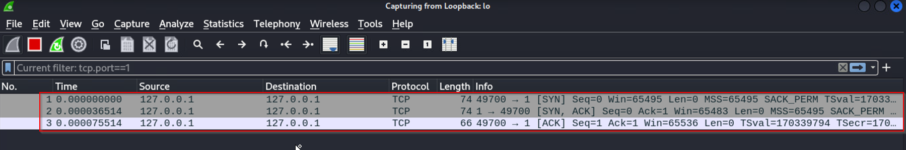

# Hasan Rhani

This repository contains my work on cyber security and ethical hacking.

## About Me

I am a devoted student with a deep passion for cyber security and ethical hacking. My areas of interest encompass penetration testing, networking, and server security.

I enjoy learning about how to test computer systems to make sure they are secure, how computer networks work, and how to keep servers safe. I have earned many certificates in these topics already, but I am eager to expand my knowledge further in this domain.

## My Work

- Network Security Engineer 
- Cybersecuriy Engineer 

I am always working on new projects, so please check back often.

## Contact Me

If you have any questions or feedback, please feel free to contact me:

* Email: rhanihasan@gmail.com
* LinkedIn: https://www.linkedin.com/in/hasan-rhani-767526210/
* Website: https://rhanihasan.github.io/journey/

## Thank You

Thank you for your interest in my work. I hope you find it helpful.

**TCP Half Connection**

In TCP communication, a "half connection" refers to the initial phase of establishing a connection between a client and a server. Here's a breakdown of the key components:

**Packet Level Analysis:**

**TCP Half Connection:**

| Packet Level      | Description                                 |
|-------------------|---------------------------------------------|
| Wireshark Filter  | tcp.port==1                                 |
| Source Address    | 127.0.0.1 (Client IP)                      |
| Source MAC Address| MAC1 (Client's MAC)                         |
| Source Port       | [Client's Dynamic Port]                    |
| Destination Address| 127.0.0.1 (Server IP - Loopback)           |
| Destination MAC Address| MAC2 (Server's MAC)                   |
| Destination Port  | [Server's Service Port]                    |
| Request/Response  | SYN Packet / Hello Packet                  |
|                   | SYN-ACK Packet                              |
|                   | ACK Packet                                  |

**Half Connection Sequence:**

1. **SYN Packet / Hello Packet:** The client initiates the connection by sending a SYN packet, often referred to as a "Hello Packet." This packet is used to request the server's attention and establish a connection.

2. **SYN-ACK Packet:** The server responds with a SYN-ACK packet, acknowledging the client's request and indicating its readiness to establish the connection.

3. **ACK Packet:** The client sends an ACK packet to confirm that it has received the server's response. This completes the initial handshake phase.

**Timeout:** If the server does not respond within a certain timeout period (e.g., 75 seconds), the request/response packets may be discarded, and the connection attempt may be considered unsuccessful.

- CLient to Server

- Server to Client

This process represents the "TCP Half Connection" phase.

**TCP Full Connection or Five-Way Handshake**

In a complete TCP connection, there's also a "Five-Way Handshake" that includes the termination of the connection:

- **FIN Packet:** To close the connection, either the client or the server sends a FIN (Finish) packet to signal the intention to terminate the connection.

- **If the TCP port is not open:** If the specified port on the server is not open or not listening, the server may respond with a RST (Reset) packet, indicating that the connection request is rejected.

