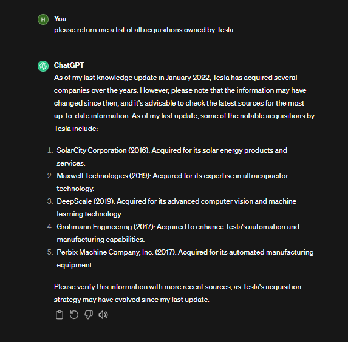

# Apex Domain Enumeration

## **Horizontal Enumeration Techniques for Comprehensive Website Discovery**

**What is Horizontal Enumeration ?**

Our main job is to list <mark style="color:blue;">**all the main websites owned by one company.**</mark> We want to know every website the company has open to the public. It's harder to find all the related sites or companies they bought because it involves a lot of detailed work and <mark style="color:blue;">**isn't always right.**</mark> Someone has to check everything by hand to be sure.

Finding related <mark style="color:blue;">**domains or acquisitions of a specific organization**</mark> can be difficult and may not always be accurate. It requires <mark style="color:blue;">**manual analysis and doesn't always guarantee right results.**</mark>

Companies like <mark style="color:orange;">**Google allow acquisitions,**</mark> but require that they own the <mark style="color:blue;">**target for more than 19 days**</mark>. This doesn't mean we should only start looking for bugs after 19 days; we should find bugs as soon as possible and report them at the right time.

<figure><figcaption><p>Horizontal Vs Vertical Domain</p></figcaption></figure>

### **1) Finding Related Domains/Acquisitions:**

* **WhoisXMLAPI:**
  * [WhoisXMLAPI](https://tools.whoisxmlapi.com/reverse-whois-search) helps find related websites and acquisitions based on WHOIS records.
  * Searching with the root domain name like **example.com** will give you a list of all the associated domains.


**These are not 100% accurate results, as they contain false positives**


**link**:- [https://tools.whoisxmlapi.com/reverse-whois-search](https://tools.whoisxmlapi.com/reverse-whois-search)

* [**Whoxy**](https://www.whoxy.com/)
  * is the cheapeast place  on the net for access to revwhois and whosi data.
  * Use Whoxy for revwhois and WHOIS data.
  *   Example:

      ```bash
      export WHOXY_API_KEY="API"
      whoxyrm -company-name "gitbook.io"
      ```
* [**whoxyrm**](https://github.com/MilindPurswani/whoxyrm)
* [**Crunchbase**](https://www.crunchbase.com/)**:**
  * Crunchbase is handy for company acquisitions.


Some features may require a paid subscription.


* Crunchbase is a good option for finding companies to buy, but you need to pay to see all the information. You can see some information with a free trial. Crunchbase gives details about people in a company, which could lead to social engineering. It also shows which company owns another and allows you to discover their main websites.
* Crunchbase and site like this **shodan, hunter.io** etc it will give the **acquisitions and phishing targets**&#x20;
* <mark style="color:blue;">**Acquisitional are the new Apex Domain**</mark>

.png>)

#### Using [MarketScreener](https://www.marketscreener.com/) for Acquisitions

MarketScreener  is a key resource for uncovering potential acquisitions, providing a wide array of financial data and insights on global companies.

1. Go to the target page.
2. Click "News."
3. Scroll all the way down.
4. Press `Ctrl + f`, then type "acquisition" to find it.


Shodan and Github Enumeration.

1.  Retrieve results from Crt.sh and query them on Shodan:

    ```bash
    crtsh "your_domain_here" | shodan search
    ```
2.  Search for SSL-certified websites belonging to "Company Inc" with HTTP 200 response:

    ```bash
    shodan ssl "Company Inc" port:443,80 http.status:200
    ```
3.  Look for login functionality in Shodan:

    ```bash
    shodan search "login" 
    ```
4.  Perform a new search for SSL certificates with a specific Common Name (CN) and HTTP 200 response:

    ```bash
    shodan ssl.cert.subject.CN:"example.com" port:443,80 http.status:200
    ```

    Note: Place the domain within quotation marks, not the organization name.
5.  Filter results in Shodan with HTTP and explore every prompt provided:

    ```bash
    shodan search "your_filter_here" --expand
    ```
6.  In GitHub, utilize the domain name and additional filters like "example.com" for sensitive information such as passwords, secrets, tokens, and more:

    ```bash
    github-dork -u "example.com" -s "passwd|pwd|pw|secret|token" 
    ```

    Note: Ensure you have the necessary tools like `github-dork` installed for GitHub dorking.

**1) Discovering IP Space:**

* Identify IP addresses associated with an organization using [Autonomous System Numbers (ASNs)](https://www.cloudflare.com/learning/network-layer/what-is-an-autonomous-system/).
* Example:


```
whois -h whois.radb.net -- '-i origin (ASN Number)' | grep -Eo "([0-9.]+){4}/[0-9]+" | uniq -u
```


[**ChatGPT**](https://chat.openai.com/)

You can leverage AI's for getting a list of acquisitions that are owned by a particular organization.

```
please return me a list of all acquisitions owned by comapany
```

<figure><figcaption><p>ChatGTP </p></figcaption></figure>


### 2) Discovering the IP space <a href="#id-2-discovering-the-ip-space" id="id-2-discovering-the-ip-space"></a>

An [Autonomous System Number (ASN)](https://www.cloudflare.com/learning/network-layer/what-is-an-autonomous-system/) is a unique ID for a group of IP addresses owned by organizations like Apple, GitHub, and Tesla. ASNs are used in a similar way to BGP (Border Gateway Protocol) AS. However, ASNs don't provide cloud service information as they're from different suppliers. To find undiscovered IP addresses linked to an organization, you can use the "[<mark style="color:blue;">**Hurricane**</mark>](https://bgp.he.net/)" tool. Once you know the ASN, you can check it with "[<mark style="color:blue;">**asmap**</mark>](https://github.com/projectdiscovery/asnmap)" from Project Discovery to confirm its details.

* is a useful website where we can query. Let's find ASN for Tesla INC**.**

<figure><figcaption><p>Hurricane Internet service</p></figcaption></figure>

After finding the ASN number of a company, our next step is to discover the IP addresses linked to that ASN. We'll do this with a tool called **whois.**


```
whois -h whois.radb.net -- '-i origin (ASN Number)' | grep -Eo "([0-9.]+){4}/[0-9]+" | uniq -u
```


**PTR Records (Reverse DNS):**

### 3) PTR records (Reverse DNS) <a href="#id-3-ptr-records-reverse-dns" id="id-3-ptr-records-reverse-dns"></a>

Reverse DNS is like looking up a phone number to find out who the number belongs to, but for websites. Normally, when you go to a website, your computer finds out the website's IP address (like a phone number for the website) from its name (like the person's name). Reverse DNS does the opposite: it starts with the IP address and finds out the website's name.

This means if we know an organization's IP addresses, we can find their websites. Cool, right?

**How does it work?** DNS PTR records (pointer record) make this possible. Using

[**dnsx**](https://github.com/projectdiscovery/dnsx)

We want to find out the website names for a specific IP address owned by **Apple Inc.** under **ASN714**, covering IP range. First, we need to install 2 tools to help us do reverse DNS queries to get these names.

```
go install -v github.com/projectdiscovery/mapcidr/cmd/mapcidr@latest
```

```
go install -v github.com/projectdiscovery/dnsx/cmd/dnsx@latest
```

When you input an IP range into **mapcidr**, it lists every IP address in that range, each on a new line. Then, **dnsx** takes each IP address, looks for its PTR record to perform a reverse DNS lookup, and if it finds one, it returns the hostname/domain name.

* Use `dnsx` to find website names for specific IP addresses.
*   Example:

    ```bash
    echo (IP_ADDRESS/Subnet) | mapcidr -cl | dnsx -ptr -resp-only -o output.txt
    ```


### 4) Favicon Enumeration

The small picture you see on the left side of a website tab is called **favicon.ico**. It's a little image that might be on another website or online service. You can find out if a website has this icon by looking at its source code.

<figure><figcaption><p>Favicon</p></figcaption></figure>

1. Search for the favicon.ico link by inspecting the source code and locating the keyword "favicon."
2. Utilize this information to identify various root domains.
3. Companies often use the same favicon across multiple domains for their web assets.
4. Conduct an Internet-wide search using Shodan to obtain all domains and IP addresses associated with web assets sharing a common favicon.

Fav-Up is a useful tool that automates the process of searching for a favicon's hash. The tool, FavUp.py, is written in Python and follows these steps when it runs:

1. Check the website's page source to find the favicon URL.
2. Retrieve the favicon.ico and generate a unique MurmurHash for it.
3. Use Shodan to search for IP addresses with the same favicon (http.favicon.hash:).

To implement this process, follow these steps:

```bash
# Clone the tool repository
git clone https://github.com/pielco11/fav-up.git

# Install required dependencies
pip3 install -r requirements.txt

# Initialize Shodan API key
shodan init APIKEY

# Run the tool on a specific website, e.g., www.github.com
python3 favUp.py -w www.github.com -sc -o output.json

# Extract found IP addresses from the output
cat output.json | jq -r 'try .found_ips' | sed "s/|/\n/g"
```

This script utilizes the "fav-up" tool to find IP addresses with the same favicon hash and outputs the results to a JSON file. The last command extracts and displays the found IP addresses from the JSON file.


You can tell it's a super effective method when the master of Recon shares about it on Twitter.



### 5) Cloud Recon <a href="#thats-it-done-with-horizontal-enumeration" id="thats-it-done-with-horizontal-enumeration"></a>

#### [Kaeferjaeger](https://kaeferjaeger.gay/)

The hacker group Karferjager checks all the big cloud providers, every IP address, and SSL certificate. They also have an offline option. Laws require Amazon and Oracle to share some information. The group then connects to these IP addresses (not websites) using port 443. Before moving forward, they scan these addresses on port 443, collect data, and organize it in a simple format called JSON.

1. Download this file and identify your targets.
2. Employ SSL and metadata to gather reconnaissance information on selected targets.
3. Examine what SSL certificates the targets have in the cloud.
4. Note that Cert.sh won't display self-signed certificates, but the mentioned approach does.
5. Kaeferjaeger focuses exclusively on scanning port 443.
6. Consider the possibility that certain web servers may operate on random ports like 8443.

### 6) Linked Discovery   <a href="#thats-it-done-with-horizontal-enumeration" id="thats-it-done-with-horizontal-enumeration"></a>

#### What are we after ?

* Linked Discovery can help in finding Apex Domain and subdomain
* count on using a spider recursively&#x20;

#### [GoSpider](https://github.com/jaeles-project/gospider)

```
gospider -S tld.txt -c 10 -d 1 --other-source -o gospider.txt
```

* [Katana](https://github.com/projectdiscovery/katana)
* [hakrawler](https://github.com/hakluke/hakrawler)
* Burpsuite Pro&#x20;

[**Rengine**](https://github.com/yogeshojha/rengine)

* reNgine is an automated reconnaissance framework for web applications

### 7)AD & Analytics Relationship

**Discovering Subdomains via Google Analytics ID**

Many organizations use Google Analytics to track website visitors and gather statistics. Importantly, they often employ the same Google Analytics ID across all subdomains of a root domain. This practice allows us to automate the enumeration of subdomains by identifying this shared Google Analytics ID. Let's explore how to achieve this:

1. **Understanding Google Analytics Usage:**
   * Organizations commonly utilize a single Google Analytics ID across all their subdomains.
2. **Manual Process with BuiltWith:**
   * BuiltWith is a browser extension known for this purpose. However, it involves a manual inspection and isn't suitable for large-scale tasks.
3. **Automated Enumeration with AnalyticsRelationships:**
   * AnalyticsRelationships is a command-line tool designed for automated subdomain enumeration via Google Analytics ID.
   * It doesn't require a login and efficiently analyzes AD analytics code.
   * This tool helps discover new information and validates phishing domains.
4. **Using AnalyticsRelationships:**
   *   Download the AnalyticsRelationships tool from the GitHub repository:

       ```bash
       git clone https://github.com/Josue87/AnalyticsRelationships.git
       ```
   *   Navigate to the tool directory and build it using Go:

       ```bash
       cd AnalyticsRelationships/GO
       go build -ldflags "-s -w"
       ```
   *   Execute the tool by specifying the target URL:

       ```bash
       ./analyticsrelationships --url https://www.company.com
       ```
5. **Considerations:**
   * The tool may yield false positives, so further verification is necessary.
   * DNS resolution may be required to validate the obtained subdomains.

By using AnalyticsRelationships, we can simplify the process of discovering subdomains associated with a particular organization through their Google Analytics ID.


### 8) TradeMarks

* By law in USA and UK its required to have a trade mark and some for copyright so they can't have stole the website.
* By google dorcking.

```
"© 2024 Websitetrademark, inc." inurl:company
```

&#x20;

### **That's it !!! Done with Apex Domain Enumeration** <a href="#thats-it-done-with-horizontal-enumeration" id="thats-it-done-with-horizontal-enumeration"></a>

**Liked my work? Don't hesitate to buy me a coffee XDD**
