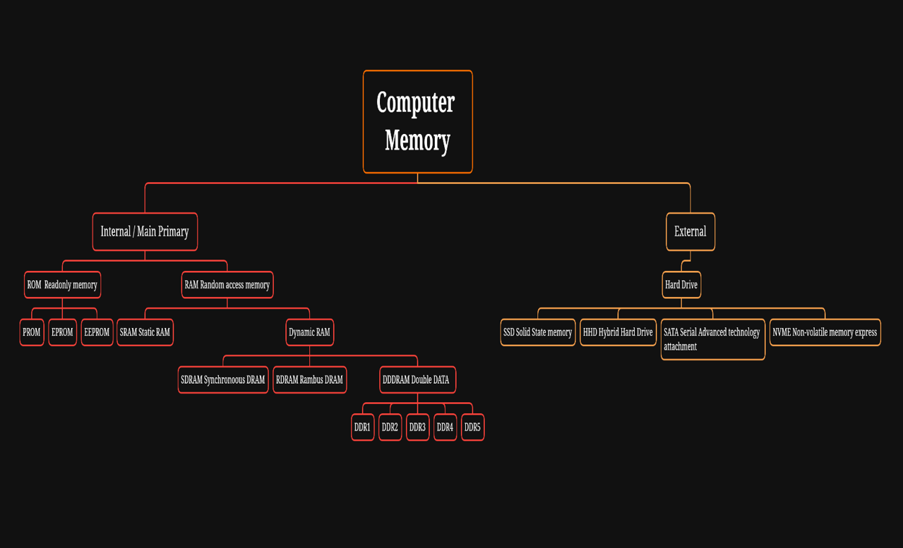

import Highlight from '@site/src/components/Highlight';
import Tabs from '@theme/Tabs';
import TabItem from '@theme/TabItem';

#  Fundamentails of Memory

---

<Tabs>
  <TabItem value="What is Memory" >
    It Stored data.
  </TabItem>
</Tabs>

## **Types of Memory**

- Internal Memory
- External Memory  

---

## **Internal Memory**

### **ROM**

### **What & Why ROM**

- Read Only Memory. 
- Small chip that doesn’t have a lot of space and does the task that it is programmed to do. It has a memory of 10mb, 12mb etc.
- Example: washing machine contains rom that tells it to set a timer and do different cycles for different amount of time, our phone shows the company name whenever it is switched on etc.

### **Type of ROM** 

<Tabs>
  <TabItem value="EPROM" >
    Erasable programmable read only memory. Rom that can be removed and erased and reprogrammed.
  </TabItem>
   <TabItem value="EEPROM" >
    Electrically erasable read only memory. Rom that can electrically erased and reprogrammed.
  </TabItem>
</Tabs>

---

### **RAM**

### **What & Why RAM**

Read Only Memory. 
Ram gives the cpu the files required for processing after retrieving it from the hard drive. Cache is present between ram and cpu.
It contains most used applications/data. It is faster than ram.
The information stored in this type of memory is lost when the power supply to the PC is switch off 

#### **Types of RAM**

- **Static:** 
    - SRAM. It is a type of cache. Expensive and very fast. Power is supplied from the machine.
    - Static Random-access memory, it doesn't need multiply power supply.
    - The information doesn’t deleted unit the user want to delete 
    - SRAM is a type of cache.

- **Dynamic:**
    - DRAM. Also known as DDR.
    - Works as normal ram. It is called dynamic because it keeps on getting refreshed continuously in a few seconds. 
    - Dynamic Random-access memory, 
    - It needs multiple times of power supply.
    - The information got deleted when PC is shutdown.

-  **Types of DRAM**

    - SDRAM 

        - Older RAMs could not be synced with the system and hence could not generate logs.
        - This would also pose difficulties to see how fast it is performing, Hence SDRAM was created. It stands for Synchronized DRAM.
        - It gives information of how long a service runs. Speed: 133 MHz Synchronous Dynamic Random-access memory.
        - SDRAM can't sync with system time and doesn’t work in heavy apps.

    - RDRAM 

        - speed: 1GHz. Rambus dynamic ram.
        - Private company create this RDRAM.
        - RDRAM can take heavy task in 1990s.

    - DDR RAM
        - Double Data Rate
        -  Updated sdram that was faster. Most phones have DDR4 nowadays.
    
> DDR1, DDR2, DDR3, DDR4, DDR5, DDR6(also known as GDDR6)

> To check vendors, we can right click on this pc, manage, device manager.

|DDR| Details |
|---|---|
|In DDR1| we can put 2gb RAM. |
|DDR1 | date is 1998 , Voltage is 25/2.6 , BandwidthSpeed is 1600.|
|DDR2| 2 x 2 = 4gb ram|
|DDR2 | date is 2003, Voltage is 1.8, BandwidthSpeed is 2133|
|DDR3| 2 x 2 x 2 = 8 gbram|
|DDR3 | date is 2007, Voltage is 1.5/1.35 , BandwidthSpeed is 2666.|
|DDR4 | date is 2014, Voltage is 1.2/1.05, BandwidthSpeed is 3200.|
|DDR6| 2 x 2 x 2 x 2 x 2 x 2 = 64gb ram.|

|Laptops have different number of slots where ram can be inserted. These slots are called dimm slots. You can check the number of dimm slots in your laptop by going to task manager.|
|---|

- DDRRAM has type
    - DDR1, DDR2, DDR3, DDR4 
    - DDR1 has created by IBM 

- CPU 
    - Central Processing Unit. 
    - A CPU has multipy Cores. Cores are called the brain .
    - Cores type : Single core, Dual core , Quad Core , Octa core, Hexa core , Deca core.

- NIC Card 
    - Network Interface Controller/Network Adopter.
    - NIC is a computer hardware component that connect a computer to a computer network.
    - NIC has MAC-Addr Not computer has MAC-Addr.

- GPU 
    - Graphics Processing Unit
    - GPU is used in a wide range of apps including graphics and videos rendering. Although they best known for their capabilities in opening.

---

## **External Memory** 

### **HardDrive**

#### **What & Why HardDrive**

- First created by IBM. Had a capacity of 5mb. 
- All data is stored here

#### **Types of HardDrive**

- **HDD** 
    - Hard Disk Drive
    - If the disk in it is cracked or bent, the data won't be recovered
    - Takes more power and requires more space.
- **SDD**
    - Solid State Drive. 
    - Very compact and fast. Data is recoverable. 

:::note
These harddrives are connected to SATA drive. (pata --> sata) pata was used before sata and was slower. Sata : serial ata.
:::

  
<Tabs>
  <TabItem value="LPDDR" label="LPDDR" >
    Low Power Double Data Rate which is mostly used in Phones.
  </TabItem>

  <TabItem value="DIMM" label="DIMM">
    Dual In-Line Memory Module Which is used in Laptops & DIMM is memory module comprised of a small-side circuit board that holds a series of memory called DRAM
  </TabItem>
</Tabs>

---

### **Cables**

<Tabs>
  <TabItem value="PATA" label="PATA Cable" >
   It  was first cable in industry to tranfer data from Hard drive to ram (upto 1GB)
  </TabItem>

  <TabItem value="SATA" label="SATA Cable">
    It was invented after pata Cable, it is also use to share data form HDD to RAM (like upto 2GB)
  </TabItem>
  <TabItem value="M2" label="M2">
    It is also a data cable and more efficient than SATA cable (upto 4GB).
  </TabItem>
     <TabItem value="NVME" label="NVME" >
   Non-Volatile Memory Express which is all in newly and lasted cable used to transfer data from HDD/SDD to RAM.
  </TabItem>
</Tabs>

<code>
User ==> Hard drive ==> Video ==>Play Video ==> CPU Command ==> RAM ==> Hard drive Software ==> Pickup ==> Video Played
</code>

||
|---| 