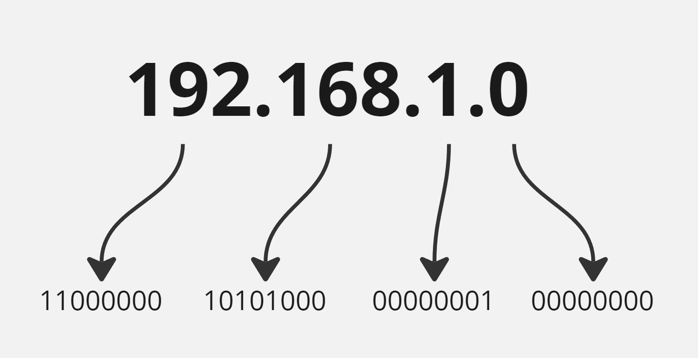
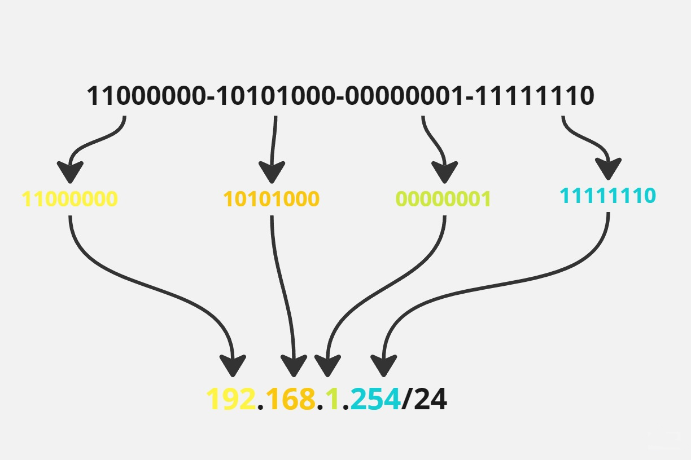
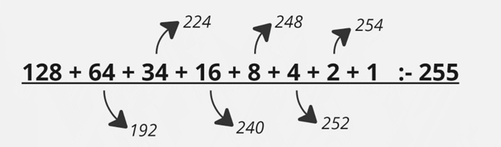
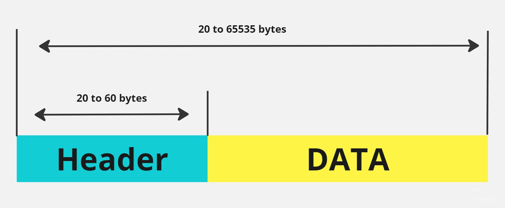
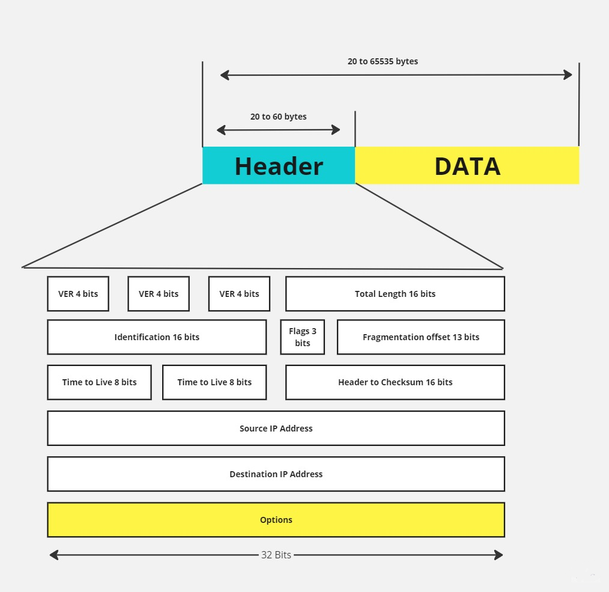

import Tabs from '@theme/Tabs';
import TabItem from '@theme/TabItem';
import Highlight from '@site/src/components/Highlight';

# IP Address & Subnetting

---

## IP & MAC

- Internet Protocols.
- Internet Assigned Number Authority.
- IP Address is a Network Identity. It's an ID in the network.
- MAC is a Device Identity.

Devices need to find each other on a network to establish communications. These devices use unique addresses, or identifiers, to locate each other. These addresses ensure that communication happens with the right device. These are called IP and MAC addresses.

**Example of IP and MAC:** A company gives you an ID card called an IP address. Your personal identity is called a MAC address. The company hires you based on your MAC address, and then you get an IP address.

### IP Address Versions

- IP Address has IPv4 and IPv6 versions.
- IPv4 is made of 4 blocks, each block holds 8 bits.
- IPv4 only uses decimal numbers.
- IPv6 was introduced due to IPv4 shortages.
- IPv6 is made of 8 blocks, each block holds 16 bits.
- IPv6 uses hexadecimal numbers.

**IP stands for Internet Protocol.**

IP addresses were created and assigned by the IANA Organization (Internet Assigned Numbers Authority). They provide addresses that control access.

**Versions:**
- IPv1
- IPv2
- IPv3
- IPv4 & IPv6 are successful and working.

IANA is responsible for distributing IP addresses globally.

### IP Address Classes

| Class   | Range                | Details                           |
| ------- | -------------------- | --------------------------------- |
| Class A | 1.0.0.0 - 126.255.255.255 | Used By ISP & its Public IP    |
|         | 127.0.0.1               | NIC Card check (Loopback)       |
| Class B | 128.0.0.0 - 191.255.255.255 | Used By ISP & its Public IP    |
| Class C | 192.0.0.0 - 223.255.255.255 | Used By ISP & its Public IP    |
| Class D | 224.0.0.0 - 239.255.255.255 | Network Device Communication    |
| Class E | 240.0.0.0 - 255.255.255.255 | Research Centers                |

- Address range: 0-255.0-255.0-255.0-255.
- Dynamic combination.
- First & last part should not be zero.
- ISPs can use Class A, B, or C.
- Last number zero indicates network.
- One IP can maintain 65,535 devices (connection & port numbers).

**Note:** Due to increased electronic devices, IP address shortage led IANA to introduce Private Addresses with NAT.

### Types of IP Address

1. **Public:** Used on the internet. No simultaneous identical IP and port for two machines.
2. **Private:** Used in LAN. Different LANs can have the same IPs. Machines in LAN can't access the web.

### NAT (Network Address Translation)

Converting private IP addresses into public IP addresses.
Private IP addresses work under LAN but need NAT to access WAN.

### Private IP Address IPv4

| Class   | Range                | Hosts                     |
| ------- | -------------------- | ------------------------- |
| Class A | 10.0.0.0 - 10.255.255.255 | 16,777,216 IP addresses |
| Class B | 172.16.0.0 -172.32.255.255 | 1,948,576 IP addresses  |
| Class C | 192.168.0.0 - 192.168.255.255 | 65,536 IP addresses     |

These are private addresses for local network use. They can't access the internet directly. Private IPs are converted to public for internet access.

### Dig up IP Address

- IPv4 is divided into 4 parts, 0-255.0-255.0-255.0-255.
- Each part has 8 bits.
- IPv4 has a total of 32 bits.
- Each part ranges from 0-255.
- IP can't start or end with 0 but can have 0 in other places.
- IP ending with 0 represents the network.

||
|---|

---

## Subnet

### What & Why Subnet

- Subnetting divides big networks.
- Subnetting controls IP addresses.
- Subnets are the bits within an IP address.

**Example:** 192.168.1.0 has a subnet mask of 255.255.255.0, which provides 65,536 IP addresses as free addresses in LANs.

||
|---|

## What & Why Subnetting

- Subnetting involves dividing subnets.
- Network bits are fixed and cannot be changed.
- Host bits are changeable.

### Example:

- **Class A:** 10.0.0.0
  - Network bits: 10
  - Host bits: 0.0.0. (32 - 8 = 24 host bits)
  - Class A 10.0.0.0 has 8 network bits and 24 host bits.

- **Class B:** 172.16.0.0
  - Network bits: 172.16
  - Host bits: 0.0. (32 - 16 = 16 host bits)
  - Class B 172.16.0.0 has 16 network bits and 16 host bits.

- **Class C:** 192.168.1.0
  - Network bits: 192.168.1
  - Host bits: 0. (32 - 24 = 8 host bits)
  - Class C 192.168.1.0 has 24 network bits and 8 host bits.

## Formula for Subnet Mask Calculation

|   N   |  2^n   |
|:-----:|:------:|
|   0   |    1   |
|   1   |    2   |
|   2   |    4   |
|   3   |    8   |
|   4   |   16   |
|   5   |   32   |
|   6   |   64   |
|   7   |  128   |

N = 1 + 2 + 4 + 8 + 16 + 32 + 64 + 128 = 255

### Network Bits and Host Bits for Each IP Class:

#### Class A

| 10. | 0. | 0. | .0 |
|:---:|:--:|:--:|:--:|
| 128+64+32+16+8+4+2+1 | 128,64,32,16,8,4,2,1 | 128,64,32,16,8,4,2,1 | 128,64,32,16,8,4,2,1 |
| 255 | 0 | 0 | 0 |
| Network Bits | Host Bits | Host Bits | Host Bits |

#### Class B

| 172. | 16. | 0. | .0 |
|:----:|:---:|:--:|:--:|
| 128+64+32+16+8+4+2+1 | 128+64+32+16+8+4+2+1 | 128,64,32,16,8,4,2,1 | 128,64,32,16,8,4,2,1 |
| 255 | 255 | 0 | 0 |
| Network Bits | Network Bits | Host Bits | Host Bits |

#### Class C

| 192 | 168. | 1. | .0 |
|:---:|:----:|:--:|:--:|
| 128+64+32+16+8+4+2+1 | 128+64+32+16+8+4+2+1 | 128+64+32+16+8+4+2+1 | 128,64,32,16,8,4,2,1 |
| 255 | 255 | 255 | 0 |
| Network Bits | Network Bits | Network Bits | Host Bits |

||
|---|

Certainly! Here's the provided text formatted in markdown:

## Subnet Address

| Number/ | Range             | Details                  |
|:-------:|:-----------------:|:------------------------:|
| /8      | 255.0.0.0         | Default of Class A Network ID |
| /9      | 255.128.0.0       |                           |
| /10     | 255.192.0.0       |                           |
| /11     | 255.224.0.0       |                           |
| /12     | 255.240.0.0       |                           |
| /13     | 255.248.0.0       |                           |
| /14     | 255.252.0.0       |                           |
| /15     | 255.254.0.0       |                           |
| /16     | 255.255.0.0       | Default of Class B Network ID |
| /17     | 255.255.128.0     |                           |
| /18     | 255.255.192.0     |                           |
| /19     | 255.255.224.0     |                           |
| /20     | 255.255.240.0     |                           |
| /21     | 255.255.248.0     |                           |
| /22     | 255.255.252.0     |                           |
| /23     | 255.255.254.0     |                           |
| /24     | 255.255.255.0     | Default of Class C Network ID |
| /25     | 255.255.255.128   |                           |
| /26     | 255.255.255.192   |                           |
| /27     | 255.255.255.224   |                           |
| /28     | 255.255.255.240   |                           |
| /29     | 255.255.255.248   |                           |
| /30     | 255.255.255.252   |                           |
| /31     | 255.255.255.254   |                           |
| /32     | 255.255.255.255   | Default Universal Broadcast ID |

### Formula for Subnet Mask

**Class A**
10.0.0.0 has 8 Network Bits and 24 Host Bits.
Host Bits [24] – Total Subnet = Converted Host Bits.
Network Bits [8] + Converted Host Bits = Subnet Mask.

**Class B**
172.16.0.0 has 16 Network Bits and 16 Host Bits.
Host Bits [16] – Total Subnet = Converted Host Bits.
Network Bits [16] + Converted Host Bits = Subnet Mask.

**Class C**
192.0.0.0 has 24 Network Bits and 8 Host Bits.
Host Bits [8] – Total Subnet = Converted Host Bits.
Network Bits [24] + Converted Host Bits = Subnet Mask.

## FLSM (Fixed Length Subnet Mask)

### What & Why FLSM

- FLSM stands for Fixed Length Subnet Mask.
- Its subnet size can't be changed; also known as Fixed Size.
- FLSM means a large IP can be divided into an equal number of smaller networks. For example, the network can be divided into 4 subnets, each with 40 IPs.

## VLSM (Variable Length Subnet Mask)

### What & Why VLSM

- VLSM stands for Variable Length Subnet Mask.
- VLSM allows us to allocate IPs according to our needs.

We start from the networks with the highest requirement.

| Required IPs | Default Subnet Mask | Network Bits | Host Bits | Usable IPs | Subnet Mask (Bit Count) | Subnet Mask | IP Range                 |
|--------------|---------------------|--------------|-----------|------------|------------------------|-------------|--------------------------|
| 40           | 255.255.255.0       | 24           | 8         | 62         | 8 - 6 = 2 (Subnet /26) | 255.255.255.192 | 192.168.1.0 - 192.168.1.63 |
| 30           | 255.255.255.0       | 24           | 8         | 30         | 8 - 5 = 3 (Subnet /27) | 255.255.255.224 | 192.168.1.64 - 192.168.1.95 |
| 20           | 255.255.255.0       | 24           | 8         | 14         | 8 - 4 = 4 (Subnet /28) | 255.255.255.240 | 192.168.1.96 - 192.168.1.111|

### Example Binary Representation

| 128 | 64 | 32 | 16 | 8 | 4 | 2 | 1 |
|-----|----|----|----|---|---|---|---|
| 0   | 0  | 1  | 1  | 1 | 1 | 1 | 1 |

---

## Format of an IPv4 Packet

### Format of an IP Version 4: The Header & the Data

||
|---|

- The size of the IP header ranges from 20 to 60 bytes.
- The header includes the IP routing information that devices use to direct the packet.
- The length of the data section of an IPv4 packet can vary greatly in size. However, the maximum possible size of an IP packet is 65,536 bytes. It contains the message being transferred to the transmission, like website information or email text.
- 
||
|---|

## IPv6

### What & Why IPv6

IPv6 was introduced to address the shortage of IPv4 addresses.
- The size of IPv6 addresses is 128 bits.
  - IPv4 has four octets (e.g., 192.168.1.0), with each octet consisting of 8 bits, totaling 32 bits.
  - IPv6 has 8 segments, each part being 16 bits.
- Example: `ffff:abcd:shsh:8587:7632:agsv:asuy:8362`
  - 16x8 = 128 bits.
- IPv6 is classless.
- IPv6 is not an upgraded version of IPv4; both are different.
- Larger Address
  - Header Size
    - IPv4 has 20 bytes.
    - IPv6 has 40 bytes.
  - 128 bits + additional information = 40 bytes.
  - IPv4 has 16 information sections to read.
  - IPv6 has 8 information sections to read.
- NAT is not required.
  - IPv4 had Private & Public IP concepts to address the IP shortage, but IPv6 provides an abundance of IPs.
- IPv6 supports Stateful, Stateless, and automatic IP generation using MAC addresses (PCs can automatically generate IPs through their own MAC addresses).
- IPv4 supports Unicast, Multicast, Broadcast, while IPv6 has Unicast, Multicast, Anycast (nearby devices), but no Broadcast.
  - Example:
    - Phone -> Airtel Tower -> Provided IP [random]
    - In IPv6, even if the location changes, the IP may not change; however, an ISP like Airtel could provide an option to maintain the same IP for payment.
  - Location changing in IPv6 doesn't necessarily result in IP changes.
- VPN supports IPv6 features.

---