import Tabs from '@theme/Tabs';
import TabItem from '@theme/TabItem';
import Highlight from '@site/src/components/Highlight';

# Networking Protocol & Services

---

### What & Why Network Protocol ?

Network protocols are like rules and regulations for communication between computers and devices on a network. When multiple machines are connected in a network, there need to be rules in place to determine which machines can provide services and which ones can access those services.

Think of network services as the functionalities or features that a network can offer. To make using these services easier and organized, specific rules and protocols are created. It's similar to how railways provide services to the public, but passengers need to follow ticketing rules and regulations to use those services. In the context of a network, services might include things like file sharing, web browsing, email, or video conferencing, and there are protocols in place to ensure these services work smoothly and securely.

## Communication Protocols

Communication protocols are the rules governing network communication. They determine how data travels between devices, when it occurs, and even help recover lost data. Below are some important communication protocols:

- **TCP/IP:** This protocol powers the internet, ensuring data reaches its intended destination.

- **HTTP/HTTPS:** Used for web browsing. HTTPS offers enhanced security.

- **SMTP/POP3/IMAP:** These protocols are used for email. SMTP sends emails, while POP3 and IMAP receive them.

- **FTP:** Used for sharing files over the internet.

More..

### TCP (Transmission Control Protocol)

- **TCP** is like the conversation manager of the internet.
- Known as a **'Stateful Protocol'** because it ensures confirmation of receipt.
- It helps devices connect and send data reliably.
- It uses a **three-way handshake** to initiate a connection:
  1. A sends a SYN (Synchronize) request to B.
  2. B responds with a SYN/ACK (Synchronize/Acknowledge) to A.
  3. A sends an ACK (Acknowledge) back to B.
- This handshake establishes a secure connection.
- TCP operates at the transport layer in the TCP/IP model.
- It's assigned **protocol number 6** in the IP world.
- TCP carries data in packets, with the packet having a **protocol number of 6** in its header.
- When the conversation ends, there's a graceful closing called a **five-way handshake**:
  1. A sends a FIN (Finish) packet to B.
  2. B replies with a FIN/ACK packet.
  3. A acknowledges with an ACK packet.
- This ensures a clean connection close.
- TCP ensures your data reaches its destination safely and in order.

### UDP (User Datagram Protocol)

- **UDP** is like sending postcards in the mail.
- It's quick but doesn't guarantee delivery.
- Protocol number: **17**.
- Uses an **8-byte header/flag**.
- Known as a **'Stateless Protocol'** because it doesn't receive confirmation of receipt.
- Ideal for applications where speed is crucial, such as streaming media.
- UDP operates at the transport layer in the TCP/IP model.
- Perfect for applications like online gaming.

In summary, **TCP** ensures reliable and ordered data delivery, **UDP** prioritizes speed, 

### HTTP (Hypertext Transfer Protocol)

- **HTTP** is like a language for web browsers and servers.
- It facilitates communication between your browser and websites.
- Uses **port 80**.
- HTTP is considered insecure, so it's being replaced by **HTTPS** for security.
- However, HTTP is still used by some websites.
- HTTP operates at the application layer in the TCP/IP model.

**Management Protocols**

Management protocols are like network supervisors, helping monitor and optimize network activity. Here are a couple of important ones:

- **SNMP (Simple Network Management Protocol):**
  - Manages and monitors devices on a network.
  - Can change device configurations and check bandwidth usage.
  - Occurs at the application layer in the TCP/IP model.

- **ICMP (Internet Control Message Protocol):**
  - Used to report data transmission errors between devices.
  - Often used for troubleshooting with the "ping" command.
  - Occurs at the internet layer in the TCP/IP model.

**Security Protocols**

Security protocols are like digital bodyguards for your data. They ensure secure communication:

- **HTTPS (Hypertext Transfer Protocol Secure):**
  - Provides secure communication between clients and websites.
  - Uses SSL/TLS encryption to protect data.
  - Operates at the application layer and uses port 443 in the TCP/IP model.

- **SFTP (Secure File Transfer Protocol):**
  - Securely transfers files over a network.
  - Uses SSH with encryption to prevent interception.
  - Occurs at the application layer and commonly used with cloud storage.

**Address Resolution Protocol (ARP)**

- ARP is like a translator between IP and MAC addresses.
- It finds the MAC address for a given IP address.
- Helps devices communicate on the same network.
- Works at the internet layer in the TCP/IP model.

Management protocols keep networks running smoothly, security protocols protect data, and ARP helps devices talk to each other effectively.

## **Ports**

Ports are like the doors and windows Or Gates of the digital world. They allow communication between devices and services on a network. 

**Types of Ports:**

- **Physical Ports:** These are like the physical connectors on your devices, such as Ethernet, USB, or AUX ports.

- **Virtual Ports:** These are logical channels for data to flow through software. There are 65535 of them, and 1024 are commonly reserved for specific services.

**TCP and UDP:**

- Both virtual and physical ports have two roads: TCP and UDP,Then Both ways have 65535 roads.

- **TCP (Transmission Control Protocol):** It's like a reliable, guaranteed delivery service. It ensures data won't be lost during transmission.

- **UDP (User Datagram Protocol):** This is more like a speedy courier. It's fast but doesn't guarantee delivery; some data may be lost.

**Rules and Regulations:**

- **TCP:** Promises not to drop your data, ensuring it gets to the destination intact.

- **UDP:** Can't guarantee data won't be dropped, but it's faster for things like real-time streaming.

**Server and Client:**

- **Server:** Software that provides services, like HTTP, MySQL, FTP, or SSH.

- **Client:** Software that uses those services, like web browsers, database clients, FTP clients, or SSH clients.

- Servers and clients communicate through ports to access and exchange data and services.

In the digital world, ports are like doors, and TCP/UDP are the rules for delivery, allowing servers and clients to talk and share data.

### **TCP Half Connection**

In TCP communication, a "half connection" refers to the initial phase of establishing a connection between a client and a server. Here's a breakdown of the key components:

**Packet Level Analysis:**

**TCP Half Connection:**

| Packet Level      | Description                                 |
|-------------------|---------------------------------------------|
| Wireshark Filter  | tcp.port==1                                 |
| Source Address    | 127.0.0.1 (Client IP)                      |
| Source MAC Address| MAC1 (Client's MAC)                         |
| Source Port       | [Client's Dynamic Port]                    |
| Destination Address| 127.0.0.1 (Server IP - Loopback)           |
| Destination MAC Address| MAC2 (Server's MAC)                   |
| Destination Port  | [Server's Service Port]                    |
| Request/Response  | SYN Packet / Hello Packet                  |
|                   | SYN-ACK Packet                              |
|                   | ACK Packet                                  |

|**Half Connection Sequence:**|
|--|
|**SYN Packet / Hello Packet:** The client initiates the connection by sending a SYN packet, often referred to as a "Hello Packet." This packet is used to request the server's attention and establish a connection.|
|**SYN-ACK Packet:** The server responds with a SYN-ACK packet, acknowledging the client's request and indicating its readiness to establish the connection.|
|**ACK Packet:** The client sends an ACK packet to confirm that it has received the server's response. This completes the initial handshake phase.|
|**Timeout:** If the server does not respond within a certain timeout period (e.g., 75 seconds), the request/response packets may be discarded, and the connection attempt may be considered unsuccessful.|
|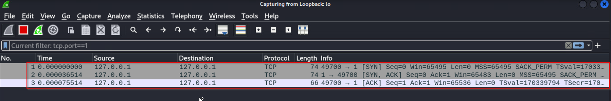|
|**CLient to Server**|
|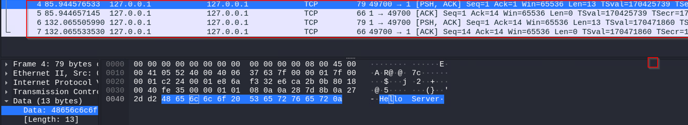|
|**Server to Client**|
|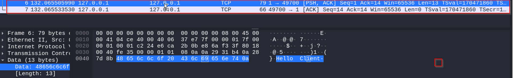|
|This process represents the "TCP Half Connection" phase.|

|**TCP Full Connection or Five-Way Handshake**|
|---|
|In a complete TCP connection, there's also a "Five-Way Handshake" that includes the termination of the connection:|
|**FIN Packet:** To close the connection, either the client or the server sends a FIN (Finish) packet to signal the intention to terminate the connection.|
|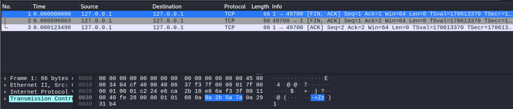|
|**If the TCP port is not open:** If the specified port on the server is not open or not listening, the server may respond with a RST (Reset) packet, indicating that the connection request is rejected.|
|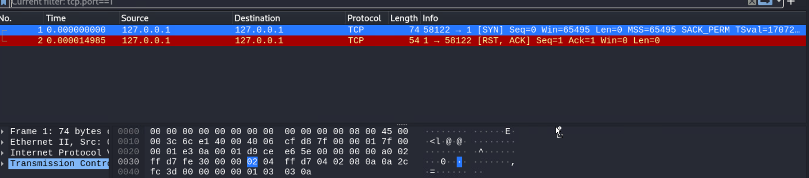| 

### UDP (User Datagram Protocol)

- To use UDP, you can use the `-u` option.
- When monitoring UDP traffic with Wireshark, you can use the filter `udp.port==1`.
- The application layer will be visible when you enter the conversation.

|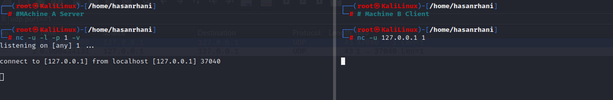|
|---|
|**Request and Response Packets**|
||
|**Client Saying Hello to Server**|
|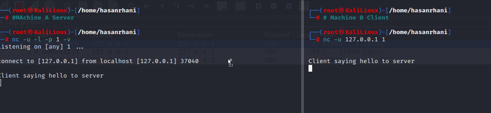|
|**Wireshark Capture:**|
||
|**Server Saying Hello to Client**|
|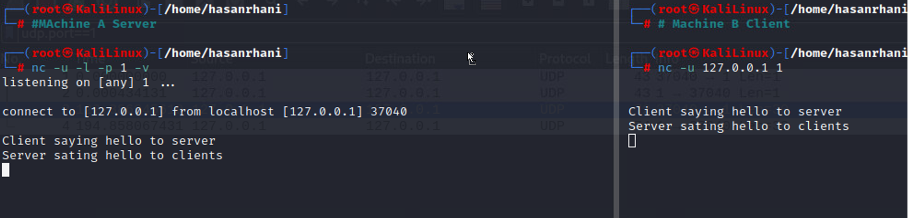|
|**Wireshark Capture:**|
|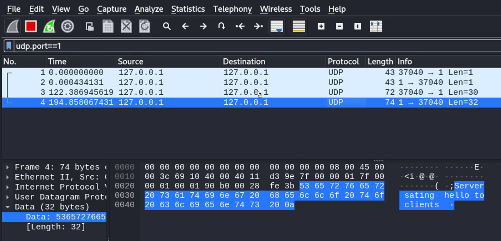|

- If both the client and server close the UDP connection, packets will not be generated.
- UDP communication is based on request and response.
- Port number 0 is used when there's no specific port assigned. In such cases, the operating system or application dynamically assigns an available port. This is particularly useful when connecting with multiple tabs in a browser or handling multiple simultaneous communications.

### ICMP (Internet Control Message Protocol)

ICMP is a network layer protocol primarily used for diagnosing network-related issues and checking connectivity between devices on a network. It provides two main services

## Services and Protocols

#### **Protocols** have their own rules and regulations, and the same applies to **services** as well. Services depend on protocols, meaning that to use software applications or deploy services, they must adhere to the rules and regulations of both the protocol and the service.

### ARP (Address Resolution Protocol)

- Each device on the network performs **ARP** (Address Resolution Protocol) and maintains an **ARP cache**, which keeps track of matching IP and MAC addresses. ARP does not have a specific port number.

### Telnet

- **Telnet** is an application layer protocol that enables a device to communicate with another device or server. Telnet sends all information in clear text, making it less secure. It uses command-line prompts to control another device, similar to **Secure Shell (SSH)**. Telnet can be used to connect to local or remote devices and typically uses **TCP port 23**.

### Secure Shell (SSH)

- **Secure Shell (SSH)** is an application layer protocol used to establish secure connections with remote systems. This protocol provides secure authentication and encrypted communication, making it a more secure alternative to Telnet. SSH operates over **TCP port 22** and is used to replace less secure protocols like Telnet.

You've provided information about various email-related protocols. Here's the content formatted in Markdown:

## Email Protocols

### Post Office Protocol (POP)

- **POP (Post Office Protocol)** is an application layer protocol (Layer 4 of the TCP/IP model) used to manage and retrieve email from a mail server.
- Many organizations have dedicated mail servers that handle incoming and outgoing mail for users on the network.
- User devices send requests to the remote mail server to download email messages locally.
- POP operates over **TCP/UDP port 110** for unencrypted, plaintext authentication, and **TCP/UDP port 995** over **Secure Sockets Layer/Transport Layer Security (SSL/TLS)** for encrypted emails.
- With POP, mail must finish downloading on a local device before it can be read, and it doesn't allow users to sync emails.

### Internet Message Access Protocol (IMAP)

- **IMAP (Internet Message Access Protocol)** is used for incoming email. It downloads email headers but not the content.
- Email content remains on the email server, allowing users to access their email from multiple devices.
- IMAP uses **TCP port 143** for unencrypted email and **TCP port 993** over **TLS** for encrypted email.
- IMAP allows users to partially read email before it finishes downloading and supports email synchronization. However, it is typically slower than POP3.

### Simple Mail Transfer Protocol (SMTP)

- **SMTP (Simple Mail Transfer Protocol)** is used to transmit and route email from the sender to the recipient's address.
- SMTP works with **Message Transfer Agent (MTA)** software, which resolves email addresses to IP addresses using DNS servers to ensure emails reach their intended destination.
- SMTP uses **TCP/UDP port 25** for unencrypted emails and **TCP/UDP port 587** using **TLS** for encrypted emails.
- TCP port 25 is often associated with high-volume spam, but SMTP helps filter out spam by regulating how many emails a source can send at a time.

## Services

### Ping

- **Purpose**: Ping is used to check the connectivity of a network or a specific device on the network.

- **Protocol Rules**: Ping follows specific protocol rules to measure various aspects of network connectivity, such as determining whether messages are delivered, counting the timing of message delivery, and identifying packet loss or network downtime.

- **Methods**: Ping uses two primary methods - ECHO and Echo Reply.

#### ICMP Echo (Request)

| Field                   | Description                                |
|-------------------------|--------------------------------------------|
| Source Address          | IP address of the source device            |
| Source MAC Address      | MAC address of the source device           |
| Source Port             | Source port (N/A for ICMP)                 |
| Destination Address     | IP address of the destination device       |
| Destination MAC Address | MAC address of the destination device      |
| Destination Port        | Destination port (N/A for ICMP)            |
| ICMP Code               | Specific code for ICMP Echo (Request)      |
| Data                    | Data payload                               |

#### ICMP Echo Reply (Response)

| Field                   | Description                                |
|-------------------------|--------------------------------------------|
| Source Address          | IP address of the responding device        |
| Source MAC Address      | MAC address of the responding device       |
| Source Port             | Source port (N/A for ICMP)                 |
| Destination Address     | IP address of the original sender          |
| Destination MAC Address | MAC address of the original sender         |
| Destination Port        | Destination port (N/A for ICMP)            |
| ICMP Code               | Specific code for ICMP Echo Reply (Response)|
| Data                    | Data payload                               |

### Traceroute

- **Purpose**: Traceroute is used to identify the path that network packets take from the source device to the destination address. It helps in understanding the route taken by packets and can be useful in diagnosing network routing issues.

- **How it Works**: Traceroute sends a series of packets with increasing Time-to-Live (TTL) values. Each router along the path decrements the TTL value. When the TTL reaches zero, the router sends an ICMP Time Exceeded message back to the source device. By analyzing these messages, Traceroute can determine the route and delays involved in reaching the destination.

**ICMP**, particularly **Ping** and **Traceroute**, is valuable for network troubleshooting and monitoring network performance. These tools provide essential insights into network connectivity and routing.

You've provided a comprehensive overview of the Domain Name System (DNS) and its various aspects. DNS is indeed a critical protocol that plays a central role in translating human-readable domain names into IP addresses, making it easier for us to access websites and services on the internet.

**DNS**

- Domain Name System uses port 53 works on UDP protocol mostly but also works on TCP.
- Domain Name System (DNS) is a protocol that translates internet domain names into IP addresses. When a client computer wishes to access a website domain using their internet browser, a query is sent to a dedicated DNS server. The DNS server then looks up the IP address that corresponds to the website domain. DNS normally uses UDP on port 53. However, if the DNS reply to a request is large, it will switch to using the TCP protocol. In the TCP/IP model, DNS occurs at the application layer.

#### Why DNS come?
- Because all the device /router/ any machine understand binary, and we humans are not good in remembering numbers/IP Addrs. That why DNS comes and helps, It requery Numbers / IP Addrs into Names 
 
#### DNS Types 
- DNS has Multiply types of Records 
  - A record: Is requery for IPv4
  - AAAA record : is requery for IPv6
  - MX record [mail server record ]:  it specifies the mail server responsible for accepting incoming emails.
  - Name server Record: It provides information about authoritative name servers for a domain.
  - CNAME Record: Redirector [One server domain redirect to Different Server domain], It acts as a redirector, redirecting one server domain to a different server domain.
 
:::note
The latest and best which is used in Current Network environment is QUIC Protocol !!.
:::

| **DNS Request Packet** |                    | **DNS Response Packet** |                    |
|------------------------|--------------------|--------------------------|--------------------|
| **Source Address:**    | 127.0.0.1          | **Source Address:**      | 127.0.0.1          |
| **Source MAC Address:**| MAC1               | **Source MAC Address:**  | MAC1               |
| **Source Port:**       | 53                 | **Source Port:**         | 53                 |
| **Destination Address:**| 8.8.8.8            | **Destination Address:** | 127.0.0.1          |
| **Destination MAC Address:**| MAC2         | **Destination MAC Address:**| MAC1             |
| **Destination Port:**  | 53                 | **Destination Port:**    | 53                 |
| **Request:**           | Nasa.com           | **Response:**            | 200.1.1.10         |
| **DATA:**              | [Additional data]  | **DATA:**                | [Additional data]  |

#### Configuration 
:::note
The configuration/CMD may very as per OEMs
:::
1.	**ip dns server [enable to act as a DNS server]**: This command typically enables the device to act as a DNS server. It allows the device to respond to DNS queries from clients on the network. Enabling this feature allows the device to perform DNS resolution.
2. **ip dns server gateway**: This command might specify the gateway or route for DNS traffic. It could indicate the path that DNS requests should take when leaving the local network.
3.	**ip host www.google.com [Name of Site] 192.168.10.50 [IP address of that host]**: This command configures a static DNS mapping. It associates the hostname "www.google.com" with the IP address "192.168.10.50." This is useful for cases where you want to manually specify DNS mappings for specific hosts on your network.
4.	**show running-configure | s ip host | ip dns**: This command displays the running configuration of the device and filters the output to show lines containing "ip host" or "ip dns." It allows you to view the current DNS-related configuration settings.

### Dynamic Host Configuration Protocol
 
- **Dynamic Host Configuration Protocol (DHCP)** is in the management family of network protocols. DHCP is an application layer protocol used on a network to configure devices. It assigns a unique IP address and provides the addresses of the appropriate DNS server and default gateway for each device. DHCP servers operate on UDP port 67 while DHCP clients operate on UDP port 68.

- **Bootstrap Protocol** is Desgin to get client IPs and it has services 68 and 67 ports And the different is DHCP Work Under UDP and Bootstrap Protocol doesn’t 
  - DHCP is a network protocol used to automatically assign IP addresses and other network configuration parameters to devices on a network.
  - It operates over UDP (User Datagram Protocol) and uses port numbers 68 (DHCP Server or BOOTP) and 67 (DHCP Client or BOOTPC).

#### How does it assigning IP Address Magic work ? 
**DORA**

#### IP Address Assignment Process (DORA):

| DHCP Stage            | Packet Type          | Source Address | Source MAC Address | Source Port | Destination Address | Destination MAC Address | Destination Port | Requested Information          |
|-----------------------|----------------------|----------------|--------------------|-------------|---------------------|-------------------------|-----------------|-------------------------------|
| DHCP Discover Packet  | DHCP Discover Packet | 0.0.0.0        | MAC1               | 68 (Client) | 255.255.255.255    | MAC2 (Broadcast)       | 67 (Server)     | UDP Request (Discover)       |
| DHCP Offer Packet     | DHCP Offer Packet    | 0.0.0.0        | MAC1               | 67 (Server) | 255.255.255.255    | MAC2 (Broadcast)       | 68 (Client)     | UDP Offered IP Address (192.168.10.3) |
| DHCP Request Packet   | DHCP Request Packet  | 0.0.0.0        | MAC1               | 68 (Client) | 255.255.255.255    | MAC2 (Broadcast)       | 67 (Server)     | UDP Requested IP Address (192.168.10.3) |
| DHCP Acknowledge Packet | DHCP Acknowledge Packet | 0.0.0.0      | MAC1               | 67 (Server) | 255.255.255.255    | MAC2 (Broadcast)       | 68 (Client)     | UDP Given IP Address (192.168.10.3) |

### Configuration.
:::note
TThe configuration/CMD may very as per OEMs
:::

|DHCP Server|
|---|
|`#ip dhcp pool [Name]`: This command is used to create a DHCP pool with a specified name. A DHCP pool defines the range of IP addresses that the DHCP server can assign to clients.|
|`#network [192.168.10.0 255.255.255.0]`: This command specifies the network address and subnet mask for the DHCP pool. It defines the range of IP addresses that can be allocated to clients within this pool.|
|`#default-gateway [IP-Address of Default Gateway]`: Here, you specify the default gateway's IP address that will be provided to DHCP clients. The default gateway is used for routing traffic outside the local network.|
|`#dns-server [IP-Address in DNS Server]`: This command configures the DNS (Domain Name System) server's IP address that DHCP clients should use for domain name resolution.|
|`#domain-name [Name of Domain]`: You set the domain name that DHCP clients should use. This domain name is often used for local network naming conventions.|
|`#option [Number of Option]`: DHCP options are used to provide additional configuration information to clients. The number corresponds to a specific DHCP option, and you can assign values to these options based on your network requirements.|
|`#debug ip dhcp server packet` [to check/see the packet of client to server]|
|`#show ip dhcp binding` [to check/see the ip address given to Client data]|
|`#show ip dhcp pool lease` [to check the duration timing / it can be increased to days or infinite.]|

## HTTP/S 
 
### What & Why HTTP/S 
 
- It's a Service which uses protocols. 
- Sources want to communicate with HTTP OR HTTPS it will use this protocol or the structure of this protocol [TCP/UDP] Latest is QUIC  
 
`A ==> B` 

### **URL Structured** 
|How is the URL structured? |
|---|
|The first is  `[which/what is protocol]` `http/https `|
|The second is ip-addr or name `[which and what is the destination]` `http://192.168.1.1 `|
|The third is Path or folder `[wherever the services have in the backend file and Directory]` `http://192.168.1.1/unresticeted-file-upload.php` |
|The fourth is Whatever the file you want to access after this `[cmd is a parameter here and whoami is the value here for the that particular Shell ]` `http://192.168.1.1/unresticeted-file-upload.php?/cmd/whoami`|
||

#### HTTP
|**HTTP port 80**|
|---|
|`#nc lvp 80 [server]`|
|`#nc 127.0.0.1 80 [client or use browser]`|
|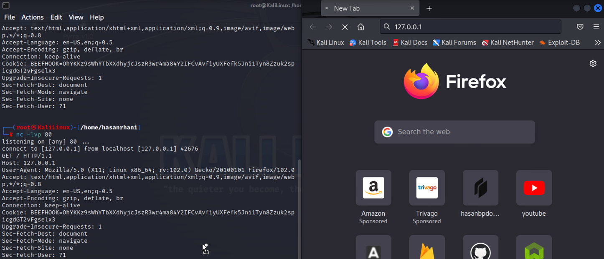|
|First **TCP** connection made because http uses TCP |
|Then **http** connection made:|
|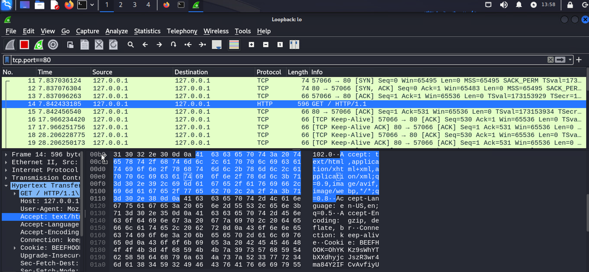|
|**Fin Packet**|
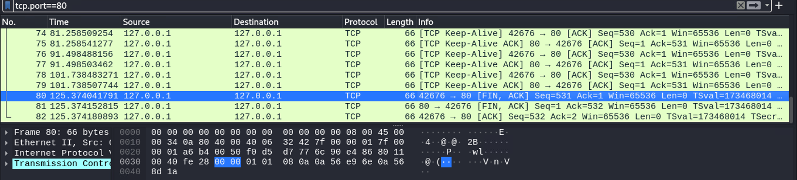|
|**When the port is not open and client request in TCP this is the RSK packet:**|
|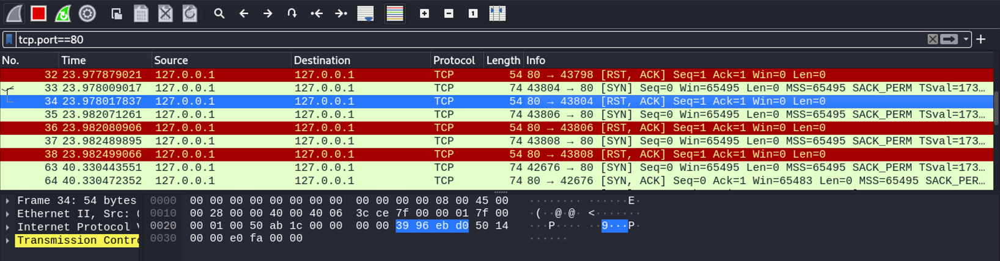|

#### HTTPS
|**HTTPS Port 443**|
|---|
|**HTTPS** is the upgradation version on HTTP.|
|**HTTPS** is secure as in HTTP the message and packet are in readable format. But in HTTPS the packets are not in readable format.||
||
|**Wireshark**|
|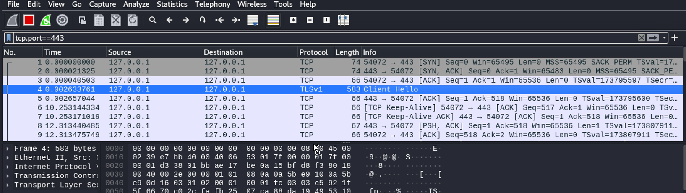|

#### SSL is Included in HTTPS 
- Hello client Is including in https service rule.
- Because of SSL it used to encrypted the packets 

|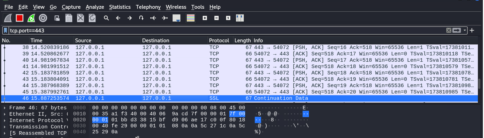|
|---|
|**Fin Packet**|
|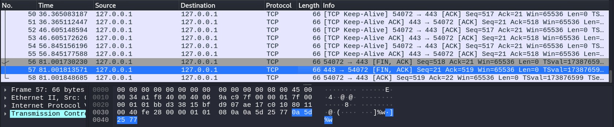|

## HTTP/S Methods

- In HTTP it has some methods which is  
 
### Methods 
`Common structure Is : [METHOD] / [FILE PATH] / [FILENAME] / [VARIBALE] = [VALUE]`
 
`GET ==> when you want something from the server or submitting of something through URL.` 
 
#### Why GET can't upload large file? 
- Becuase when use such URLs that is what you GET method it is something happened in a backend  
 
<Highlight color="#25c2a0"> GET change the URL, GET / [file size XXXXXXXXXXXXXXXX] /HTTP 1.1 And GET has some limitation that URL can be big enough but when you upload something, it has size limitations. that where POST comes. </Highlight>
 

#### The basis search functionality can be use through GET 

### **GET**:- 
- The GET method is used to retrieve information from the given server using a given URL. Requests using GET should only retrieve data and should have no other effect on the data 

**GET Method Request:**

| Request Line | Headers                                        |
|--------------|------------------------------------------------|
|`GET /hello.htm HTTP/1.1 | User-Agent: Mozilla/4.0 (Windows NT)`|
|            | Host: [IP, Name]                 |
|            | Accept-Language: en-us            |
|            | Accept-Encoding: gzip, deflate   |
|            | Connection: Keep-Alive           |

**GET Method Response:**

| Status Line     | Headers                                        | Body                         |
|-----------------|------------------------------------------------|------------------------------|
| HTTP/1.1 200 OK | Date: Mon, DD-MM-YYYY HH:MM:SS IST | `\<html>...\<h1>Hello, World!\</h1>... `|
|                 | Server: Apache/2.2.14 (Win32)       |                              |
|                 | Last-Modified: DD-MM-YYYY HH:MM:SS IST  |                              |
|                 | Content-Type: text/html             |                              |
|                 | Connection: Closed/open             |                              |

### POST

- When Uploading file HTTP/HTTPS use POST, and Submit sensitivity information because the URL don’t change it stick to the `[title]` The POST data will not be going to be visible in Brower history, it can be used for multi-purpose file Uploading, sensitive information, cookies ETC  
 
- Content Type ==> can be different type like ==> multipart/form data is the most common content type, boundary is the beginning and ending part. 
- USER-Agent ==>  will going to have your browser information , at server end they can access-list the browser they what the client to interreact with  
- ACCEPT ==> It is telling to server I can accept which type of data value  
- ACCEPTY ==> Encodeing ==> client browser accept there are different encodeing value that your browser allowed and the server will send whenever its required  
- COOKIE ==> whenever login in to particaular website your authentication data will gonna be saved in a cookie format  
 
**POST Method Request:**

| Request Line                  | Headers                                        |
|-------------------------------|------------------------------------------------|
| POST /cgi-bin/process.cgi HTTP/1.1 | User-Agent: Mozilla/4.0 (compatible; MSIE5.01; Windows NT) |
|                               | Host: 192.168.1.1/ane-pte                        |
|                               | Content-Type: text/xml; charset=utf-8            |
|                               | Accept-Language: en-us                          |
|                               | Accept-Encoding: gzip, deflate                  |
|                               | Connection: Keep-Alive                           |

**POST Method Response:**

| Status Line                  | Headers                                        |
|-----------------------------|------------------------------------------------|
| HTTP/1.1 200 OK             | Date: DD-MM-YYYY HH:MM:SS IST               |
|                             | Server: Apache/2.2.14 (Win32)               |
|                             | Last-Modified: DD-MM-YYYY HH:MM:SS IST     |
|                             | Vary: Authorization, Accept                |
|                             | Content-Type: text/html                   |
|                             | Connection: Closed/open                  |

<Highlight color="#25c2a0"> #http://192.168.1.1/Files/unrestricted_file.php/?username=xyz/?password=xyz </Highlight>

### Options

-  its say what are the other methods that are allowed. The OPTIONS method is used by the client to find out the HTTP methods and other options supported by a web server. The client can specify a URL for the OPTIONS method, or an asterisk (*) to refer to the entire server. The following example requests a list of methods supported by a web server running. 

**OPTIONS Method Request:**

| Request Line              | Headers                                 |
|---------------------------|-----------------------------------------|
| OPTIONS * HTTP/1.1        | User-Agent: Mozilla/4.0 (compatible; Windows NT) |

**OPTIONS Method Response:**

| Status Line              | Headers                                        |
|-------------------------|------------------------------------------------|
| HTTP/1.1 200 OK         | Date: Mon, DD-MM-YYYY HH:MM:SS IST           |
|                         | Server: Apache/2.2.14 (Win32)                 |
|                         | Allow: GET, HEAD, POST, OPTIONS, TRACE       |
|                         | Content-Type: httpd/unix-director            |

### Put
- Something to be uploaded. 
- Example: register on website this will happened through POST methods let say change the password that can be done by PUT method, it can depend on developer if want to use PUT  

**PUT Method Request:**

| Request Line             | Headers                                 |
|--------------------------|-----------------------------------------|
| PUT /hello.htm HTTP/1.1  | User-Agent: Mozilla/4.0 (compatible; Windows NT) |
|                          | Host: [IP, Name]                         |
|                          | Accept-Language: en-us                  |
|                          | Connection: Keep-Alive                  |
|                          | Content-type: text/html                 |

**PUT Method Response:**

| Status Line              | Headers                                        |
|-------------------------|------------------------------------------------|
| HTTP/1.1 201 Created    | Date: Mon, DD-MM-YYYY HH:MM:SS IST           |
|                         | Server: Apache/2.2.14 (Win32)                 |
|                         | Content-type: text/html                      |
|                         | Content-length: 30                            |
|                         | Connection: Closed                            |

### Delete Method

- Mostly used in APIs , this help deleting a data form XYZ, this DELETE method is used to request the server to delete a file at a location specified by the given URL. 

**DELETE Method Request:**

| Request Line             | Headers                                 |
|--------------------------|-----------------------------------------|
| DELETE /hello.htm HTTP/1.1 | User-Agent: Mozilla/4.0 (compatible; Windows NT) |
|                          | Host: [IP, Name]                         |
|                          | Accept-Language: en-us                  |
|                          | Connection: Keep-Alive                  |

**DELETE Method Response:**

| Status Line              | Headers                                        |
|-------------------------|------------------------------------------------|
| HTTP/1.1 200 OK         | Date: DD-MM-YYYY HH:MM:SS IST               |
|                         | Server: Apache/2.2.14 (Win32)                 |
|                         | Content-type: text/html                      |

### Connect Method
- The CONNECT method is used by the client to establish a network connection to a web server over HTTP. 

**CONNECT Method Request:**

| Request Line              | Headers                                 |
|---------------------------|-----------------------------------------|
| CONNECT [IP, Name] HTTP/1.1 | User-Agent: Mozilla/4.0 (compatible; Windows NT) |

**CONNECT Method Response:**

| Status Line                 | Headers                                        |
|----------------------------|------------------------------------------------|
| HTTP/1.1 200 Connection established | Date: Mon, DD-MM-YYYY HH:MM:SS IST         |
|                            | Server: Apache                               |

## HTTP Status Code

**1XX - Informational / Hold On:**

- 100 Continue: Continue with the request.
- 101 Switching Protocols: Switch to a new protocol.
- 102 Processing: Request is being processed, but there's no response yet.

**2XX - Success / Here you go:**
- 200 OK: Request successful; data returned.
- 201 Created: Request successful; a new resource has been created.
- 202 No Content: Request successful; no data to return (typically used for updates).
- 205 Reset Content: Request successful; client should reset the document view.

**3XX - Redirection / Go Away :**
- 300 Multiple Choices: Multiple options available; client should choose one.
- 302 Found: Resource temporarily moved; use the new URL (commonly used for redirects).
- 303 See Other: Similar to 302, but explicitly indicating a GET request to the new URL.
- 305 Use Proxy: Resource must be accessed through a proxy.

**4XX - Client Error / You Fucked Up:**
- 400 Bad Request: Server can't understand the request due to malformed syntax.
- 401 Unauthorized: Request lacks proper authentication credentials.
- 402 Payment Required: Not widely used, and meaning not well-defined.
- 404 Not Found: Requested resource was not found.

**5XX - Server Error / I Fucked Up:**
- 501 Not Implemented: Server doesn't support needed functionality.
- 502 Bad Gateway: Server acting as a gateway received an invalid response from an upstream server.
- 503 Service Unavailable: Server currently unable to handle the request due to overloading or maintenance.
- 504 Gateway Timeout: Server acting as a gateway did not receive a timely response from an upstream server.
- 506 Variant Also Negotiates: Server has an internal configuration error.
- 507 Insufficient Storage: Server is unable to store the representation needed to complete the request.

## MindMap Pending