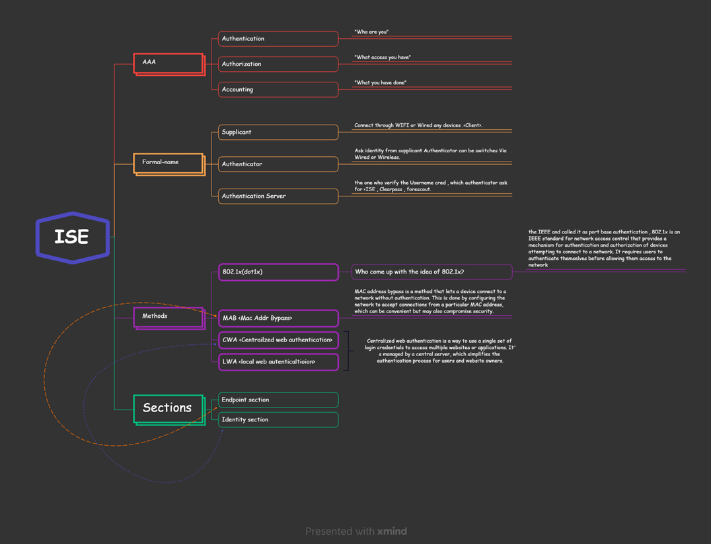

import Tabs from '@theme/Tabs';
import TabItem from '@theme/TabItem';
import Highlight from '@site/src/components/Highlight';

# Securing Your Network with Cisco ISE 

### **What & Why Securing Networks  ?**

<Tabs>
  <TabItem value="Cisco ISE" label="Cisco ISE" default>
    Firewall provide security from Outsiders, what about the Insiders ?  that where ISE comes and Cisco ISE secures internal network from insider threats while ,  Employees can MAC Spoof and bypass Port security, and then Malicious Activity happen. Which is Prevented By Cisco ISE
  </TabItem>
  <TabItem value="AAA" label="AAA">
    What if the insider shares the data to  Outsiders ? that where AAA comes in .AAA (authentication,authorization,accouting), AAA provides a framework for controlling access and ensuring security.
  </TabItem>
  <TabItem value="Microsoft Active Directory" label="Microsoft Active Directory">
    Microsoft Active Directory simplifies user and device management in Windows-based environments, reducing the risk of data breaches.Microsoft Active Directory (AD) simplifies the process of managing user accounts and permissions in Windows-based environments. It allows administrators to efficiently create, modify, and delete user accounts, set access permissions, and enforce security policies across the network. This centralized management reduces the risk of data breaches caused by unauthorized access or mishandling of user accounts, while maintaining the security and integrity of user accounts and resources within an organization.
  </TabItem>
</Tabs>

### **Three-tiered approach**

**1. Supplicants:**
   - Supplicants are devices or clients that seek network access, either through a wired connection or Wi-Fi.
   - They generate authentication requests to gain access to the network.
   - By default, supplicants may send authentication requests up to three times if needed to establish a connection.
   - Examples of supplicants include laptops, smartphones, and any device requiring network access.

**2. Authenticator:**
   - Authenticators are network devices responsible for controlling access to the network.
   - They can be physical devices like switches, wireless access points (APs), or even network ports on a switch.
   - When a supplicant connects to an authenticator, the authenticator requests the supplicant's identity and relays this information for verification.
   - Authenticators enforce authentication policies, such as allowing or denying network access based on the authentication results.
   - They are the intermediaries between supplicants and the authentication server.

**3. Authentication Server:**
   - Authentication servers are responsible for verifying the credentials provided by supplicants.
   - They include services like RADIUS (Remote Authentication Dial-In User Service) servers.
   - When an authenticator requests authentication for a supplicant, it forwards the supplicant's credentials to the authentication server.
   - The authentication server validates the credentials against a user database or directory, such as Microsoft Active Directory.
   - If the credentials are correct, the authentication server sends an "access allowed" message to the authenticator, granting network access to the supplicant.

### **Summary**

||
|---|