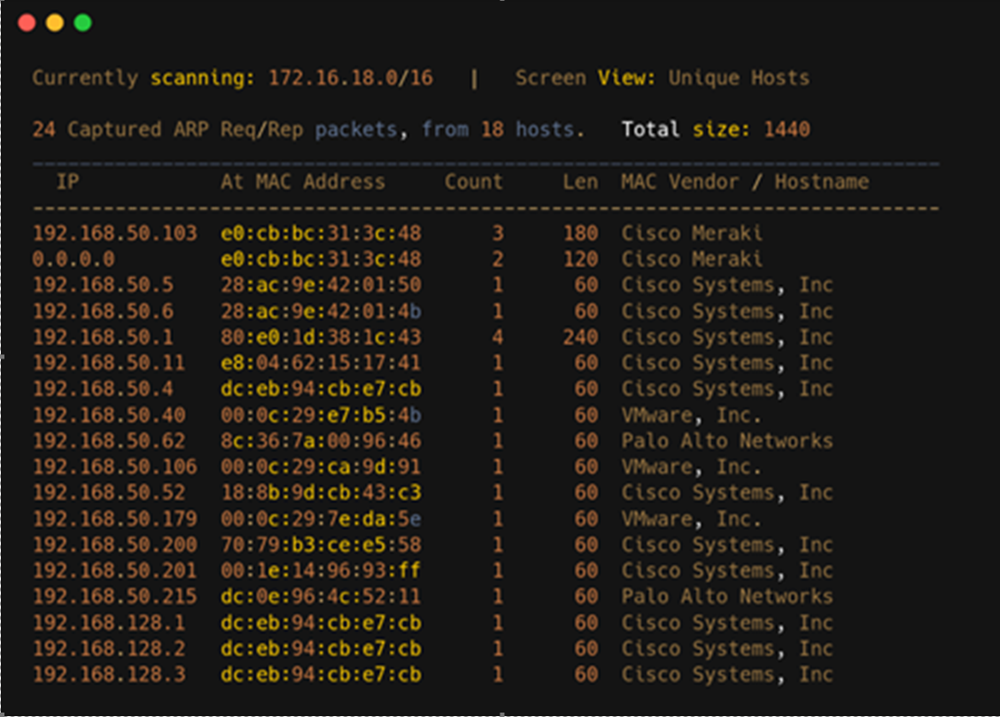

# Active Scanning !

---

### What is Active Scanning?

Active scan, is scan in real time so the target may find the scanner.

### What are the pros and cons of Active Scanning?

Pros :- Active scanning has several benefits. It can detect more vulnerabilities than passive scanning, as it actively attempts to exploit any weaknesses it finds. It can also detect hidden vulnerabilities.

Cons :- Active scanning also has some drawbacks. It can be time consuming, as it requires more resources than passive scanning. Additionally, it can be disruptive to the system or network. The target or the entitles may find out that they have been active scan.

## TTL Probs

The **TTL** is determined by the remote host. The ping you see in the shell is the **echo-reply**. The initial **TTL** is set by the OS. Linux uses 64, Windows 128 and Routers 255. Every Hop reduces the TTL by at least 1

For example: If you ping a Linux Host and there are 20 Hops between, then the TTL is 64-20 = 44.

# **Network** **Scanning**

- Scanning is Active Information Gathering, find the network running, the operating system, application and software running, services running on a pc
- Network Scan: Scanning a network to find the number of systems connected to it. We can find potential targets in this stage
- Host Discovery: Net discover [ Which use ARP Protocols to recognizes the network]
- Route Discovery: Nmap
- Protocol and ports
- TCP/UDP
- DNS, HOST FILE
- Communication through Netcat, NMAP

## **Netcat and** **NetDiscover**

### What is Netcat?

·          **_Netcat_** : Is a software utility it can be a Server OR a Client.

### Syntax & Command

>#netstate -altp [ to see availability]

>#nc -lp 1234 [ any random port, l mean listing p means port]

|   |
|---|
|Listing and Using Random Port which is specified.|
||

### Syntax & Command

>#nc (linux-ip-addr) 127.0.0.1 (random port ) 1234 ( start Server)

>#nc 127.0.0.1 1234

>#nc -lp 1234

| Getting reply form Server  |
|---|
||
||

## ***Network Scan Using NetDiscover***

### ***What is Netdiscover?***
 
| Netdiscover Which use ARP Protocols to recognizes the network and network machines vendous  |
|---|
| Syntax & Command |
|netdiscover|
||

|Netdiscover Which use ARP Protocols to recognizes the network and network machines vendors.  |
|---|
| Syntax & Command |
|netdiscover|
||
|netdiscover -r [ -r means Range]|
|netdiscover -r [ network id and mask] (Example: 192.168.50.0/24)|

| Syntax Commands  |
|---|
|>>#ifconfig [ check your interface eth/fa]|
||

| Syntax & Commands  |
|---|
|>>#netdiscover -i eth0 [ -i define interface]|
||
