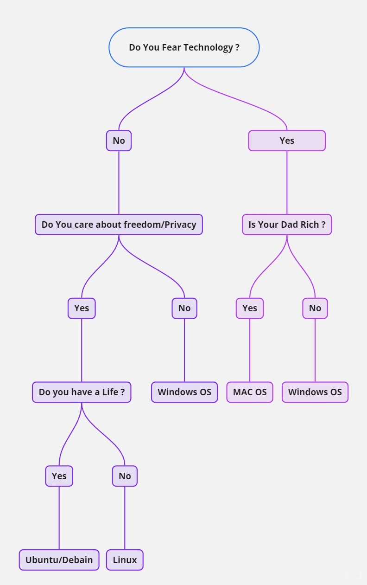

# All About Linux

## Shell: Your Command Interpreter

**User:**
The user is the individual engaging with the computer, initiating and managing tasks. Linux is designed to accommodate multiple users simultaneously, allowing shared resource usage.

**Applications:**
Applications perform specific tasks. Some come pre-installed, like calculators, while others require installation. Package managers facilitate application management and installation.

**Shell:**
The shell is your command-line interpreter. It handles text-based input and translates your commands to kernel-understandable instructions. The shell bridges communication between you and your computer.

**Filesystem Hierarchy Standard (FHS):**
FHS organizes data storage, determining where data resides within the operating system. It uses directories, analogous to folders, to house files or other directories, ensuring data's systematic placement.

**Kernel:**
The kernel manages processes and memory, communicating with applications for command execution. It's pivotal for resource allocation and hardware control, enhancing task efficiency.

**Hardware:**
Physical components of a computer. Peripheral devices, like monitors, and internal components, including CPU and RAM, play distinct roles in system function.

## Linux Distributions: Expanding the Horizon

Previously, you acquainted yourself with various Linux distributions, notably KALI LINUX ™. Nevertheless, the realm of cybersecurity encompasses a wider spectrum of distributions.

**KALI LINUX ™:**
An open-source Debian-based distribution, KALI LINUX ™ is widely embraced in the security sector. Pre-equipped with penetration testing and digital forensics tools, it's a go-to for simulated attack identification and post-attack data analysis.

**Ubuntu:**
Ubiquitous and user-friendly, Ubuntu caters to security and various industries. Featuring both GUI and CLI interfaces, it offers a range of applications, including security tools. Its strong community support bolsters its usability.

**Parrot:**
Parrot, like KALI LINUX ™ and Ubuntu, is Debian-based, tailored for security with pre-installed penetration testing and digital forensics utilities. Boasting a user-friendly GUI, it's a versatile option.

**Red Hat® Enterprise Linux®:**
A subscription-based distribution catering to enterprise requirements, Red Hat Enterprise Linux stands out with its dedicated support. It's used for robust enterprise operations.

**CentOS:**
CentOS, a Red Hat-derived open-source distribution, offers similar functionality but relies on community support rather than enterprise-level backing.

## Package Managers Simplified

Packages house software, collectively forming applications. Package managers facilitate package installation, resolving dependencies. Different Linux distributions and sources like Debian or Red Hat influence the choice of package manager. Notably, package management tools like APT and YUM enhance package handling.

## Shell: The Interpreter

**Command Communication:**
Remember the shell? It's your command interpreter, acting as a translator between you and the computer. Input a command, and the shell initiates a series of internal processes, conveying your instructions to the kernel and delivering the outcomes back to you.

**Diverse Shell Types:**
Various Linux shells exist, each with unique features. Examples include:
- Bourne-Again Shell (bash)
- C Shell (csh)
- Korn Shell (ksh)
- Enhanced C shell (tcsh)
- Z Shell (zsh)

These shells employ shared commands but differ in other aspects, like prompt indicators.

**Bash: The Go-To Shell**
Bash, Linux's default shell, suits both basic commands and complex projects. Noted for user-friendliness,

## Filtering Content in Linux

Filtering is a crucial skill for security analysts to extract specific information from files and directories. Linux provides powerful commands for this purpose. Here's a summary of key commands and techniques:

**grep Command:**

The **grep** command is used to search for specific text patterns within files.

Syntax: `grep pattern file`

Example: `grep "OS" updates.txt`

- This searches for the word "OS" in the file "updates.txt" and displays all lines containing that pattern.

**Piping:**

Piping (`|`) is used to send the output of one command as input to another. It allows chaining multiple commands together.

Example: `ls /home/analyst/reports | grep users`

- This lists files and directories in "reports" and then filters the output to display lines containing the word "users."

**find Command:**

The **find** command searches for files and directories that meet specified criteria.

Syntax: `find starting_location criteria`

Example: `find /home/analyst/projects -name "*log*"`

- This searches for files in the "projects" directory whose names contain the word "log," regardless of case.

**find Criteria:**

- **-name:** Searches for file/directory names containing a specific string (case-sensitive).
- **-iname:** Searches for names containing a specific string (case-insensitive).
- **-mtime:** Searches for files/directories modified within a specified time frame (days).
- **-mmin:** Searches for files/directories modified within a specified time frame (minutes).

Example: `find /home/analyst/projects -mtime -3`

- This finds files and directories in "projects" modified within the last three days.

These Linux commands enable security analysts to efficiently filter and search for information within files and directories, helping to identify potential security threats or relevant data.

## Managing Directories and Files in Linux

In Linux, efficient management of directories and files is essential for effective security analysis. Here are some key commands and techniques:

**Creating and Modifying Directories:**

1. **mkdir (Make Directory):** Creates a new directory. Use absolute or relative paths. E.g., `mkdir /home/analyst/logs/network` or `mkdir network`.
2. **rmdir (Remove Directory):** Deletes an empty directory. E.g., `rmdir /home/analyst/logs/network`.

**Creating and Modifying Files:**

1. **touch:** Creates an empty file. E.g., `touch permissions.txt`.
2. **rm (Remove):** Deletes a file. Use with caution. E.g., `rm permissions.txt`.

**Moving and Copying Files:**

1. **mv (Move):** Moves a file or directory to a new location. E.g., `mv permissions.txt /home/analyst/logs`.
2. **cp (Copy):** Copies a file or directory to a new location. E.g., `cp permissions.txt /home/analyst/logs`.

**Renaming Files:**

To rename a file, use the **mv** command. E.g., `mv permissions.txt perm.txt`.

**Using the Nano Text Editor:**

1. **nano:** A command-line text editor for creating and modifying files.
   - Open existing file: `nano filename`
   - Create new file: `nano new_filename`
   - Save: Ctrl + O
   - Exit: Ctrl + X

**Standard Output Redirection:**

1. **> and >> Operators:** Redirect standard output to a file.
   - **>** overwrites existing content: E.g., `echo "last updated date" > permissions.txt`
   - **>>** appends content: E.g., `echo "time" >> permissions.txt`

Using these commands and techniques, you can effectively manage directories, create and modify files, and use text editors to enhance your security analysis capabilities.

## Authenticate and Authorize Users in Linux

Authentication and authorization are essential aspects of securing a Linux system. Here's an overview of permission commands and concepts:

**Reading Permissions:**

In Linux, permissions are represented by a 10-character string, including read, write, and execute permissions for the user, group, and others.

- **read:** Ability to read file contents or list directory contents.
- **write:** Ability to modify file contents or create new files in a directory.
- **execute:** Ability to run a file as a program or access a directory's contents.

The 10-character string is structured as follows:
`-rw-rw-r--`
1. File type indicator (e.g., `-` for regular file, `d` for directory)
2-4. User permissions (read, write, execute)
5-7. Group permissions (read, write, execute)
8-10. Other permissions (read, write, execute)

**Exploring Permissions:**

You can use the `ls` command with various options to display permissions and other details about files and directories.

- `ls -a`: Displays hidden files (starting with a dot).
- `ls -l`: Displays detailed information including permissions, owner, group, size, and modification time.
- `ls -la`: Combines `-l` and `-a` options.

**Changing Permissions:**

The principle of least privilege suggests granting minimal access required for a task. The `chmod` command is used to change permissions.

Syntax: `chmod permissions filename`

- Example: `chmod u+rwx,g-rw,o-rw file.txt`
  - Adds read, write, and execute permissions for the user.
  - Removes read and write permissions for the group and others.

**chmod Arguments:**

- `u`: User permissions
- `g`: Group permissions
- `o`: Other permissions
- `+`: Adds permissions
- `-`: Removes permissions
- `=`: Assigns exact permissions

**Principle of Least Privilege:**

As a security analyst, you apply the principle of least privilege to grant only necessary permissions. Example scenario:

- File: `bonuses.txt`
- Permissions: `-rw-rw----`

The group owner has unnecessary read and write permissions. To align with the principle of least privilege, you can use: `chmod g-rw bonuses.txt`

This command removes read and write permissions for the group, ensuring that only authorized users can access the file.

By understanding and using permission commands, security analysts ensure that users have the appropriate level of access, enhancing system security.

## Linux Resources for Security Analysts

As a security analyst working with Linux systems, you have access to a wealth of resources that can help you learn, troubleshoot, and utilize Linux effectively. Here are some key resources you can leverage:

**1. Linux Community:**
The Linux community is a vast online network of users, developers, and experts who share knowledge and provide assistance. This community is an excellent place to find answers to your questions, learn from others' experiences, and stay updated on the latest developments in the Linux world. Online forums, discussion boards, and social media platforms are common places to engage with the Linux community.

**2. UNIX and Linux Stack Exchange:**
The UNIX and Linux Stack Exchange is a trusted question-and-answer website where users can ask and answer Linux-related questions. It covers a wide range of topics and issues, and the community votes on the quality of answers. This resource can be particularly helpful for troubleshooting and getting expert guidance on complex Linux issues.

**3. Integrated Linux Support Commands:**
Linux provides built-in commands to access support and documentation directly from the terminal:
 
- **man:** The `man` command displays comprehensive manual pages for various commands. To access the manual page for a specific command, use `man` followed by the command name. For example, `man chown` displays information about the `chown` command, including its usage and options.
 
- **apropos:** The `apropos` command helps you search for relevant commands based on specific keywords. It searches through the descriptions of man pages. Use `apropos` followed by a keyword to find commands related to that keyword. For instance, `apropos -a graph editor` would display man pages containing both "graph" and "editor" in their descriptions.
 
- **whatis:** The `whatis` command provides a brief description of a command on a single line. It's useful for quickly getting an overview of a command's purpose. For instance, `whatis nano` provides a short description of the `nano` command.

**4. Online Tutorials and Documentation:**
Numerous online tutorials, guides, and documentation resources are available to help you learn Linux concepts and commands. Websites like Linux Documentation Project (TLDP), DigitalOcean tutorials, and various Linux distributions' official documentation can provide step-by-step instructions and explanations.

**5. Linux Distributions' Communities:**
Each Linux distribution has its own user community and resources. These communities offer distribution-specific support, forums, wikis, and guides tailored to their users' needs.

**6. Blogs and YouTube Channels:**
Many Linux experts and enthusiasts maintain blogs, YouTube channels, and other content platforms where they share tips, tricks, and tutorials related to Linux. These resources can provide valuable insights and practical demonstrations.

By utilizing these resources, you can enhance your Linux skills, troubleshoot issues effectively, and stay up-to-date with the evolving Linux landscape. Whether you're a beginner or an experienced security analyst, these tools can help you make the most of Linux in your work.

### Choosing An OS 

||
|---|
