--- 

sidebar_position: 4 

--- 

  

# Foot Printing And More..


---

## ***What is Foot Printing***  

  

Foot Printing means there is a history of information, A mark leave behind or the entitles information in open internet, when validating the information is called foot printing. 

  

- After validation when the information is dug up is called enumerations. 

---

## ***Type of Foot Printing*** 

  

- Passive: the target didn't know that they have been footprinted and the tester is anonyms. 

  

- Active: the target knows that they have been footprinted and the tester is not anonyms. 

  
---

# ***Wappalyzer - Technology profiler***  

  

## ***What is Wappalyzer*** 

  

As nmap works in Command line interface Wappalyzer works for Graphical level. 

It helps us in Gathering information, enumeration, and more. 


---

# ***Passive Foot printing, Recon and Enumerations***  

  

:::note 

Target is nestforms.com 

::: 

  

- Using Wappalyzer for basic passive foot printing, enumeration and information gathering. 

  

Sometimes the Wappalyzer didn’t give full information or because of cache its show previews or stored information 

  

To remove the Cache. 

  

  

  

  

> Navigate to **Wappalyzer setting** >> 

  

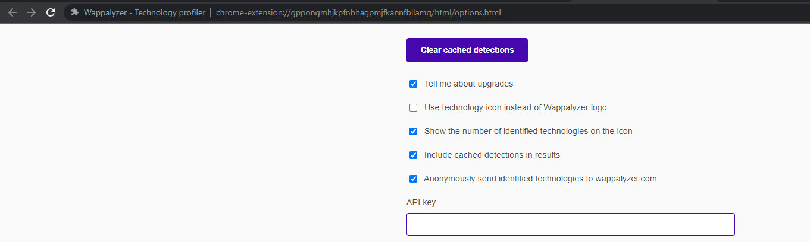 

  

>Select Clear Cached. 

  

>There is the Cleared Cached Results.. 

  

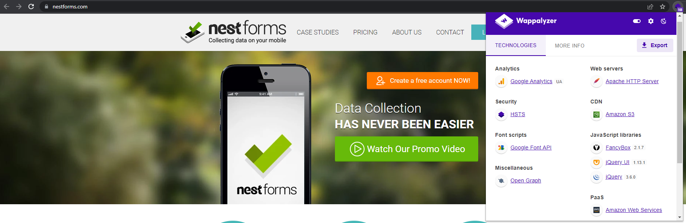 

  

:::note 

As there is PAAS services there which means this website is using AWS Services. 

::: 

:::note
There is a similar website which has the same situation, which is IPSY.com
Target : IPSY.com
:::


As the images URL seems there are two URLs in search box.

Right click for images URLs, and copy images URL information enumeration.

Then paste it and compare the two different images URLs.

There is a redirector in images


- There are two URLs in one image.

### Basic Active foot printing, enumeration and information gathering [Header 1]

Search: AWS Meta URLs in google [to get AWS Localhost IP-Address So that query with that IP-Address and see will get the response in AWS Console or not ] 

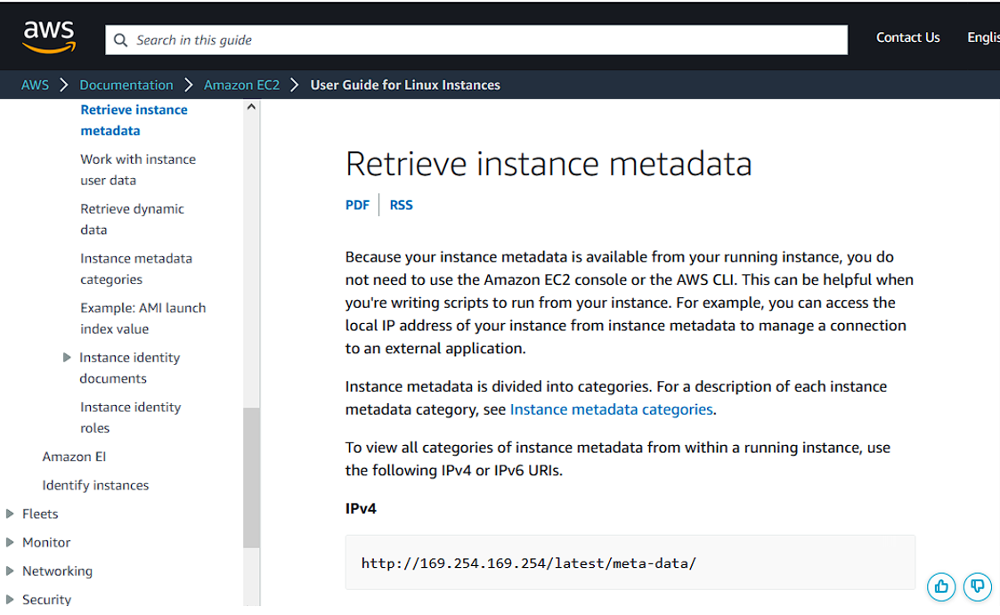


<code>https://docs.aws.amazon.com/AWSEC2/latest/UserGuide/instancedata-data-retrieval.html </code>

And the AWS local host IP-Address and put the local IP-Address in the Next URL redirector to check it will allow other things.

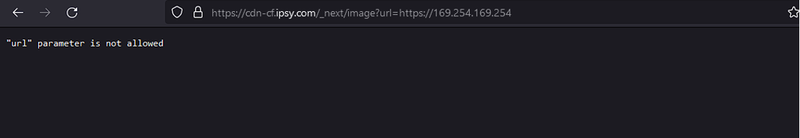

Unlucky me because something is blocking that specific traffic ..

There is another website which is redirecting:
<code> https://www.ign.com/video-embed?url=https:https://www.ign.com/videos/2015/06/09/new-photos-of-wonder-womans-outfit-and-the-batmobile-ign-news</code>
With the Wappalizer output

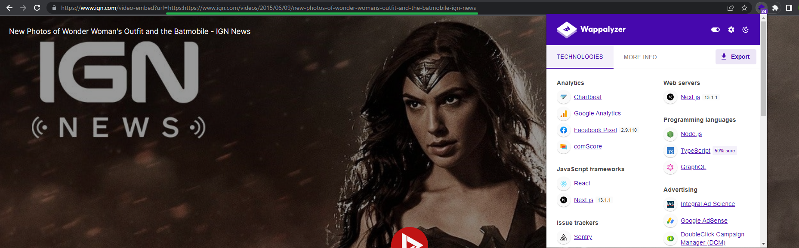


---


## ***Basic Authentication Bypass*** 

  


### ***Foot Printing Using Search Engine*** 

  

- Using some syntax to get the particular information's. 

  

:::note 

Target is monash.edu 

::: 

  

``` 

site:*.*.monash.edu ext:yml 

``` 

  

- Means site : all sub domains . all sub domains . root domains . edu 

- What is yml ? 

	- It is an YAML language which used in websites like. env which is environment file   

  

  

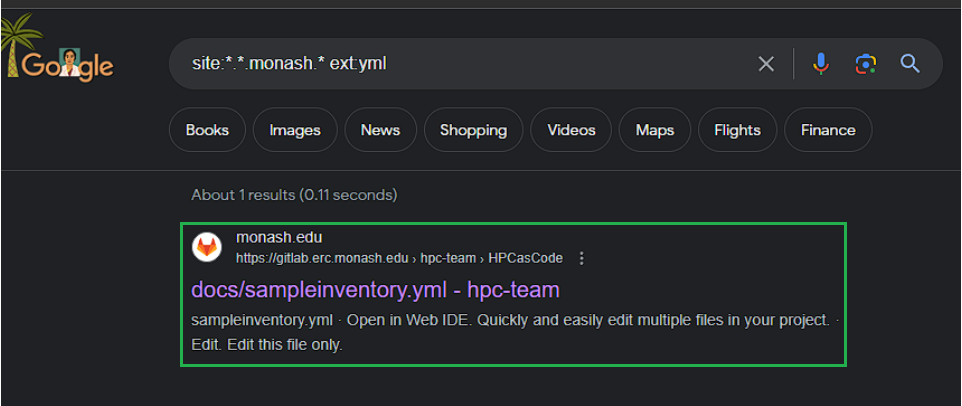 

  

From the URL it seems that they are using services which are Gitlab and GitHub. 

  

  

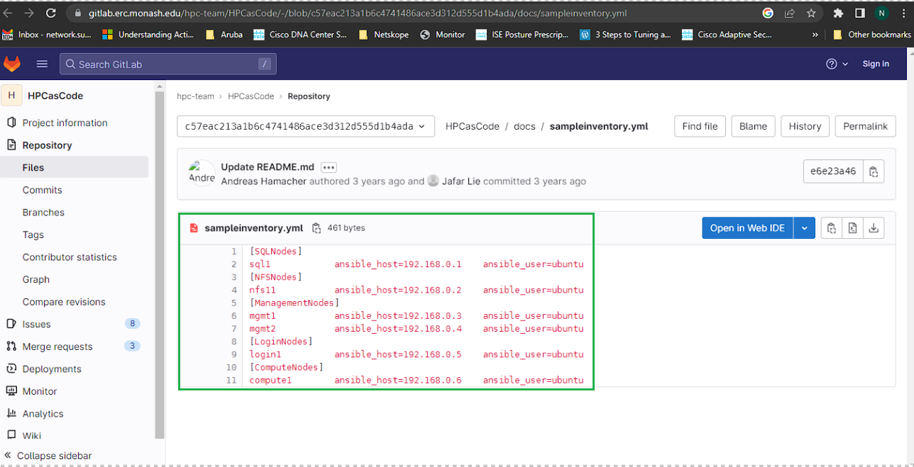 

  

>Repository  

  

  

***How to Identify that the GitHub repository is Private or Public ?*** 

  

> Repository is open  

  

  

  

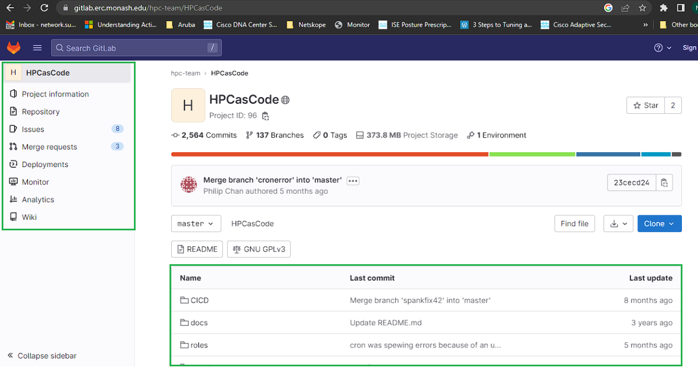 

  

Checked the env file. 

  

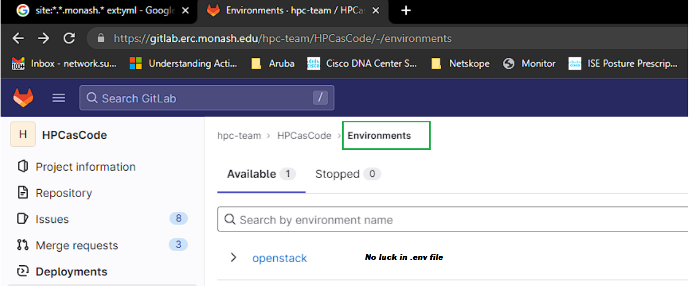 

  

***Why it didn't ask for GitHub/GitLab Login Credentials ?*** 

  

- To that Navigate to monash index.html file 

	 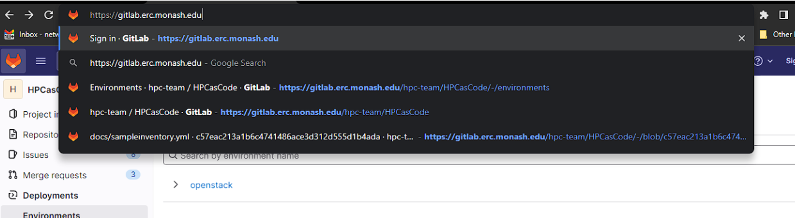 

    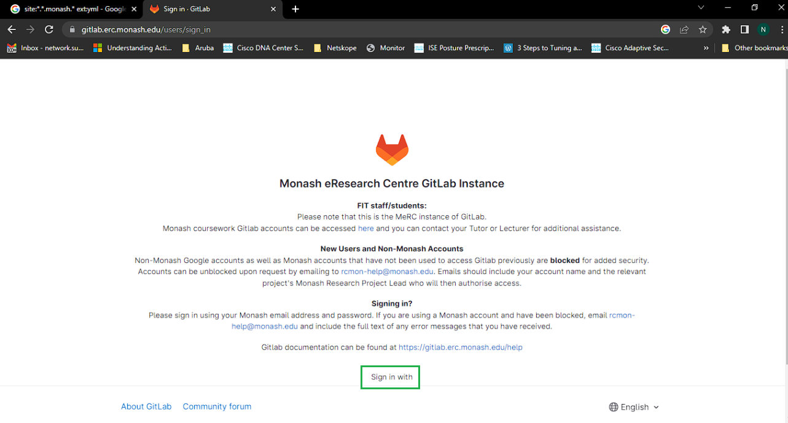 

:::note
- As the above results show there is authentication Functions from index.html knowing it is in GitLab, with enumeration break the CIA! of monash.edu 
:::

---
