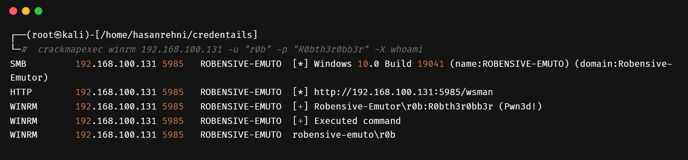

import Tabs from '@theme/Tabs';
import TabItem from '@theme/TabItem';
import Highlight from '@site/src/components/Highlight';


# Network Service Enumeration
---


## Enumeration

### **What & Why Enumeration?**

- **Enumeration** is a process used by attackers to find weaknesses in a system by gathering information from different services. It's an important step in a successful attack.
- Gathering information from the target activity.
- Enumeration is also called scanning.

- Digging up and validating the information which is gathered in information gathering/recon process.
- There are many network services like FTP, SMB, and more.

## **Services**

### **What & Why Service?**

- To make jobs easy, services are created. For example, railways are created for public purpose or service, but to use the service, one has to obey the rules & regulations of railways, like buying tickets.

## **Service Enumeration**

### **What & Why Service Enumeration?**

- It's a process of digging up the services, finding services with loopholes.
- Conducting a scan to verify service ports are open. After verification of which service is running, there are various tools for enumerations:
  - NSE script of Enumerations based on LUA language
  - Enum4linux based on Python
  - Crackmapexec tools that were breached, created by NSA
  - And many more...

## **SMB Service**

### **What & Why SMB?**

- **Server Message Block (SMB)** allows sharing resources with other computers over the network.
- Computers (SMB clients) on a network can connect to SMB servers to access shared files and directories or perform tasks like downloading files over the Local Area Network.
- SMB is an OSI application layer protocol that allows for file and device sharing and inter-process communication (IPC) between applications on a network through a client-server.
- The same service in Linux OS is called SAMBA.
- SMB uses ports 139 & 443.

#### **What does port 139 do?**

- Port 139 uses the **NetBIOS** protocol.
- NetBIOS stands for Network Basic Input Output System.
- Software applications that run on a NetBIOS network locate and identify each other via their NetBIOS names.

#### **What does NetBIOS do?**

- Allows communication between computers on local networks.

#### **Port 445**

- Port 445 is known as **SMB over IP** or **Server Message Block over IP**.
- SMB in modern language is also referred to as **Common Internet File System**.
- SMB can run directly over TCP/IP without the need for NetBIOS over TCP/IP.
- Port 445 is used for SMB when running over IP.

#### **IPC$ Share**

- **IPC$** is a special hidden share that allows for inter-process communication (IPC) on Windows systems.
- With an anonymous null session, you can access the IPC$ share and interact with exposed services.

#### **SMB Protocol**

- SMB is a **response-request protocol** used for sharing files, printers, and other resources on a network.

#### **Client-Server Connection**

- Clients connect to servers using **TCP/IP** or **QUIC protocols**.

#### **Enumerating NetBIOS**

- Enumerating NetBIOS provides information about the target computer group, domain, network shares, and computer names.

#### **Possible Credentials**

| Username(s)          | Common Passwords              |
|----------------------|------------------------------|
| (blank)              | (blank)                      |
| guest                | (blank)                      |
| Administrator, admin | (blank), password, administrator, admin |


## **Identification & Scan**

#### **SMB Communication via Wireshark**

You can analyze SMB communication using Wireshark, a network protocol analyzer.

#### **nblookup**

|Getting NetBIOS IP Address using `nmblookup`|
|---|
|To retrieve NetBIOS IP addresses, use the following syntax and command:|
```bash
nmblookup -A <IP>
```

#### **nbstate**

|Getting PC Information using `nbstate`|
|---|
||
|To obtain PC information using `nbstate`, use the following syntax and command:|
||
```bash
#nbstate
#nbtstat –A <target-IP-Addrs>
```

#### **nbtscan**

#### **Syntax & Commands**

|You can use `nbtscan` to gather NetBIOS information from a target IP address. Below are the commands and syntax:|
|---|
||
- To scan a target IP address:
  ```bash
  #nbtscan –r <Target-IP-Addr>
  ```

- For a verbose scan (to display more detailed information):
  ```bash
  #nbtscan –v [verbose]
  ```


## **Communication between Two Windows PCs**

In this scenario, communication between two Windows PCs is established using **SMB Port Number 445**.

| Windows | IP Address        |
|---------|------------------|
| Windows 1 (initiating connection) | 192.168.190.229 |
| Windows 2 (being accessed)       | 192.168.190.44  |

#### **Syntax & Commands**

|Description|
|-----|
||
|**After Login Success:**|
||
|**Accessing a File Packet:**|
||


:::note
All the data exchanged during this communication is encrypted.
:::


## **SMB Login with Credentials & Hashes**

#### **Syntax & Commands for Credentials**

| Description                     | Command                                         |
|---------------------------------|-------------------------------------------------|
| Authenticate using credentials  | `smbmap -u "username" -p "password" -H <IP> -P <PORT>` |

#### **Syntax & Commands for Hashes**

| Description                     | Command                                         |
|---------------------------------|-------------------------------------------------|
| Authenticate using NTLM/LM hashes | `smbmap -u "username" -p "<NT>:<LM>" -H <IP> -P <PORT>` |
| Establish SMB null session      | If password response is "randomus" or blank, it's an SMB null session. |

#### **Accessing Shares using smbclient**

| Description                     | Command                                         |
|---------------------------------|-------------------------------------------------|
| Access shares using smbclient   | `smbclient -U 'username[%passwd]' -L [--pw-nt-hash] //<Target-IP>` |
| With `--pw-nt-hash`              | Use NT hash as the password (can be obtained using various methods). |

Certainly, here's your provided Nmap scan syntax and commands formatted in markdown:

## **Nmap Scan**

#### Syntax & Commands**

You can perform an Nmap scan using the following syntax and commands:

```bash
nmap -Sv -n -Pn -p 138,445 <Target-IP>
```

- `-Sv`: Probe open ports to determine service/version info
- `-n`: No DNS resolution (speeds up the scan)
- `-Pn`: Treat all hosts as online (skip host discovery)
- `-p 138,445`: Scan ports 138 and 445

Replace `<Target-IP>` with the IP address of the target system.

Certainly, here's the information about SMB enumeration using NSE (Nmap Scripting Engine) presented using tables, bullet points, and code blocks within the markdown format:

## **SMB Enumeration**

### **NSE Nmap**

#### **Syntax & Commands For SMB V1**

| Description     | Command                                      |
|-----------------|----------------------------------------------|
| Enumerate using SMB scripts | `nmap --script smb-enum-*.nse 192.168.50.124` |


|**Output:**|
|---|
||


#### Windows

| Description     | Command                                      |
|-----------------|----------------------------------------------|
| Enumerate using SMB scripts | `nmap --script smb-enum-*.nse 192.168.100.130` |

**Output:**

```
Starting Nmap 7.93 ( https://nmap.org ) at 2023-06-26 12:19 EDT
Failed to resolve "smb-enum-groups.nse".
Failed to resolve "smb-enum-processes.nse".
...
Nmap scan report for 192.168.100.130
Host is up (0.0068s latency).
...
Nmap done: 1 IP address (1 host up) scanned in 6.08 seconds
```

#### **BeeBox**

| Description     | Command                                      |
|-----------------|----------------------------------------------|
| Enumerate using SMB scripts | `nmap -vv --script smb-*.nse 192.168.100.130` |

|**Output:**|
|---|
||


## **SMB Enumeration Using SMBv2 Scripts**

#### **Syntax & Commands**

To enumerate SMBv2 using Nmap scripts, you can use the following commands:

For Linux:

```shell
nmap -vv --script smb2-*.nse 192.168.100.130
```

For Windows:

```shell
nmap -vv --script smb2-*.nse 192.168.50.124
```

#### **Output Examples**

#### **Output (Linux):**

```
Starting Nmap 7.93 ( https://nmap.org ) at 2023-06-26 12:38 EDT
NSE: Loaded 1 scripts for scanning.
...
PORT     STATE SERVICE      REASON
21/tcp   open  ftp          syn-ack ttl 64
22/tcp   open  ssh          syn-ack ttl 64
...
Host script results:
|_smb2-capabilities: SMB 2+ not supported
...
Nmap done: 1 IP address (1 host up) scanned in 11.89 seconds
```

#### **Output (Windows):**

```
Starting Nmap 7.94 ( https://nmap.org ) at 2023-06-26 22:09 IST
NSE: Loaded 4 scripts for scanning.
...
PORT     STATE SERVICE       REASON
21/tcp   open  ftp           syn-ack
22/tcp   open  ssh           syn-ack
...
Host script results:
| smb2-capabilities: 
|   2:0:2: 
|     Distributed File System
|   2:1:0: 
|     Distributed File System
|     Leasing
...
| smb2-time: 
|   date: 2023-06-26T16:35:58
...
| smb2-security-mode: 
|   3:1:1: 
|_    Message signing enabled but not required
...
Nmap done: 1 IP address (1 host up) scanned in 1.69 seconds
```

### **Enumeration Insights**

- There are two types of sessions: Guest sessions (random password entered) and Null sessions (blank password entered).
- Null Sessions have no credentials, and authentication is performed over SMB.
- Count Sessions or Guest Sessions typically have any name, and authentication is performed over SMB.

---


## **Guest Sessions Enumeration**

### **What are Guest Sessions?**

Guest sessions refer to cases where random passwords are entered for authentication attempts. These sessions are typically used to explore accessible resources without providing valid credentials.

### **Why Use Guest Sessions?**

Guest sessions can be useful for probing systems to identify open shares, services, and other network resources. They allow you to interact with the system without using valid credentials.

### **Count Sessions / Guest Sessions**

In some scenarios, you can perform count sessions or guest sessions by providing any name during authentication. The format is:

| Authentication | SMB   |
| -------------- | ----- |
| Any Name       | AUTH  |
|                | SMB   |

### **SMB Client Usage**

#### **Syntax & Commands for SMB Client**

To use the SMB client (`smbclient`) for enumeration and interaction with shares, you can use the following commands:

| Description                             | Command                              |
| --------------------------------------- | ------------------------------------ |
| Enumerate shares without a username and password | `smbclient -L <Target-IP>`        |
| Enumerate shares without a password (using `-N` flag) | `smbclient -N -L <Target-IP>`     |

#### **Example**

```shell
smbclient -N -L 192.168.100.130
```

|The `-N` flag indicates no password should be provided during the authentication attempt.|
|---|
||

#### **smbmap**

|**Syntax & Commands**|
|---|
|`smbmap –u ‘anonymous’ -p ‘anonymous’ <Target-IP>`|
||


#### **Enum4linux**

|**Syntax & Commands**|
|---|
|`enum4linux [-u "<username>" -p "<passwd>"] <Target-IP>`|
||
| **-a** Will do Basic Enumeration & **-A** will do Aggressive Enumeration |
|`#enum4linux -a [-u "<username>" -p "<passwd>"] <Target-IP>`|
||


#### **Impacket-smbclient**

|**Syntax & Commands**|
|---|
|` impacket-smbclient://<Username>@<target-ip>  (for windows)`|
||

#### **Crackmapexec The Brute Force & Uses/Password Spray **

|**Syntax & Commands**|
|---|
|`crackmapexec smb <IP> -u 'username.txt' -p 'password.txt'` | 
|`crackmapexec smb <IP> -u 'username'.txt -H '<HASH>`|
|IN crackmapexec Pwn3d means correct credentials.|
|`crackmapexec smb <IP> -u 'username'.txt -p 'password.txt' --shares`|
||
|`crackmapexec smb <IP_Addres> --users [-u <username> -p <password>]`|
||
|`crackmapexec smb <IP> -u 'username' -p 'password' --shares #Guest user`|
|OR|
|`crackmapexec smb <IP> -u 'username' -H '<HASH>' --shares #Guest user`|
||


## **Null Sessions  Enumeration**

#### **What & Why Null Sessions**

- Null sessions. Means blank password entered.
- Null Sessions ==> NO Credentials ==> AUTH ==> SMB

#### **Smbclinet**

|**Syntax & Commands**|
|---|
|smb client without username and password|
|`smbclient -L <Target-IP>`|
|-N means –no passwords|
|`smbclient -N -L <Target-IP>`|
||

#### **Smbmap**

|**Syntax & Commands**|
|---|
|`smb –u’’ -p ‘’ -H <Target-IP>`|
||

#### **Enum4linux**

|**Syntax & Commands**|
|---|
|`enum4linux [-u "<username>" -p "<passwd>"] <Target-IP>`|
||


#### **Crackmapexec**

|**Syntax & Commands**|
|---|
|`crackmapexec smb <IP> -u blank-p blank#Guest user`|
|`crackmapexec smb <IP> -u blank-H '<HASH>`|
|`crackmapexec smb <IP> -u blank-p blank--shares `|
||

## **FTP**

### **What & Why FTP**


<Tabs>
  <TabItem value="FTP"  default>
    FTP is a File Transfer Protocol Which is commonly used for transferring files from various devices.
  </TabItem>
  <TabItem value="What is Communication Model does FTP Used?" >
    Clinet-Server
  </TabItem>
  <TabItem value="What the standard FTP Port ?" >
    Port Number 21
  </TabItem>
</Tabs>

### **Identification & Scan**

#### **Nmap**

|**Syntax & Commands**|
|---|
|Output|
```
┌──(hasanrehni㉿kali-Hasan)-[~/credentails]
└─$ nmap -p 21 192.168.50.124                                                                                                                            
Starting Nmap 7.94 ( https://nmap.org ) at 2023-06-27 00:40 IST
Nmap scan report for 192.168.50.124
Host is up (0.00028s latency).
 
PORT   STATE SERVICE
21/tcp open  ftp
 
Nmap done: 1 IP address (1 host up) scanned in 0.05 seconds
```


### **Enumerating FTP**

- There are various digging up on various **services Enumerations** which is Network Service Enumeration

#### **NSE Enumeration**

|**Syntax & Commands**|
|---|
|`# nmap -Pn --script ftp-*.nse <Target-ip>`|
||


#### **What is FTP Anonymous Login ?**

:::note
In FTP There is Anonymous Login Functional open but current it does not open by defaults.
How does the nmap nse ftp-anon verify that its ftp anon open
:::
||
|---|


#### **FTP Web Access**

|**Uploading & Executing through web**|
|---|
|`#ftp://<target-ip>`|
||
||
||


### **Brute Forces & Password/Users Spray**

#### **Hydra**

|**Syntax & Commands**|
|---|
|`#hydra -L users.txt -P passwords.txt IP ftp`|
||


## **WinRM**

#### **What & Why WinRM ?**
- Windows Remote Management 
- This is a service remotely manage a particular device in for the windows environment.
  - Uses the Port 5985 for non-encrypted & Port 5986 is for encrypted.
  - In Windows Server this service is enabled but in Normal in windows this service this disable 
  - To Enable the PowerShell commands is #Enable-Psremoting –Force

### **Identification & Scan**

#### **Nmap**

|**Syntax & Commands**|
|---|
||


### **Enumeration WinRM**

#### **Evil-winrm**


|**Syntax & Commands**|
|---|
|`#gem install evil-winrm`|
|`#evil-winrm -i [Target-IP] -u Administrator -p 'password'`|
|`#evil-winrm -i 10.11.1.111 -u Administrator -H 'hash-pass' -s /scripts/folder`|
||


### **Brute Forces & Password/Users Spray**

#### **Crackmapexec**

|**Syntax & Commands**|
|---|
|`#crackmapexe winram <target-ip> -u usrname.txt -p password.txt -X (powershell cmd) Get -MPrefences`|
||


## **RDP**

- Remote Desktop Service
#### **What & Why Remote Desktop Service ?**

- The Remote Desktop Protocol (RDP) is a protocol developed by Microsoft for remote access to a computer running the Windows operating system. This protocol allows display and control commands to be transmitted via the GUI encrypted over IP networks.
- Works on port 3389

### **Identification and Scans** 

#### **Nmap**

|**Syntax & Commands**|
|---|
|`# Nmap -sV -p 3389 target ip`|
||


### **Enumeration RDP**

#### **NSE Nmap**


|**Syntax & Commands**|
|---|
|`#nmap -Pn -sV --version-intensity=5 -p T:3389 --script=xxxx <IP>`|
|`#nmap -sV -sC  -p3389 --script rdp*`|
|`nmap -sV -sC  -p3389 --packet-trace --disable-arp-ping –n`|
||
|**Wiresharks**|
||

### **Brute Force & Users/Password Spray**

|**Syntax & Commands**|
|---|
|**Using ncrack for one user**|
|`ncrack -vv -u username -P passwords.txt rdp://IP`|
|**Using ncrack for several users**|
|`ncrack -vv -U users.txt -P passwords.txt rdp://IP`|

#### **Hydra**

|**Syntax & Commands**|
|---|
|`hydra -L user.list -P password.list rdp://<Target-IP>`|
||


### **Discovery**

#### **Xfreerdp**

|**Syntax & Commands**|
|---|
||
||


## **SMTP**

#### **What is SMTP?**

**SMTP (Simple Mail Transfer Protocol)** is a TCP/IP protocol designed for the transmission of electronic mail (e-mail) between computers. It serves as a communication channel for sending and receiving emails. Typically, SMTP is used in conjunction with other protocols such as POP3 or IMAP, which enable users to store messages in a server mailbox and download them as needed. This combination of protocols is often referred to as a "mail system."

#### **How SMTP Works**

SMTP operates as a client-server-based protocol, facilitating the sending and fetching of emails. Users employ email programs that utilize SMTP for sending messages and either POP3 or IMAP for receiving them. SMTP servers commonly operate on ports 25, 465, or 587. Key functions of an SMTP server include spam prevention through authentication and authorization of legitimate users to send emails. Many SMTP servers also support the Extended Simple Mail Transfer Protocol (ESMTP) with SMTP-Auth.


1. **Sending an Email:**
   - The SMTP client (Mail User Agent or MUA) converts the email into a header and a body.
   - The client uploads both the header and body to the SMTP server.

2. **Server Processing:**
   - The SMTP server, acting as a Mail Transfer Agent (MTA), checks the email for size and spam.
   - A Mail Submission Agent (MSA) may validate the email's content before the MTA, ensuring authenticity and origin.

3. **Mail Submission and Transfer:**
   - The MSA/MTA processes can be compared to a post office and are hosted on servers.
   - The processed email is sent to the recipient's Mail User Agent (MUA) via POP3 or IMAP.

4. **Receiving Email:**
   - With POP3, the email is deleted from the server once received.
   - IMAP stores the original email on the server and sends a copy to the client's mailbox.

####  **SMTP vs. POP vs. IMAP**

| Protocol | Description | Function | Port No | Default Port No (SSL) |
|----------|-------------|----------|---------|------------------------|
| SMTP | Simple Mail Transfer Protocol | Send Mail (Push Mail) | 25 | N/A |
| POP | Post Office Protocol | Retrieve Mail (POP Mail) | 110 | 995 |
| IMAP | Internet Message Access Protocol | Retrieve Mail (IMAP Mail) | 143 | 993 |

#### **Commands in SMTP**

- **AUTH PLAIN:** Used for client authentication.
- **HELO:** The client logs in with its computer name to start the session.
- **MAIL FROM:** The client specifies the email sender.
- **RCPT TO:** The client specifies the email recipient.
- **DATA:** Initiates the transmission of the email.
- **RSET:** The client aborts the initiated transmission but maintains the connection.
- **VRFY:** Checks if a mailbox is available for message transfer.
- **EXPN:** Similar to VRFY, it checks if a mailbox is available for messaging.
- **NOOP:** Requests a server response to prevent disconnection due to timeout.
- **QUIT:** Terminates the session.

### **Identification & Scans**

#### **DIG**
|**Syntax & Commands**|
|---|
|`# dig +short mx google.com`|
||
|You can connect to an SMTP server with netcat and run the VRFY command to check if email addresses are valid. You can also check mailing list membership with EXPN.|

#### **Nmap**

|**Syntax & Commands**|
|---|
|`# Nmap –Pn –n –Sv –p 25 <Target-IP>`|
||


#### **Telnet**

|**Syntax & Commands**|
|---|
|`Telent <Target-IP> <Port>`|
||


### **Enumeration SMTP**

#### **NSE Nmap**

|**Syntax & Commands**|
|---|
|`#nmap -Pn -n -p 25 --script=smtp-*  <Target-IP>`|
||
|**Wireshark**|
|

### **Brute Force & Uses/Password Spray**

### **Hydra**

|**Syntax & Commands**|
|`# hydra -L users.txt TARGET-IP smtp-enum`|
||


## **Microsoft SQL Server (MSSQL)**

#### **What is MSSQL?**

**Microsoft SQL Server** is a robust relational database management system (RDBMS) developed by Microsoft. As a database server, it serves as a software product with the primary function of storing and retrieving data as requested by various software applications. These applications can run either on the same computer where MSSQL is installed or on other computers across a network, including the Internet.

#### **Key Features:**

- **Database Management:** MSSQL is designed for efficiently managing databases, ensuring data integrity, and providing secure access to stored data.

- **Query Language:** It employs a powerful backend language to handle queries and data manipulation tasks. SQL (Structured Query Language) is commonly used for interacting with MSSQL databases.

- **Networking Capabilities:** MSSQL enables communication between client applications and the database server over a network.

- **Instances:** A server running MSSQL can host multiple instances on high ports, allowing for the management of distinct databases.

#### **Port Usage**:

- **Port 1433:** Used by clients to interact with the MSSQL database. This port is crucial for communication and executing queries.

- **Port 1434:** Used for listing available instances. A server running MSSQL can have multiple instances, each potentially on a different high port.

#### **Security Considerations:**

- **Default Credentials:** MSSQL installations often come with default credentials, and the commonly used ones include `sa:sa` where `sa` stands for Sysadmin or system admin. It is crucial to change these defaults to enhance security.

- **Authentication:** MSSQL provides various authentication mechanisms to control access, and it's recommended to use strong authentication methods to protect sensitive data.

#### **Why MSSQL?**

- **Reliability:** MSSQL is known for its reliability, providing robust mechanisms for data storage, backup, and recovery.

- **Scalability:** It offers scalability options, allowing organizations to scale their databases as their data storage needs grow.

- **Integration with Microsoft Ecosystem:** For organizations using other Microsoft products and technologies, MSSQL seamlessly integrates with the Microsoft ecosystem.

- **Security:** MSSQL provides security features to protect data and control access, including encryption and authentication mechanisms.

- **Enterprise-Level Support:** Microsoft offers comprehensive support for MSSQL, making it suitable for enterprise-level applications.

For more in-depth details, please refer to the official [Microsoft SQL Server website](https://www.microsoft.com/en-us/sql-server).


### **Identification & Scans**

#### **Nmap**

|**Syntax & Commands**|
|---|
|`# Nmap -n -Sv -Pn -p 1433,1434 Target-IP`|
||

### **Enumeration MSSQL**

#### **NSE Nmap**

|**Syntax & Commands**|
|---|
|`# nmap -n -Pn --script=mysql-*  <Target-IP>`|
||


### **Brute Force & Uses/Password Spray**

#### **Medusa**

|**Syntax & Commands**|
|---|
|`# medusa -h <Target-IP> -u 'username/username.txt' -p 'password/password.txt' -M mysql`|
||


#### **Impacket**

|**Syntax & Commands**|
|---|
|`impacket-mssqlclient -port 1433 DOMAIN/username:password@<target-ip>`|`
|`impacket-mssqlclient -port 1433 DOMAIN/username:password@<target-ip> -windows-auth`|


#### **Sqsh**

|**Syntax & Commands**|
|---|
|`sqsh -S <target-ip> -U username -P password`|
|`sqsh -S <target-ip> -U username -P password -D database`|
|`# Get all users`|
|`> SELECT * FROM sys.database`|
|`# Switch to the database`|
|`> USE <database>`|
|`# Get databases`|
|`> SELECT * FROM master.dbo.sysdatabases`|
||


## **MySQL**

#### **What is MySQL?**

**MySQL** is an open-source SQL (Structured Query Language) relational database management system (RDBMS) developed and supported by Oracle. In the context of databases, MySQL serves as a structured and organized collection of data designed for easy storage, retrieval, and management.

- MSSQL===> open source==> if you are performing an attack in a small org, or someone who have limited scope . Can assume that the application could be MSQL Because they are already tired with the budget

#### **Key Features:**

- **Open Source:** MySQL is an open-source database system, making its source code accessible to the public and allowing users to modify and distribute it freely.

- **SQL:** SQL is the primary language used to interact with MySQL databases. It provides a standardized way to query and manipulate data in relational databases.

- **Portability:** MySQL is a cross-platform database system, meaning it can run on various operating systems such as Windows, Linux, and macOS.

- **Community Support:** Being open source, MySQL has a large and active community of developers and users who contribute to its development, offer support, and share knowledge.

- **Scalability:** MySQL is scalable, making it suitable for both small-scale applications and large-scale enterprise solutions.

#### **MySQL in Comparison to MSSQL:**

- **Open Source vs. Commercial:** MySQL is open source, while MSSQL (Microsoft SQL Server) is a commercial database management system.

- **Port Number:** MySQL commonly uses port number 3306 for communication.

- **Installation:** MySQL can be installed on various operating systems using commands like `sudo apt install mysql-server -y` for Ubuntu-based systems.

- **Language:** MySQL, like MSSQL, is based on SQL, providing a standardized language for database interactions.

- **Communication Model:** MySQL uses a client-server communication model, where client applications interact with the MySQL server to execute queries and manage data.

- **Workflow:** MySQL is typically used as a backend database, handling the storage, retrieval, and management of data on the server side.

#### **Why MySQL?**

- **Open Source Advantage:** Being open source, MySQL is cost-effective and well-suited for organizations with budget constraints.

- **Community Support:** The active community around MySQL ensures ongoing support, updates, and a wealth of resources for users.

- **Compatibility:** MySQL is compatible with various programming languages, making it versatile for developers working in different environments.

- **Scalability and Performance:** MySQL's scalability and performance make it suitable for a wide range of applications, from small projects to large-scale enterprise systems.

- **Reliability:** MySQL is known for its reliability, data integrity, and robust features, making it a trusted choice for many developers and organizations.

For more detailed information and resources, visit the official [MySQL website](https://www.mysql.com/).


### **Identification & Scans**

#### **Nmap**

|**Syntax & Commands**|
|---|
|`# nmap -sV -p 3306 target-ip`|
||
|**Wireshark**|
||
|Got and ACK packet that who nmap knows the port is open.|
|Closed Ports/Filtered Ports|
||
|The ball/packet nmap send did not return do nmap assume the port is closed/filtered.|


### **Enumeration MYSQL**

#### **NSE Nmap**

|**Syntax & Commands for mysql-info**|
|---|
|`# nmap -Pn -n -p 3306 --script=mysql-info.nse <tarhet-ip>`|
||
|**Wireshark**|
||


### **NSE Nmap**

|**Syntax & Commands**|
|---|
|`# nmap -Pn -n -p 3306 --script=mysql-* <target-ip>`|
||


### **Brute Force & Users/Password Spray**

#### **Hydra**
- If the NSE scripts / other enum finds database users, bruteforce password with hydra

|**Syntax  & Commands**|
|---|
|`#sudo hydra -l root -P /usr/share/wordlist mysql://target`|
||


#### **Medusa**
|**Syntax & Commands**|
|---|
|`# medusa -h [Target-IP] -u username -P password.txt -t -M mysql`|
||


### **Discovery**

| **Discovery**                             | **Command**                                              |
|-------------------------------------------|----------------------------------------------------------|
| **Try Connection from Outside**           | `mysql --host <IP> -u root -p root`                      |
| **Connection from the Target Machine**    | `mysql -u root -p root database`                          |
| **Classical Commands**                    |                                                          |
| Show existing databases                   | `show databases;`                                        |
| Use a specific database                   | `use database_name;`                                     |
| Show tables in the current database       | `show tables;`                                           |
| Describe the structure of a table         | `describe table_name;`                                   |
| View user details in MySQL                | `select host, user, password from mysql.user;`           |
| **Local Access / Remote Access**          |                                                          |
| Connect to MySQL as root                  | `mysql -u root`                                          |
| For remote access                         | `mysql -u root -p`                                       |
|                                           | *(A password will be asked. Always test root:root credentials)* |


||
|---|

## **NFS**


| **NFS**                                       |                                                    |
|-----------------------------------------------|----------------------------------------------------|
| **What is NFS?**                              | Network File System                                 |
| **Development Year**                          | 1984                                               |
| **Developed by**                              | Sun Microsystems                                   |
| **Similar to**                                | SMB (Server Message Block)                         |
| **Guest Sessions**                            | Available (similar to SMB)                         |
| **NFS Ports**                                 | 111 (TCP/UDP) - Data transfer & validation        |
|                                               | 2049 (TCP/UDP) - Default                            |
| **Authentication/Authorization**              | No mechanism for authentication or authorization |
| **Cross-Platform Sharing**                    | Windows NFS server shares files with Linux & MacOS|
| **NFS Acronym**                               | Network File System                                |
| **NFS Client Interaction**                    | Mounting (Process that allows an NFS client to interact with a remote directory as if it were a physical device) |
| **Representation of Files/Directories on Server** | File handle                                    |
| **Communication Protocol**                    | RPC (Remote Procedure Call)                        |
| **Latest Version**                            | NFSv4.2                                           |
| **NFS Versions**                              |                                                    |
| NFSv2                                         | Older version, supported by many systems, operated entirely over UDP |
| NFSv3                                         | More features, including variable file size and better error reporting, not fully compatible with NFSv2 clients |
| NFSv4                                         | Includes Kerberos, works through firewalls and on the Internet, no longer requires portmappers, supports ACLs, applies state-based operations, provides performance improvements and high security. The first version to have a stateful protocol. |
| **More Details**                              | Available on the website                            |


### **Identification & Scans**

#### **Nmap**

|**Syntax & Commands**|
|---| 
|`Nmap –n -Pn -v -p 111,2049 Target-IP`|

#### **rpcinfo**

|**Syntax & Commands**|
|`rpcinfo -p <ip>`|


### **Enumeration NFS**


|**Syntax & Commands**|
|---|
|`nmap -sV -p 111 --script=rpcinfo <target-ip>`|
|`nmap -p 111 --script nfs* <target-ip>`|
||


#### **Show all mounts**

- If nfs is available, use showmount to view available mounting points
- There is nfs share available or not but its shows/works on the subnets basis
- To know which folder has the server available to mount you an ask it using:

|**Syntax & Commands**|
|---|
|`#Showmount -e target`|
```
┌──(root㉿Kali-Linux-full)-[/home/hasanrehni/credentails]
└─# showmount -e 192.168.100.130            
Export list for 192.168.100.130:
/mnt/nfs_share *
```
||
|---|


#### **Mounting the Share**
```bash
# Create a directory for mounting
mkdir /mnt/new_back

# Mount the NFS share (version 2) with nolock option
mount -t nfs -o vers=2 10.12.0.150:/backup /mnt/new_back -o nolock

# Create the directory for mounting
mkdir /mnt/nfs

# Mount the NFS share
mount -t nfs $ip:/share /mnt/nfs

# Example: Mounting an NFS share
┌──(root㉿Kali-Linux-full)-[/home/hasanrehni]
└─# mount -t nfs 192.168.100.130:/mnt/nfs_share /home/hasanrehni/mntdir

# Output: Created symlink for systemd
Created symlink /run/systemd/system/remote-fs.target.wants/rpc-statd.service → /lib/systemd/system/rpc-statd.service.
```

Explanation:
- `mkdir /mnt/new_back`: Creates a directory named "new_back" in the "/mnt" directory.
- `mount -t nfs -o vers=2 10.12.0.150:/backup /mnt/new_back -o nolock`: Mounts an NFS share from IP address "10.12.0.150" at the "/backup" directory to the local directory "/mnt/new_back" using NFS version 2 and the "nolock" option.
- `mkdir /mnt/nfs`: Creates a directory named "nfs" in the "/mnt" directory.
- `mount -t nfs $ip:/share /mnt/nfs`: Mounts an NFS share from the specified IP address and directory to the local directory "/mnt/nfs".
- `mount -t nfs 192.168.100.130:/mnt/nfs_share /home/hasanrehni/mntdir`: Example command to mount an NFS share from IP address "192.168.100.130" at the "/mnt/nfs_share" directory to the local directory "/home/hasanrehni/mntdir".


Certainly! Here's the information in a formatted manner:

### **SSH (Secure Shell)**

**What is SSH?**
Secure Shell (SSH) is a Command Line Interface (CLI) that provides similar services to Telnet but in a secure manner. Unlike Telnet, SSH encrypts the communication between the client and the server, providing a more secure method of remote access.

**Key Features:**
- **Public Key & Private Key:** SSH uses a pair of cryptographic keys, a public key, and a private key. Both parties share their public keys, and communication is encrypted using each other's public keys, which can only be decrypted by their corresponding private keys.
- **Port Number:** SSH operates on Port 22.

### **Identification & Scans**

**Nmap:**
```bash
# Nmap Scan for Port 22 (SSH)
nmap -n -Pn -p 22 192.168.50.124
```

**Nmap Scan Output:**
```bash
Starting Nmap 7.94 ( https://nmap.org ) at 2023-07-12 15:35 IST
Nmap scan report for 192.168.50.124
Host is up (0.00092s latency).
 
PORT   STATE SERVICE
22/tcp open  ssh
 
Nmap done: 1 IP address (1 host up) scanned in 0.07 seconds
```

Explanation:
- `nmap -n -Pn -p 22 192.168.50.124`: Initiates an Nmap scan to check the status of Port 22 (SSH) on the IP address "192.168.50.124".


Certainly! Here's the information in a formatted manner:

### **Enumeration for SSH**

#### **NSE (Nmap Scripting Engine) Scans**

#### 1. Check SSH Public Key Acceptance
```bash
nmap -n -Pn -p 22 --script=ssh-publickey-acceptance.nse  192.168.50.124
```

#### 2. Check SSHv1
```bash
nmap -n -Pn -p 22 --script=sshv1.nse 192.168.50.124
```

#### 3. Check SSH Host Key
```bash
nmap -n -Pn -p 22 --script=ssh-hostkey.nse 192.168.50.124
```

- SSH Host Key Output:
```bash
PORT   STATE SERVICE
22/tcp open  ssh
| ssh-hostkey: 
|   2048 db:a0:f9:fe:d5:d4:b8:cb:c0:30:67:ce:f9:59:6a:da (RSA)
|   256 74:a7:94:d6:8f:19:62:98:f1:24:37:2b:c1:6c:b9:5f (ECDSA)
|_  256 c2:e5:3b:e8:cf:8f:83:53:b0:6c:1b:47:65:05:c4:4a (ED25519)
```

#### 4. Check SSH Run (Authentication Methods)
```bash
nmap -n -Pn -p 22 --script=ssh-run.nse 192.168.50.124
```

- SSH Run Output (Failed without specifying credentials and command):
```bash
PORT   STATE SERVICE
22/tcp open  ssh
|_ssh-run: Failed to specify credentials and command to run.
```

#### 5. Check SSH Authentication Methods
```bash
nmap -n -Pn -p 22 --script=ssh-auth-methods.nse 192.168.50.124
```

- SSH Authentication Methods Output:
```bash
PORT   STATE SERVICE
22/tcp open  ssh
| ssh-auth-methods: 
|   Supported authentication methods: 
|     publickey
|     password
|_    keyboard-interactive
```

### Additional Information
- SSH operates on Port 22.
- Nmap can be used to perform various SSH-related checks, including public key acceptance, SSHv1 support, host key enumeration, authentication methods, and more.
- Ensure proper credentials and commands are provided when using specific scripts, as failure messages may occur without proper specification.


### **Brute Force & Users/Password Spray**

#### **Hydra**
|**Syntax & Commands**|
|`#Hydra –U username.txt -P password.txt ssh://Target-IP`|


#### **Medusa**
|**Syntax & Commands**|
|`#medusa -h $ip -U user.txt -P pass.txt -M ssh`|


#### **Ncrack**
|**Syntax & Commands**|
|---|
|`#ncrack –v –U user.txt –P pass.txt $ip:22`|
||

