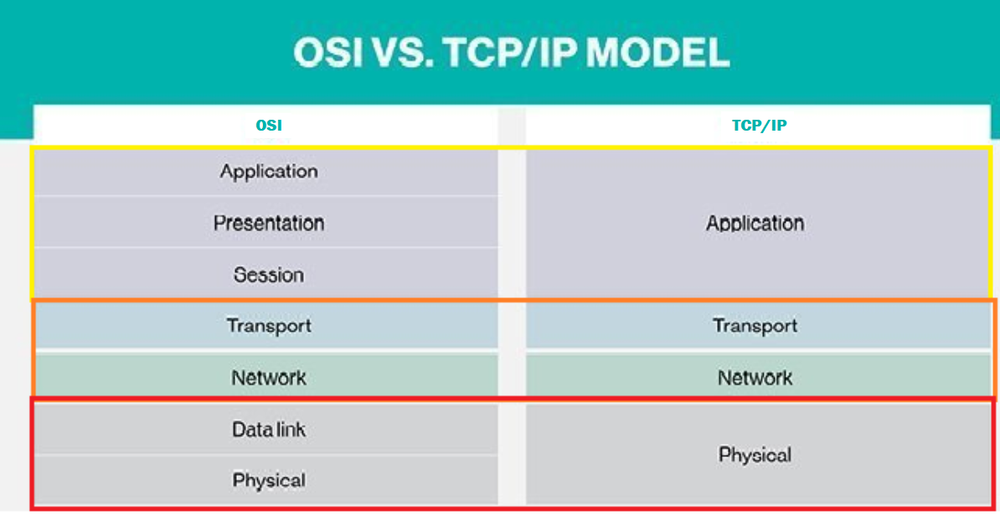

# Networking !


---


## ***What is Network ?***

Connecting two or more computers.

## ***What is Networking ?***

Understanding the concept of Network.

>Example 
>
>How the roads are created to transport or travel. But some use this road for their own benefit known as hackers. 

- Networking is the process of connecting two or more computers so that they can share data and resources. Networks can be small, such as a home network, or large, such as the internet.

---

## ***ISO  International Standard Organization***

- An organization that sets international standards for all different kinds of measurement. 
    
- ISO created OSI in 1970, 
    
- ISO file is created by Linux O.S version Of Ubuntu. 
    

### ***Open system interconnection*** 

- The OSI model describes seven layers that computer systems use to communicate over a network. 
    
- OSI help to connect all different vendors/PC to each other 

> Example
> 
When company create new pc and OSI is applied that means company agree to OSI protocols /rules.] 
 

### ***How data transfer through OSI? Through OSI LAYERS ?***

*OSI Model Layers.* 

1.Application: means to make connection for interface other devices it requires http, https, ftp. 

2.Presentaion: It is presentation of data in graphical mode, represent data mode in which type like MP4, MP3, compressed.  Example: if the data is in email format so the presentation layer will apply email format to show data in email format. 

3.Sessions: it handles all sessions like how much time the website is active and when the connection is close, it collects all data of time. 

4.Transport: It provides host-to-host communication service for application; it decides source port and destination port and decides which protocol under which service comes. It's like a channel. The transport layer is responsible for providing a reliable connection between nodes. The transport layer is responsible for providing a reliable connection between nodes. 

5.Network: it is responsible for packet forwarding including routing through intermediate routers. It sends data in packet format to the next layer, it decides which IP address like which source IP and destination, router and network layer understand IP address router works under Network layer. It checks whether or not the particular packet is allowed or not, Firewall works on this. And encryption works here also, the network layer is responsible for routing data between nodes on the network.  

6.Data link: this transfer data between nodes on a network segment across the physical layer. It understands MAC-Addr , switch work under Data layer. Datalink sends data in frame format to next layer; The data link layer is responsible for error detection and correction. 

7.Physical: check physical connectivity, check speed, check power supply. Data was in bites format, and it goes to receiver layer in binary format, The physical layer is responsible for the physical transmission of data over the network.

---

## ***TCP/IP***

### ***What is TCP/IP ?***

TCP/IP stands for Transmission Control Protocol/Internet Protocol, and it used for communication protocols. 

TCP and IP protocol combine in this TCP/IP protocol. 

### ***How does TCP/IP function*** ? 

- TCP/IP operates based on the client-server communication model, where a user or machine (referred to as a client) receives a service, such as sending a webpage, from another computer (referred to as a server) within the network. 
    

- The TCP/IP protocol Knows as stateless. This means that each client request is treated as a new request, independent of any previous requests. Being stateless allows for the continuous utilization of network paths, as they are not tied to specific client requests. 
    
- The TCP/IP model is somewhat different from the seven-layer Open Systems Interconnection (OSI) networking model that was created later. The OSI reference model outlines how applications can communicate across a network. 
    

#### ***There are 4 layer in TCP/IP*** 

1.Application Layer : which include the osi 3 layer , which is Application presentation, sessions layer

2.Transport Layer : Which include the osi 1 layer which is Transport Layer.

3.Network Layer :Which include the osi  1 layer which is Network Layer.

4.Network Interface : Which include the remaining 2 osi layer which is Data link , Physical Layers.



- The total protocol is 255. 
    

- Transmission control protocol. 
    
- TCP has protocol number 6. 
    

TCP has a **three-way handshake**. 

- A --> B SYK Packet 
- A <-- B SYK.ACK Packet 
- A --> B ACK Packet 
    

Now the connection is made. This process is called TCP full connection also known as three-way handshake. 

If the connection is closed this packet will be there. 

- A --> B Fin packet. 
- A <-- B Fin ack packet. 
    

This is called a **five-way handshake.**

---


## ***UDP***  

### ***What is UDP ?***

- User Datagram protocol, protocol number is 17. 
    
- It’s a request and response mode. 

- It has header/Flag size of 8bytes. 
    
- It is also known as ‘stateless protocol’ meaning it doesn’t acknowledge that packet being sent have been received it most used for steaming media. 


---

## ***IP***

### ***What is IP ?***

- Internet Protocols. 
    
- Internet assign number authority. 
    
- IP Addr is a Network Identity. It's an ID in the network, 
    
- MAC is a Device Identity, 
    

>Example of Ip and mac: company give a id card to you that called IP, 
>
>Whereas there is personal identity you have is called as MAC. 
Company then only hires where you have MAC addr then only you get IP addr. 

---

### ***IP Address Versions*** 

- IP Addr has Ipv4 and Ipv6 are Open source activated 
    
- IPv4 is made of 4 blocks, each block hold 86bits 
    
- IPv4 only use decimal, 
    
- Why IPv6 comes > because the IPv4 get shortage, 
    
- IPv6 is made of 8 blocks, each block hold 128bits 
    
- IPv6 use hexadecimal, 
    
---


## ***DNS***

### ***What is DNS ?***

- Domain Name System uses port 53 works on UDP protocol mostly but also works on TCP. 
    

### ***Why DNS come ?*** 

Because all the device /router/ any machine understand binary, and we humans are not good in remembering numbers/IP Addrs. That why DNS comes and helps , 

It requery Numbers / IP Addrs into Names  

### ***DNS Records***

#### ***What is DNS Records ?***

DNS has Multiply types of Records  

- A record: Is requery for IPv4 
    
- AAAA record : is requery for IPv6 
    
- MX record [mail server record ]:  it specifies the mail server responsible for accepting incoming emails. 
    
- Name server Record: It provides information about authoritative name servers for a domain. 
    

- CNAME Record: Redirector (One server domain redirect to Different Server domain), It acts as a redirector, redirecting one server domain to a different server domain. 
    

:::note
 The latest and best which is used in Current Network environment is QUIC Protocol !!. 
:::

---


## ***Network devices*** 

- *Router*: A router is a device that connects two or more networks together. Routers use the internet layer to route data between networks. 
    
- *Switch*: A switch is a device that connects devices on the same network together. Switches use the data link layer to forward data between devices. 
    

- *Hub*: A hub is a device that connects devices on the same network together. Hubs use the physical layer to repeat data between devices. 
    
- *Wireless*: A wireless access point is a device that allows devices to connect to a network wirelessly. Wireless access points use the physical layer to transmit data over the air. 
    
---


## ***Network Cable*** 

- *UTC Cable*: UTP cable is a type of cable that is used to connect devices to a network. UTP cable is made up of four pairs of copper wires. And it transports in Waves. 
    
- *Fiber cable*: Fiber optic cable is a type of cable that is used to connect devices to a network. Fiber optic cable is made up of a thin strand of glass or plastic that carries light. It transports in light.

---

## ***PORTS***

- Its has two Types.
- *Physical port*: which is ethernet, USB, AUX.... 
    

- *Virtual port*: it has a pair of 65535... 
    
### ***What are the ways ports go ?***

It has two ways to go TCP or UDP 

Then Both ways have 65535 roads. 

Both Ways TCP and UDP has it rules and regulation  

which is  

- TCP state that data connection will not be dropped. 
    
- UCP state that it can't guarantee that data connection will not be dropped. 
    

>Server: means whatever software is deployed. 
>Client: they are using the software without copying the actual data. 


>Server --> HTTP, MYSQL, FTP, open SHH 
>Client --> Browser/curl, Maria Database, FTP client, SSH 


Whatever the software functionality is.. 
when the software is over the world to use as a server and client they using ports. 

## ***Netcat***

### ***What is Netcat ? ***
Netcat is a software who communicate in TCP and UDP protocal. 

Netcat can become server or client.  

- In order to make a server netcat has to listen. 
    - -L listing become a server and use a software. -P port  -v verbosity 
    

```
nc –L  -p 1 –v
```

- In order to make client connect to netcat server using the below cmd
- Which means >>#<code>***nc (server-ip) 127.0.0.1 (port) 1***</code>
```
nc  127.0.0.1 1
```


- Wireshark filter For TCP ports {Any Random Port}

```
tcp.port==1
```

---
### ***TCP HankShakes***

- #### ***TCP Half Connection***
- Wireshark packet 
	- TCP SYN,
	- TCP SY+ACK
	- TCP ACK


|  Clinet to Server   |
|---|
||

| Server to Client |
|---|
| |


- #### ***TCP Full Connections***

|Fin Packet |
|---|
| |


- **If the TCP port is not open in server end this will be the RST packet reset packet:**


---

### **UDP**

•	**-u** for UDP,


> Wireshark filter: udp.port==1


-	***The application layer will be seen when you enter.***
-	***This is the request and response packet:***


| ***Client saying hello to server:*** |
|---|
| |
| ***WireShark***|
| |


| ***Server saying hello to client:***|
|---|
| |
| ***Wiresharks***|
||

- If Client and Server Close the Connection of UDP the packet did not generate.
- It bases on request and response.

And port number 0 is used , at that time nc using the whatever  free port  is , 
Choice any port which is available.
And ***why it is used because when connect with multiply tabs on browser , multiply communication.***

### ***Service*** 

- Protocol has its own ***rules and regulations***, and *** same for Services *** also.
So, services are depended on protocol.
That means to use the _software application or deployment they do agree on rules and regulation of both protocol and services._

#### HTTP port 80:

|#nc lvp 80 (server) #nc 127.0.0.1 80 (client or use browser)|
|---|
||
| First **TCP** connection made because **http uses TCP**  Then **http** connection made:|
| |

| **Fin Packet** |
|---|
| |

| **When the port is not open and client request in TCP this is the RSK packet:**|
|---|
| |

### ***HTTPS***

- **HTTPS** is the **upgradation** version on **HTTP**.
- **HTTPS** is secure as in **HTTP** the message and packet are in readable format. But in HTTPS the packets are not in readable format.

||
|---|

| **Wireshark**|
|---|
||

| **Example** | 
|---|
|Hello client Is including in https service rule.|
|Because of SSL it used to encrypted the packets |
| **SSL is included in https service** |
| |
|**Fin Packet** |
| |

---

