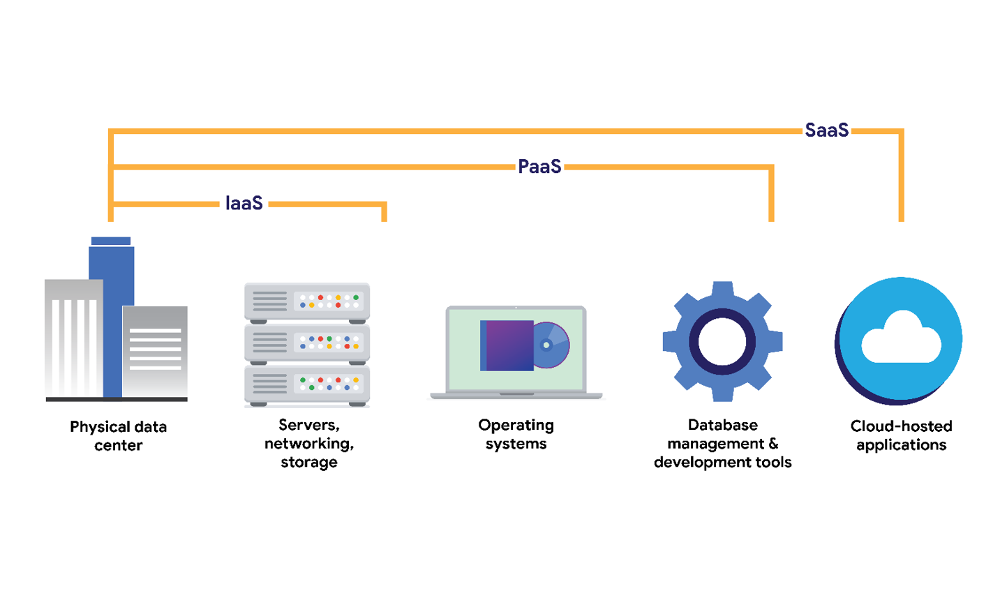

# Networking !


---


:::tip

A Typical day of me as a network engineer.

It would start with solving a problem.  Maybe I  trying to debug, why is this particular endpoint flooded with so 
much traffic?  Or why is this endpoint actually slowing down?  And I would start with, okay, let me get to the endpoint. 
Let me capture some traffic on the endpoint and see what kind of traffic is coming in and going out through this endpoint. 
So I would typically go back, think about the problem during lunch. Sometimes things would click. When I am  thinking i might not have thought about a problem from a different perspective, i might want to actually see how it looks like.  So i would go about maybe doing a lab recreate. Let me connect these endpoints and let me try to reproduce the issue. I might see some things in the lab recreate that you might have not 
thought of. And i might need to actually consult with experts from different domains who might know better about this area. Get their view on what the problem is, analyze, show them everything that you have done. I  might get the solution just by talking to people. It's a pretty busy day, but it's also a very fun day. It's like solving puzzles all the time, which is pretty exciting. Some of the best practices in network  that I've learned are, 
don't try to always reinvent the wheel. There are certain protocols, there are certain algorithms that have been tried, tested, analyzed, and they have been deemed secure for being used in network security.
 


:::
## ***What is Network ?***

Connecting two or more computers.

## ***What is Networking ?***

Understanding the concept of Network.

>Example 
>
>How the roads are created to transport or travel. But some use this road for their own benefit known as hackers. 

- Networking is the process of connecting two or more computers so that they can share data and resources. Networks can be small, such as a home network, or large, such as the internet.

|At home, the devices connected to your network might be your laptop, cell phones, and smart devices, like your refrigerator or air conditioner. In an office, devices like workstations, printers, and servers all connect to the network. The devices on a network can communicate with each other over network cables, or wireless connections. Networks in your home and office can communicate with networks in other locations, and the devices on them |
|---|
---

## LAN & WAN

- Devices can communicate on two types of networks a local area network, also known as a LAN, 
and a wide area network, also known as a WAN.

- LAN
	- A local area network, or LAN, spans a small area like an office building, a school, or a home. 
		- Example, when a personal device like your cell phone or tablet  connects to the WIFI in your house, they form a LAN. The LAN then connects to the internet

- WAN
	- A wide area network or WAN spans a large geographical area like a city, state, or country. 
	- You can think of the internet as one big WAN.


## ***ISO  International Standard Organization***

- An organization that sets international standards for all different kinds of measurement. 
    
- ISO created OSI in 1970, 
    
- ISO file is created by Linux O.S version Of Ubuntu. 
    

### ***Open system interconnection*** 

- The OSI model describes seven layers that computer systems use to communicate over a network. 
    
- OSI help to connect all different vendors/PC to each other 

> Example
> 
When company create new pc and OSI is applied that means company agree to OSI protocols /rules.] 
 

### ***How data transfer through OSI? Through OSI LAYERS ?***

#### *OSI Model Layers.* 

#### Layer 7: Application layer

- **Application**: means to make connection for interface other devices it requires http, https, ftp.

	- The application layer includes processes that directly involve the everyday user. This layer includes all of the networking protocols that software applications use to connect a user to the internet. This characteristic is the identifying feature of the application layer ++user connection to the network via applications and requests++.
	
	- An example of a type of communication that happens at the application layer is using a web browser. The internet browser uses HTTP or HTTPS to send and receive information from the website server. The email application uses simple mail transfer protocol (SMTP) to send and receive email information. Also, web browsers use the domain name system (DNS) protocol to translate website domain names into IP addresses which identify the web server that hosts the information for the website. 

#### Layer 6: Presentation layer
- **Presentation**: It is presentation of data in graphical mode, represent data mode in which type like MP4, MP3, compressed.  Example: if the data is in email format so the presentation layer will apply email format to show data in email format.

	- Functions at the presentation layer involve data translation and encryption for the network. This layer adds to and replaces data with formats that can be understood by applications (layer 7) on both sending and receiving systems. Formats at the user end may be different from those of the receiving system. Processes at the presentation layer require the use of a standardized format.
	- Some formatting functions that occur at layer 6 include encryption, compression, and confirmation that the character code set can be interpreted on the receiving system. One example of encryption that takes place at this layer is SSL, which encrypts data between web servers and browsers as part of websites with HTTPS


#### Layer 5: Session layer
- **Sessions**: it handles all sessions like how much time the website is active and when the connection is close, it collects all data of time.
	- A session describes when a connection is established between two devices. An open session allows the devices to communicate with each other. Session layer protocols occur to keep the session open while data is being transferred and terminate the session once the transmission is complete. 

	- The session layer is also responsible for activities such as authentication, reconnection, and setting checkpoints during a data transfer. If a session is interrupted, checkpoints ensure that the transmission picks up at the last session checkpoint when the connection resumes. Sessions include a request and response between applications. Functions in the session layer respond to requests for service from processes in the presentation layer (layer 6) and send requests for services to the transport layer (layer 4).

#### Layer 4: Transport layer

- **Transport**: It provides host-to-host communication service for application; it decides source port and destination port and decides which protocol under which service comes. It's like a channel. The transport layer is responsible for providing a reliable connection between nodes. The transport layer is responsible for providing a reliable connection between nodes.

	- The transport layer is responsible for delivering data between devices. 
	- This layer also handles the speed of data transfer, flow of the transfer, and breaking data down into smaller segments to make them easier to transport. Segmentation is the process of dividing up a large data transmission into smaller pieces that can be processed by the receiving system. These segments need to be reassembled at their destination so they can be processed at the session layer (layer 5). The speed and rate of the transmission also has to match the connection speed of the destination system. TCP and UDP are transport layer protocols. 

#### Layer 3: Network layer

- **Network**: it is responsible for packet forwarding including routing through intermediate routers. It sends data in packet format to the next layer, it decides which IP address like which source IP and destination, router and network layer understand IP address router works under Network layer. It checks whether or not the particular packet is allowed or not, Firewall works on this. And encryption works here also, the network layer is responsible for routing data between nodes on the network. 

- The network layer oversees receiving the frames from the data link layer (layer 2) and delivers them to the intended destination. The intended destination can be found based on the address that resides in the frame of the data packets. Data packets allow communication between two networks. These packets include IP addresses that tell routers where to send them. They are routed from the sending network to the receiving network. 

#### Layer 2: Data link layer

- **Data link**: this transfer data between nodes on a network segment across the physical layer. It understands MAC-Addr , switch work under Data layer. Datalink sends data in frame format to next layer; The data link layer is responsible for error detection and correction.

	- The data link layer organizes sending and receiving data packets within a single network. 
	- The data link layer is home to switches on the local network and network interface cards on local devices.
	- Protocols like network control protocol (NCP), high-level data link control (HDLC), and synchronous data link control protocol (SDLC) are used at the data link layer.

#### Layer 1: Physical layer 

- **Physical**: check physical connectivity, check speed, check power supply. Data was in bites format, and it goes to receiver layer in binary format, The physical layer is responsible for the physical transmission of data over the network.

	- As the name suggests, the physical layer corresponds to the physical hardware involved in network transmission. Hubs, modems, and the cables and wiring that connect them are all considered part of the physical layer. 
	- To travel across an ethernet or coaxial cable, a data packet needs to be translated into a stream of 0s and 1s. 
	- The stream of 0s and 1s are sent across the physical wiring and cables, received, and then passed on to higher levels of the OSI model.


---

## ***TCP/IP***

### ***What is TCP/IP ?***

TCP/IP stands for Transmission Control Protocol/Internet Protocol, and it used for communication protocols. 

TCP and IP protocol combine in this TCP/IP protocol. 

### ***How does TCP/IP function*** ? 

- TCP/IP operates based on the client-server communication model, where a user or machine (referred to as a client) receives a service, such as sending a webpage, from another computer (referred to as a server) within the network. 
    

- The TCP/IP protocol Knows as stateless. This means that each client request is treated as a new request, independent of any previous requests. Being stateless allows for the continuous utilization of network paths, as they are not tied to specific client requests. 
    
- The TCP/IP model is somewhat different from the seven-layer Open Systems Interconnection (OSI) networking model that was created later. The OSI reference model outlines how applications can communicate across a network. 
    

#### ***There are 4 layer in TCP/IP*** 

##### 1.Application Layer [which include the OSI 3 layer , which is Application presentation, sessions layer]

- The **Application layer** in the TCP/IP model is similar to the application, presentation, and session layers of the OSI model. The application layer is responsible for making network requests or responding to requests. This layer defines which internet services and applications any user can access. Some common protocols used on this layer are:

	- Hypertext transfer protocol (HTTP)
	- Simple mail transfer protocol (SMTP)
	- Secure shell (SSH)
	- File transfer protocol (FTP)
	- Domain name system (DNS)
	- Application layer protocols rely on underlying layers to transfer the data across the network.


##### 2.Transport Layer [which include the osi 1 layer which is Transport Layer]
- The transport layer is responsible for reliably delivering data between two systems or networks. TCP and UDP are the two transport protocols that occur at this layer. 
Transmission Control Protocol 

- The UDP is used by applications that are not concerned with the reliability of the transmission. Data sent over UDP is not tracked as extensively as data sent using TCP. Because UDP does not establish network connections, it is used mostly for performance sensitive applications that operate in real time, such as video streaming.

##### 3.Network Layer [which include the osi  1 layer which is Network Layer]

- The **Internet layer**, sometimes referred to as the network layer, is responsible for ensuring the delivery to the destination host, which potentially resides on a different network. The internet layer determines which protocol is responsible for delivering the data packets. Here are some of the common protocols that operate at the internet layer:

- Internet Protocol (IP). IP sends the data packets to the correct destination and relies on the Transmission Control Protocol/User Datagram Protocol (TCP/UDP) to deliver them to the corresponding service. IP packets allow communication between two networks. They are routed from the sending network to the receiving network. The TCP/UDP retransmits any data that is lost or corrupt.

- Internet Control Message Protocol (ICMP). The ICMP shares error information and status updates of data packets. This is useful for detecting and troubleshooting network errors. The ICMP reports information about packets that were dropped or that disappeared in transit, issues with network connectivity, and packets redirected to other routers.

##### 4.Network Interface [which include the remaining 2 osi layer which is Data link , Physical Layes]

- The network access layer, sometimes called the data link layer, organizes sending and receiving data frames within a single network. This layer corresponds to the physical hardware involved in network transmission. Hubs, modems, cables, and wiring are all considered part of this layer. The address resolution protocol (ARP) is part of the network access layer. ARP assists IP with directing data packets on the same physical network by mapping IP addresses to MAC addresses on the same physical network.

- |TCP-IP MOdel|
|---|
||

## **Operations at the network layer**

- Functions at the network layer organize the addressing and delivery of data packets across the network and internet from the host device to the destination device. This includes directing the packets from one router to another router across the internet, based on the internet protocol (IP) address of the destination network. 
- The destination IP address is contained within the header of each data packet. This address will be stored for future routing purposes in  routing tables along the packet’s path to its destination.
- All data packets include an IP address; this is referred to as an IP packet or datagram. 
	- A router uses the IP address to route packets from network to network based on information contained in the IP header of a data packet. Header information communicates more than just the address of the destination. It also includes information such as the source IP address, the size of the packet, and which protocol will be used for the data portion of the packet. 

## **IP & MAC**

- Internet Protocols.
	- Internet assign number authority.
	- IP Addr is a Network Identity. It's an ID in the network,

- MAC is a Device Identity,
	- Devices need to find each other on a network to establish communications. 
	- These devices will use unique addresses, or identifiers, to locate each other. 
	- The addresses will ensure that communications happens with the right device. 
	- These are called the IP and MAC addresses.

> Example of Ip and mac: company give a id card to you that called IP, Whereas there is personal identity you have is called as MAC.
Company then only hires where you have MAC addr then only you get IP addr.

## **IP Address Versions & Formats**

- IP Address has Ipv4 and Ipv6 are Open source activated.
	- IPv4 is made of 4 blocks, each block hold 86bits
	- IPv4 only use decimal,
	- Why IPv6 comes > because the IPv4 get shortage,
	- IPv6 is made of 8 blocks, each block hold 128bits
	- IPv6 use hexadecimal,
	
### **Format of an IPv4 packet**

|Format of an IP Version 4 The Header & the Data|
|---|
|The size of the IP header ranges from 20 to 60 bytes. |
|The header includes the IP routing information that devices use to direct the packet.|
|The length of the data section of an IPv4 packet can vary greatly in size. However, the maximum possible size of an IP packet is 65,536 bytes. It contains the message being transferred to the transmission, like website information or email text. |
||

#### **Fields in IPv4 Packet**
|Fields within header of an IPv4 Packets|
|---|
|**Version**: The first 4-bit header tells receiving devices what protocol the packet is using. The packet used in the illustration above is an IPv4 packet.|
|**IP Header Length (HLEN)**: HLEN is the packet’s header length. This value indicates where the packet header ends and the data segment begins.|
|**Type of Service (ToS)**: Routers prioritize packets for delivery to maintain quality of service on the network. The ToS field provides the router with this information.|
|**Total Length**: This field communicates the total length of the entire IP packet, including the header and data. The maximum size of an IPv4 packet is 65,535 bytes.|
|**Identification**: For IPv4 packets that are larger than 65, 535 bytes, the packets are divided, or fragmented, into smaller IP packets. The identification field provides a unique identifier for all the fragments of the original IP packet so that they can be reassembled once they reach their destination. |
|**Flags**: This field provides the routing device with more information about whether the original packet has been fragmented and if there are more fragments in transit.|
|**Fragmentation Offset**: The fragment offset field tells routing devices where in the original packet the fragment belongs.|
|**Time to Live (TTL)**: TTL prevents data packets from being forwarded by routers indefinitely. It contains a counter that is set by the source. The counter is decremented by one as it passes through each router along its path. When the TTL counter reaches zero, the router currently holding the packet will discard the packet and return an ICMP Time Exceeded error message to the sender. |
|**Protocol**: The protocol field tells the receiving device which protocol will be used for the data portion of the packet.|
|**Header Checksum**: The header checksum field contains a checksum that can be used to detect corruption of the IP header in transit. Corrupted packets are discarded.|
|**Source IP Address**: The source IP address is the IPv4 address of the sending device.|
|**Destination IP Address**: The destination IP address is the IPv4 address of the destination device.|
|**Options**: The options field allows for security options to be applied to the packet if the HLEN value is greater than five. The field communicates these options to the routing devices.|
||


### **Difference between IPv4 and IPv6**	

- it became clear that all of the IPv4 addresses would eventually be depleted; this is called IPv4 address exhaustion. At the time, no one had anticipated how many computing devices would need an IP address in the future.
- IPv6 was developed to mitigate IPv4 address exhaustion and other related concerns. 

|IP Version 4 Vs IP Version 6|
|---|
| One of the key differences between IPv4 and IPv6 is the length of the addresses. |
|IPv4 addresses are numeric, made of 4 bytes, and allow for up to 4.3 billion possible addresses. |
|IPv4 addresses are made up of four strings and the numbers range from 0 to 255. |
| An example of an IPv4 address would be: 198.51.100.0. IPv6 addresses are hexadecimal, made up of 16 bytes, and allow for up to 340 undecillion addresses (340 followed by 36 zeros).| 
|An example of an IPv6 address would be: 2002:0db8:0000:0000:0000:ff21:0023:1234.|
|There are also some differences in the layout of an IPv6 packet header. The IPv6 header format is much simpler than IPv4. For example, the IPv4 Header includes the HLEN Identification, and Flags fields, whereas the IPv6 does not. The IPv6 header introduces different fields not included in IPv4 headers, such as the Flow Label and Traffic Class.|  
|There are some important security differences between IPv4 and IPv6. |
|IPv6 offers more efficient routing and eliminates private address collisions that can occur on IPv4 when two devices on the same network are attempting to use the same address.|
||

---

## **Communication protocols**

Communication protocols govern the exchange of information in network transmission. They dictate how the data is transmitted between devices and the timing of the communication. They also include methods to recover data lost in transit.

### **TCP**
Transmission Control Protocol (TCP) is an internet communication protocol that allows two devices to form a connection and stream data. TCP uses a three-way handshake process. First, the device sends a synchronize (SYN) request to a server. Then the server responds with a SYN/ACK packet to acknowledge receipt of the device's request. Once the server receives the final ACK packet from the device, a TCP connection is established. In the TCP/IP model, TCP occurs at the transport layer.
The TCP ensures that data is reliably transmitted to the destination service. TCP contains the port number of the intended destination service, which resides in the TCP header of an TCP/IP packet.
- The total protocol is 255.
- Transmission control protocol.
- TCP has protocol number 6.
> TCP has a **Three-way handshake**.
- A --> B SYK packet
- A <-- B SYK packet
- A --> B ACK Packet

Now the connection is made. This process is called **TCP full connection** also known as **three-way handshake.**

If the connection is closed this packet will be there.
•	A --> B Fin packet.
•	A ß B Fin ack packet.
This is called a **Five-way handshake**.


### **UDP** 
- User Datagram protocol, protocol number is 17.
- It’s a request and response mode.
- It has header/Flag size of 8bytes.
- It is also known as ‘stateless protocol’ meaning it doesn’t acknowledge that packet being sent have been received it most used for steaming media.
- User Datagram Protocol (UDP) is a connectionless protocol that does not establish a connection between devices before a transmission. This makes it less reliable than TCP. But it also means that it works well for transmissions that need to get to their destination quickly. For example, one use of UDP is for internet gaming transmissions. In the TCP/IP model, UDP occurs at the transport layer


### **DNS**


- Domain Name System uses port 53 works on UDP protocol mostly but also works on TCP.
- Domain Name System (DNS) is a protocol that translates internet domain names into IP addresses. When a client computer wishes to access a website domain using their internet browser, a query is sent to a dedicated DNS server. The DNS server then looks up the IP address that corresponds to the website domain. DNS normally uses UDP on port 53. However, if the DNS reply to a request is large, it will switch to using the TCP protocol. In the TCP/IP model, DNS occurs at the application layer.

#### **Why DNS come?**
Because all the device /router/ any machine understand binary, and we humans are not good in remembering numbers/IP Addrs. That why DNS comes and helps,
It requery Numbers / IP Addrs into Names 


### **DNS Types** 
DNS has Multiply types of Records 

- **A record**: Is requery for IPv4
- **AAAA record** : is requery for IPv6
- **MX record** [mail server record ]:  it specifies the mail server responsible for accepting incoming emails.
- **Name server Record**: It provides information about authoritative name servers for a domain.
- **CNAME Record**: Redirector [One server domain redirect to Different Server domain], It acts as a redirector, redirecting one server domain to a different server domain.

:::info
 The latest and best which is used in Current Network environment is QUIC Protocol !!.
:::


## **Management Protocols**

Management protocols are used for monitoring and managing activity on a network. They include protocols for error reporting and optimizing performance on the network.

- **Simple Network Management Protocol (SNMP)** is a network protocol used for monitoring and managing devices on a network. SNMP can reset a password on a network device or change its baseline configuration. It can also send requests to network devices for a report on how much of the network’s bandwidth is being used up. 
	- In the TCP/IP model, SNMP occurs at the application layer.

- **Internet Control Message Protocol (ICMP)** is an internet protocol used by devices to tell each other about data transmission errors across the network. ICMP is used by a receiving device to send a report to the sending device about the data transmission. ICMP is commonly used as a quick way to troubleshoot network connectivity and latency by issuing the “ping” command on a Linux operating system. 
	- In the TCP/IP model, ICMP occurs at the internet layer.


## **Security Protocols**

Security protocols are network protocols that ensure that data is sent and received securely across a network. Security protocols use encryption algorithms to protect data in transit. Below are some common security protocols.

- **Hypertext Transfer Protocol Secure (HTTPS)** is a network protocol that provides a secure method of communication between clients and website servers. 
	- HTTPS is a secure version of HTTP that uses secure sockets layer/transport layer security (SSL/TLS) encryption on all transmissions so that malicious actors cannot read the information contained. HTTPS uses port 443. 
	- In the TCP/IP model, HTTPS occurs at the application layer.

- **Secure File Transfer Protocol (SFTP)** is a secure protocol used to transfer files from one device to another over a network. SFTP uses secure shell (SSH), typically through TCP port 22. SSH uses Advanced Encryption Standard (AES) and other types of encryption to ensure that unintended recipients cannot intercept the transmissions.
	-  In the TCP/IP model, SFTP occurs at the application layer. 
	- SFTP is used often with cloud storage. Every time a user uploads or downloads a file from cloud storage, the file is transferred using the SFTP protocol.

:::caution
Note: The encryption protocols mentioned do not conceal the source or destination IP address of network traffic. This means a malicious actor can still learn some basic information about the network traffic if they intercept it.
:::

### **Dynamic Host Configuration Protocol**

**Dynamic Host Configuration Protocol (DHCP)** is in the management family of network protocols. DHCP is an application layer protocol used on a network to configure devices. 
- It assigns a unique IP address and provides the addresses of the appropriate DNS server and default gateway for each device.
- DHCP servers operate on UDP port 67 while DHCP clients operate on UDP port 68.

### **Address Resolution Protocol**
- I think by now you are familiar with IP and MAC addresses.  
- Each device on a network has both an IP address that identifies it on the network and a MAC address that is unique to that network interface. 
- A device’s IP address may change over time, but its MAC address is permanent. 
- Address Resolution Protocol (ARP) is an internet layer protocol in the TCP/IP model used to translate the IP addresses that are found in data packets into the MAC address of the hardware device. 
- Each device on the network performs ARP and keeps track of matching IP and MAC addresses in an ARP cache. ARP does not have a specific port number.


### **Telnet** 

- Telnet is an application layer protocol that allows a device to communicate with another device or server. Telnet sends all information in clear text. 
- It uses command line prompts to control another device similar to secure shell (SSH), but Telnet is not as secure as SSH. 
- Telnet can be used to connect to local or remote devices and uses TCP port 23. 


### **Secure shell**

- Secure shell protocol (SSH) is used to create a secure connection with a remote system. This application layer protocol provides an alternative for secure authentication and encrypted communication. SSH operates over the TCP port 22 and is a replacement for less secure protocols, such as Telnet.

### **Post office protocol**
- **Post office protocol (POP)** is an application layer (layer 4 of the TCP/IP model) protocol used to manage and retrieve email from a mail server. 
- Many organizations have a dedicated mail server on the network that handles incoming and outgoing mail for users on the network. 
- User devices will send requests to the remote mail server and download email messages locally. 
- If you have ever refreshed your email application and had new emails populate in your inbox, you are experiencing POP and internet message access protocol (IMAP) in action.
- Unencrypted, plaintext authentication uses TCP/UDP port 110 and encrypted emails use Secure Sockets Layer/Transport Layer Security (SSL/TLS) over TCP/UDP port 995.  
- When using POP, mail has to finish downloading on a local device before it can be read and it does not allow a user to sync emails. 

### **Internet Message Access Protocol (IMAP)**
- **IMAP** is used for incoming email. It downloads the headers of emails, but not the content. 
- The content remains on the email server, which allows users to access their email from multiple devices. 
- IMAP uses TCP port 143 for unencrypted email and TCP port 993 over the TLS protocol. Using IMAP allows users to partially read email before it is finished downloading and to sync emails. However, IMAP is slower than POP3.

### **Simple Mail Transfer Protocol**

- **Simple Mail Transfer Protocol (SMTP)** is used to transmit and route email from the sender to the recipient’s address. 
- SMTP works with Message Transfer Agent (MTA) software, which searches DNS servers to resolve email addresses to IP addresses, to ensure emails reach their intended destination. 
- SMTP uses TCP/UDP port 25 for unencrypted emails and TCP/UDP port 587 using TLS for encrypted emails. 
- The TCP port 25 is often used by high-volume spam. 
- SMTP helps to filter out spam by regulating how many emails a source can send at a time.

### **Protocols and port numbers**

- Remember that port numbers are used by network devices to determine what should be done with the information contained in each data packet once they reach their destination.
- Firewalls can filter out unwanted traffic based on port numbers. 
>> For example, an organization may configure a firewall to only allow access to TCP port 995 (POP3) by IP addresses belonging to the organization.


|Protocols | Ports|
|---|---|
| DHCP | UDP port 67 (servers) UDP port 68 (clients)|
| ARP | none|
|Telnet|TCP port 23|
|SSH |TCP port 22|
|POP3|TCP/UDP port 110 (unencrypted) TCP/UDP port 995 (encrypted, SSL/TLS)|
|IMAP|TCP port 143 (unencrypted)  TCP port 993 (encrypted, SSL/TLS)|
|SMTP|TCP/UDP port 587 (encrypted, TLS)|


## ***Network devices*** 

- *Router*: A router is a device that connects two or more networks together. Routers use the internet layer to route data between networks. 
    
- *Switch*: A switch is a device that connects devices on the same network together. Switches use the data link layer to forward data between devices. 
    

- *Hub*: A hub is a device that connects devices on the same network together. Hubs use the physical layer to repeat data between devices. 
    
- *Wireless*: A wireless access point is a device that allows devices to connect to a network wirelessly. Wireless access points use the physical layer to transmit data over the air. 
    
---


## ***Network Cable*** 

- *UTC Cable*: UTP cable is a type of cable that is used to connect devices to a network. UTP cable is made up of four pairs of copper wires. And it transports in Waves. 
    
- *Fiber cable*: Fiber optic cable is a type of cable that is used to connect devices to a network. Fiber optic cable is made up of a thin strand of glass or plastic that carries light. It transports in light.

---

## ***PORTS***

- Its has two Types.
- *Physical port*: which is ethernet, USB, AUX.... 
    

- *Virtual port*: it has a pair of 65535... 
    
### ***What are the ways ports go ?***

It has two ways to go TCP or UDP 

Then Both ways have 65535 roads. 

Both Ways TCP and UDP has it rules and regulation  

which is  

- TCP state that data connection will not be dropped. 
    
- UCP state that it can't guarantee that data connection will not be dropped. 
    

>Server: means whatever software is deployed. 
>Client: they are using the software without copying the actual data. 


>Server --> HTTP, MYSQL, FTP, open SHH 
>Client --> Browser/curl, Maria Database, FTP client, SSH 


Whatever the software functionality is.. 
when the software is over the world to use as a server and client they using ports. 

## ***Netcat***

### ***What is Netcat ? ***
Netcat is a software who communicate in TCP and UDP protocal. 

Netcat can become server or client.  

- In order to make a server netcat has to listen. 
    - -L listing become a server and use a software. -P port  -v verbosity 
    

```
nc –L  -p 1 –v
```

- In order to make client connect to netcat server using the below cmd
- Which means >>#<code>***nc (server-ip) 127.0.0.1 (port) 1***</code>
```
nc  127.0.0.1 1
```


- Wireshark filter For TCP ports {Any Random Port}

```
tcp.port==1
```

---
### ***TCP HankShakes***

- #### ***TCP Half Connection***
- Wireshark packet 
	- TCP SYN,
	- TCP SY+ACK
	- TCP ACK


|  Clinet to Server   |
|---|
||

| Server to Client |
|---|
| |


- #### ***TCP Full Connections***

|Fin Packet |
|---|
| |


- **If the TCP port is not open in server end this will be the RST packet reset packet:**


---

### **UDP**

•	**-u** for UDP,


> Wireshark filter: udp.port==1


-	***The application layer will be seen when you enter.***
-	***This is the request and response packet:***


| ***Client saying hello to server:*** |
|---|
| |
| ***WireShark***|
| |


| ***Server saying hello to client:***|
|---|
| |
| ***Wiresharks***|
||

- If Client and Server Close the Connection of UDP the packet did not generate.
- It bases on request and response.

And port number 0 is used , at that time nc using the whatever  free port  is , 
Choice any port which is available.
And ***why it is used because when connect with multiply tabs on browser , multiply communication.***

### ***Service*** 

- Protocol has its own ***rules and regulations***, and *** same for Services *** also.
So, services are depended on protocol.
That means to use the _software application or deployment they do agree on rules and regulation of both protocol and services._

#### HTTP port 80:

|#nc lvp 80 (server) #nc 127.0.0.1 80 (client or use browser)|
|---|
||
| First **TCP** connection made because **http uses TCP**  Then **http** connection made:|
| |

| **Fin Packet** |
|---|
| |

| **When the port is not open and client request in TCP this is the RSK packet:**|
|---|
| |

### ***HTTPS***

- **HTTPS** is the **upgradation** version on **HTTP**.
- **HTTPS** is secure as in **HTTP** the message and packet are in readable format. But in HTTPS the packets are not in readable format.

||
|---|

| **Wireshark**|
|---|
||

| **Example** | 
|---|
|Hello client Is including in https service rule.|
|Because of SSL it used to encrypted the packets |
| **SSL is included in https service** |
| |
|**Fin Packet** |
| |

---

## **The evolution of wireless security protocols**

In the early days of the internet, all internet communication happened across physical cables. It wasn’t until the mid-1980s that authorities in the United States designated a spectrum of radio wave frequencies that could be used without a license, so there was more opportunity for the internet to expand. 

In the late 1990s and early 2000s, technologies were developed to send and receive data over radio. Today, users access wireless internet through laptops, smart phones, tablets, and desktops. Smart devices, like thermostats, door locks, and security cameras, also use wireless internet to communicate with each other and with services on the internet.

||
|---|


## **Introduction to wireless communication protocols**

- Many people today refer to wireless internet as Wi-Fi. 
- Wi-Fi refers to a set of standards that define communication for wireless LANs. 
- Wi-Fi is a marketing term commissioned by the Wireless Ethernet Compatibility Alliance (WECA). 
- WECA has since renamed their organization Wi-Fi Alliance. 
- Wi-Fi standards and protocols are based on the 802.11 family of internet communication standards determined by the Institute of Electrical and Electronics Engineers (IEEE). 
- ***As a Network Engineer i have seen Wi-Fi referred to as IEEE 802.11.***
- Wi-Fi communications are secured by wireless networking protocols. 
- Wireless security protocols have evolved over the years, helping to identify and resolve vulnerabilities with more advanced wireless technologies.
- In this reading, you will learn about the evolution of wireless security protocols from WEP to WPA, WPA2, and WPA3. 
- I also learn how the Wireless Application Protocol was used for mobile internet communications.

## **Wired Equivalent Privacy**

- Wired equivalent privacy (WEP) is a wireless security protocol designed to provide users with the same level of privacy on wireless network connections as they have on wired network connections. 
- WEP was developed in 1999 and is the oldest of the wireless security standards.
- WEP is largely out of use today, but security analysts should still understand WEP in case they encounter it. 
For example, a network router might have used WEP as the default security protocol and the network administrator never changed it. Or, devices on a network might be too old to support newer Wi-Fi security protocols. Nevertheless, a malicious actor could potentially break the WEP encryption, so it’s now considered a high-risk security protocol.

## **Wi-Fi Protected Access**

- Wi-Fi Protected Access (WPA) was developed in 2003 to improve upon WEP, address the security issues that it presented, and replace it. WPA was always intended to be a transitional measure so backwards compatibility could be established with older hardware.
- The flaws with WEP were in the protocol itself and how the encryption was used. WPA addressed this weakness by using a protocol called Temporal Key Integrity Protocol (TKIP). 
- WPA encryption algorithm uses larger secret keys than WEPs, making it more difficult to guess the key by trial and error.
- WPA also includes a message integrity check that includes a message authentication tag with each transmission. 
- If a malicious actor attempts to alter the transmission in any way or resend at another time, WPA’s message integrity check will identify the attack and reject the transmission.
- Despite the security improvements of WPA, it still has vulnerabilities. Malicious actors can use a key reinstallation attack (or KRACK attack) to decrypt transmissions using WPA. 
- Attackers can insert themselves in the WPA authentication handshake process and insert a new encryption key instead of the dynamic one assigned by WPA. If they set the new key to all zeros, it is as if the transmission is not encrypted at all.
- Because of this significant vulnerability, WPA was replaced with an updated version of the protocol called WPA2. 


## **WPA2 & WPA3**

### **WPA2**
- The second version of Wi-Fi Protected Access—known as WPA2—was released in 2004. WPA2 improves upon WPA by using the Advanced Encryption Standard (AES). WPA2 also improves upon WPA’s use of TKIP. WPA2 uses the Counter Mode Cipher Block Chain Message Authentication Code Protocol (CCMP), which provides encapsulation and ensures message authentication and integrity. Because of the strength of WPA2, it is considered the security standard for all Wi-Fi transmissions today. WPA2, like its predecessor, is vulnerable to KRACK attacks. This led to the development of WPA3 in 2018. 

### **Personal**
- WPA2 personal mode is best suited for home networks for a variety of reasons. It is easy to implement, initial setup takes less time for personal than enterprise version. The global passphrase for WPA2 personal version needs to be applied to each individual computer and access point in a network. 
- This makes it ideal for home networks, but unmanageable for organizations. 


### **Enterprise**

- WPA2 enterprise mode works best for business applications. 
- It provides the necessary security for wireless networks in business settings. 
- The initial setup is more complicated than WPA2 personal mode, but enterprise mode offers individualized and centralized control over the Wi-Fi access to a business network. This means that network administrators can grant or remove user access to a network at any time. 
- Users never have access to encryption keys, this prevents potential attackers from recovering network keys on individual computers.

### **WPA3**

- WPA3 is a secure Wi-Fi protocol and is growing in usage as more WPA3 compatible devices are released. These are the key differences between WPA2 and WPA3:
	- WPA3 addresses the authentication handshake vulnerability to KRACK attacks, which is present in WPA2. 
	- WPA3 uses Simultaneous Authentication of Equals (SAE), a password-authenticated, cipher-key-sharing agreement. This prevents attackers from downloading data from wireless network connections to their systems to attempt to decode it.
	- WPA3 has increased encryption to make passwords more secure  by using 128-bit encryption, with WPA3-Enterprise mode offering optional 192-bit encryption.


## **Computing processes in the cloud**

- Traditional networks are called on-premise networks, which means that all of the devices used for network operations are kept at a physical location owned by the company, like in an office building, for example. Cloud computing, however, refers to the practice of using remote servers, applications, and network services that are hosted on the internet instead of at a physical location owned by the company.

- A cloud service provider (CSP) is a company that offers cloud computing services. These companies own large data centers in locations around the globe that house millions of servers. Data centers provide technology services, such as storage, and compute at such a large scale that they can sell their services to other companies for a fee. Companies can pay for the storage and services they need and consume them through the CSP’s application programming interface (API) or web console.

- CSPs provide three main categories of services:
	- Software as a service (SaaS) refers to software suites operated by the CSP that a company can use remotely without hosting the software. 

	- Infrastructure as a service (Iaas) refers to the use of virtual computer components offered by the CSP. These include virtual containers and storage that are configured remotely through the CSP’s API or web console. Cloud-compute and storage services can be used to operate existing applications and other technology workloads without significant modifications. Existing applications can be modified to take advantage of the availability, performance, and security features that are unique to cloud provider services.

	- Platform as a service (PaaS) refers to tools that application developers can use to design custom applications for their company. Custom applications are designed and accessed in the cloud and used for a company’s specific business needs.

||
|---|

### **Hybrid cloud environments**

- When organizations use a CSP’s services in addition to their on-premise computers, networks, and storage, it is referred to as a hybrid cloud environment.
- When organizations use more than one CSP, it is called a multi-cloud environment. 
- The vast majority of organizations use hybrid cloud environments to reduce costs and maintain control over network resources.

## **Network security applications**

- Each device, tool, or security strategy put in place by security analysts further protects—or hardens—the network until the network owner is satisfied with the level of security. 
- This approach of adding layers of security to a network is referred to as defense in depth.
- In this reading, you are going to learn about the role of four devices used to secure a network—firewalls, intrusion detection systems, intrusion prevention systems, and security incident and event management tools.
- Network security professionals have the choice to use any or all of these devices and tools depending on the level of security that they hope to achieve. 
- This reading will discuss the benefits of layered security. Each tool mentioned is an additional layer of defense that can incrementally harden a network, starting with the minimum level of security (provided by just a firewall), to the highest level of security (provided by combining a firewall, an intrusion detection and prevention device, and security event monitoring). 

||
|---|

## **Firewall**

- Most firewalls are similar in their basic functions. 
- Firewalls allow or block traffic based on a set of rules. As data packets enter a network, the packet header is inspected and allowed or denied based on its port number. 
- NGFWs are also able to inspect packet payloads. Each system should have its own firewall, regardless of the network firewall.

||
|---|

## **Intrusion Detection System** 

- An **intrusion detection system (IDS)** is an application that monitors system activity and alerts on possible intrusions. 
- An IDS alerts administrators based on the signature of malicious traffic.
- The IDS is configured to detect known attacks. IDS systems often sniff data packets as they move across the network and analyze them for the characteristics of known attacks. 
- Some IDS systems review not only for signatures of known attacks, but also for anomalies that could be the sign of malicious activity. 
- When the IDS discovers an anomaly, it sends an alert to the network administrator who can then investigate further.
- The limitations to IDS systems are that they can only scan for known attacks or obvious anomalies. 
- New and sophisticated attacks might not be caught. 
- The other limitation is that the IDS doesn’t actually stop the incoming traffic if it detects something awry. 
- It’s up to the network administrator to catch the malicious activity before it does anything damaging to the network. 

||
|---|

## **Intrusion Prevention System** 


- An **intrusion prevention system (IPS)** is an application that monitors system activity for intrusive activity and takes action to stop the activity. 
- It offers even more protection than an IDS because it actively stops anomalies when they are detected, unlike the IDS that simply reports the anomaly to a network administrator.
- An IPS searches for signatures of known attacks and data anomalies. 
- An IPS reports the anomaly to security analysts and blocks a specific sender or drops network packets that seem suspect. 

||
|---|


- The IPS (like an IDS) sits behind the firewall in the network architecture. 
- This offers a high level of security because risky data streams are disrupted before they even reach sensitive parts of the network. 
- However, one potential limitation is that it is inline: If it breaks, the connection between the private network and the internet breaks. 
- Another limitation of IPS is the possibility of false positives, which can result in legitimate traffic getting dropped.

## **Full packet capture devices**

- Full packet capture devices can be incredibly useful for network administrators and security professionals. 
- These devices allow you to record and analyze all of the data that is transmitted over your network. 
- They also aid in investigating alerts created by an IDS.

## **Security Information and Event Management** 

- **A security information and event management system (SIEM)**  is an application that collects and analyzes log data to monitor critical activities in an organization. SIEM tools work in real time to report suspicious activity in a centralized dashboard. 
- SIEM tools additionally analyze network log data sourced from IDSs, IPSs, firewalls, VPNs, proxies, and DNS logs. SIEM tools are a way to aggregate security event data so that it all appears in one place for security analysts to analyze. This is referred to as a single pane of glass. 
- Below, you can review an example of a dashboard from Google Cloud’s SIEM tool, Chronicle. 
- Chronicle is a cloud-native tool designed to retain, analyze, and search data.
||
|---|

### **Splunk**
- Splunk is another common SIEM tool. 
- Splunk Enterprise and Splunk Cloud. 
- Both options include detailed dashboards which help security professionals to review and analyze an organization's data. 
- There are also other similar SIEM tools available, and it's important for security professionals to research the different tools to determine which one is most beneficial to the organization.
- A SIEM tool doesn’t replace the expertise of security analysts, or of the network- and system-hardening activities , but they’re used in combination with other security methods. 
- Security analysts often work in a Security Operations Center (SOC) where they can monitor the activity across the network. 
- They can then use their expertise and experience to determine how to respond to the information on the dashboard and decide when the events meet the criteria to be escalated to oversight.


